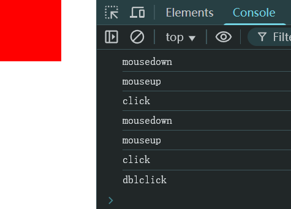

# Ch23L49 事件2


## 1 JS 拖拽实现

```html
<style>
    .box {
        width: 100px;
        height: 100px;
        background-color: red;
        position: absolute;
        left: 0;
        top: 0;
    }
</style>
<div class="box"></div>
```

JS 实现：

```js
function drag(elem) {
    elem.addEventListener('mousedown', function (ev1) {
        const x = ev1.clientX - elem.offsetLeft,
            y = ev1.clientY - elem.offsetTop,
            handlerMove = moveHandler(elem, x, y);
        document.addEventListener('mousemove', handlerMove);
        document.addEventListener('mouseup', function (ev3) {
            document.removeEventListener('mousemove', handlerMove);
        });
    });
    function moveHandler(elem, x, y) {
        return function (ev2) {
            elem.style.left = `${ev2.clientX - x}px`;
            elem.style.top = `${ev2.clientY - y}px`;
        }
    }
}
const box = document.querySelector('.box');
drag(box);
```


## 2 click、mousedown 与 mouseup

`click` = `mousedown` + `mouseup`，并且三者同时绑定事件处理逻辑时，执行顺序依次为：

1. `mousedown`
2. `mouseup`
3. `click`
4. `mousedown`
5. `mouseup`
6. `click`
7. `dblclick`

最后一个为鼠标双击事件。

例如：

```js
/*
.box {
    width: 100px;
    height: 100px;
    background-color: red;
    position: absolute;
    left: 0;
    top: 0;
}
<div class="box"></div>
*/
box.addEventListener('mousedown', ev1 => console.log('mousedown'));
box.addEventListener('mouseup', ev2 => console.log('mouseup'));
box.addEventListener('click', ev3 => console.log('click'));
box.addEventListener('dblclick', ev4 => console.log('dblclick'));
```

实测结果：




## 3 鼠标左右键的区分

支持事件：`mousedown` 或 `mouseup`

判定条件：

- 左键：`event.button == 0`；
- 右键：`event.button == 2`；
- 滚轮：`event.button == 1`；

根据 `DOM3` 标准规定，`click` 事件只对左键单击生效，鼠标按键 **只能通过** `mouseup` 和 `mousedown` 来判定。


## 4 避免 mousedown 与 click 的冲突

方法：控制时间间隔。前后在指定间隔（如 `500ms`）内，执行单击逻辑：

```js
/*
.box {
    width: 100px;
    height: 100px;
    background-color: red;
}
<div class="box"></div>
*/
const box = document.querySelector('.box');
let time0 = 0,
    clickable = false;
const threshold = 500;
box.addEventListener('mousedown', ev => {
    console.log('mousedown');
    time0 = Date.now();
});
box.addEventListener('mouseup', ev => {
    console.log('mouseup');
    if(Date.now() - time0 < threshold) {
        clickable = true;
    }
});
box.addEventListener('click', ev => {
    console.log(clickable ? 'click' : 'not click');
    if (clickable) {
        clickable = false;
    }
});
```


## 5 键盘事件

执行顺序和鼠标事件略有不同，依次为：

1. `keydown`
2. `keypress`
3. `keyup`

`keydown` 和 `keypress` 的区别：

- `keydown` 可以响应任意键盘键，但无法区分大小写；
- `keypress` 仅响应字符类按键，但能区分大小写（ASCII 码，可直接转换成字符）；


