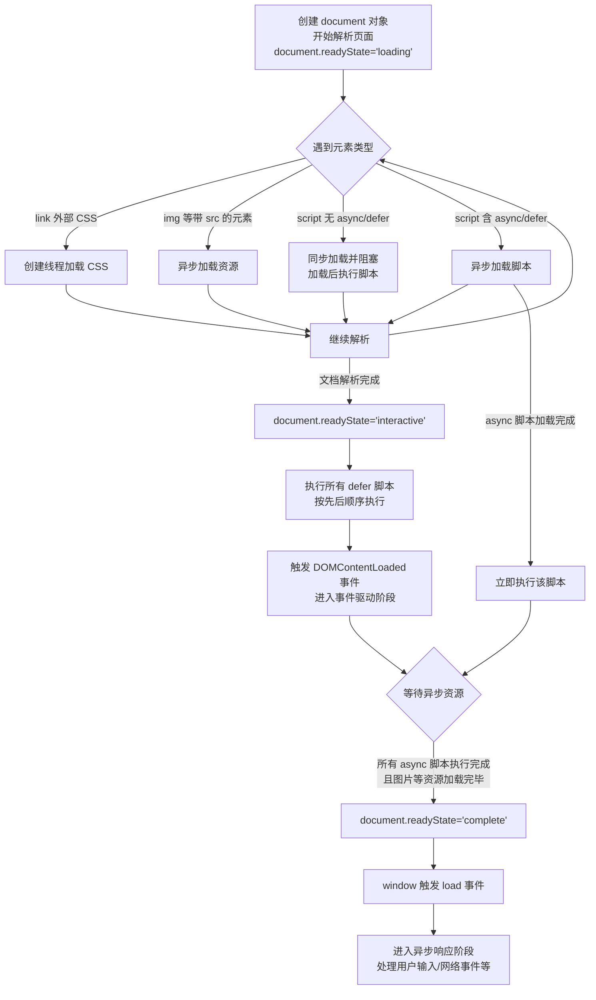
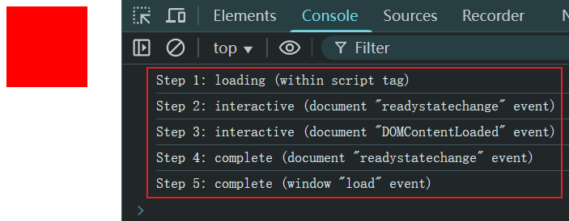
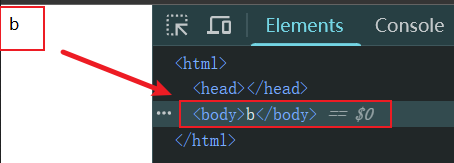
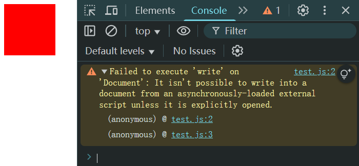

# Ch24L51 json，异步加载，时间线（下）


## 1 JS 加载时间线（必须掌握）

概念：依据 `JavaScript` 出生的那一刻开始记录的一系列浏览器按照顺序做的事。

其主要节点依次为：

1. 创建 `document` 对象，开始解析 `Web` 页面：解析 `HTML` 元素和他们的文本内容后添加 `Element` 对象和 `Text` 节点到文档中。此阶段 `document.readyState = 'loading'`；
2. 遇到 `link` 关联的外部 `CSS`，创建线程加载，并继续解析文档；
3. 遇到 `script` 外部 `JavaScript`，且不含 `async` / `defer` 标记：浏览器同步加载，并阻塞，待 `JavaScript` 加载完成再执行该脚本，然后继续解析文档；
4. 遇到 `script` 外部 `JavaScript`，且包含 `async` / `defer` 标记：浏览器创建线程异步加载，并继续解析文档。对于带 `async` 属性的脚本，脚本加载完成后立即执行（异步将禁止使用 `document.write()` 方法）；
5. 遇到 `img` 等带 `src` 属性的元素，先正常解析 `DOM` 结构，然后浏览器异步加载 `src`，并继续解析文档；
6. 当文档解析完成，此时 `document.readyState = 'interactive'`；
7. 文档解析完成后，所有设置了 `defer` 的脚本会按顺序执行（注意与 `async` 的不同，但同样会禁用 `document.write()` 方法）；
8. `document` 对象触发 `DOMContentLoaded` 事件，标志着程序执行从 **同步脚本执行阶段** 转化为 **事件驱动阶段**；
9. 当所有 `async` 异步脚本加载完成并执行后、`img` 等加载完成后，`document.readyState = 'complete'`，`window` 对象触发 `load` 事件。
10. 至此，以异步响应方式处理用户输入、网络事件等。

以下是 `DeepSeek` 根据上述处理流程绘制的 `Mermaid` 示意图：



以下脚本可观测 `document.readyState` 的取值变化情况：

```html
<div style="width: 100px;height: 100px;background:red"></div>
<script>
    const currState = (function () {
        let i = 0;
        return () => `Step ${++i}: ${document.readyState}`;
    }());

    console.log(`${currState()} (within script tag)`); // loading
    document.onreadystatechange = function ({ type }) {
        console.log(`${currState()} (document "${type}" event)`); // interactive | complete
    };
    document.addEventListener('DOMContentLoaded', function ({ type }) {
        console.log(`${currState()} (document "${type}" event)`); // interactive
    });
    window.onload = function ({ type }) {
        console.log(`${currState()} (window "${type}" event)`); // complete
    };
</script>
```

实测结果：



> [!tip]
>
> **`window.onload` VS `$(document).ready(callbackFn)`**
>
> 区别在于前者执行更晚（即上图中最后的 `Step5`，不仅要解析完 `DOM` 树，还需加载完所有异步内容才会触发）；后者大致相当于上述第 8 个节点（`DOMContentLoaded`），因此 **后者更常用**（也可以放到 `head` 标签内）。


## 2 关于 document.write() 的特殊性

在以下两种特殊情况中，`document.write()` 具有 **清除先前文档流** 的作用：

（1）放到 `window.onload` 事件回调中时：

```html
<div style="width: 100px;height: 100px;background:red"></div>
<script>
    document.write('a');
    window.addEventListener('load', () => {
        document.write('b');
    });
</script>
```

实测结果：



（2）`script` 标签带 `defer` 或 `async` 标记（即启用异步加载时）：

```js
// test.js
(function(){
    document.write('aaa');
}());

// demo.html
<div style="width: 100px;height: 100px;background:red"></div>
<script async type="text/javascript" src="test.js"></script>
```

实测结果（异步脚本中的 `write` 方法直接被禁用）：


