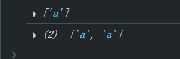
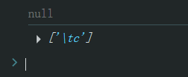

# Ch25L52 正则表达式（上）


## 1 利用反斜杠实现字符串换行

除了用 `"abc\ndef"` 换行，还可以对回车转义：

```html
<div style="width: 100px;height: 100px;background:red"></div>
<script>
    const div = document.querySelector('div');
    const html = '\
        <div style="width: 20px;height: 20px;background:blue"></div>\
        <div style="width: 20px;height: 20px;background:green"></div>\
        <div style="width: 20px;height: 20px;background:yellow"></div>\
    ';
    div.innerHTML = html;
</script>
```


## 2 new RegExp() 与 RegExp()

当参数为正则字面量时（如 `/abc/g`），带 `new` 的生成不同的对象；不带 `new` 的，其结果指向同一个正则对象：

```js
var pattern = /abc/;
var regexp1 = new RegExp(pattern);
var regexp2 = RegExp(pattern);

regexp1.abc = 123;
console.log(regexp2.abc); // undefined

pattern.abc = 456;
console.log(regexp2.abc); // 456
```


## 3 多行匹配选项 m 的用法

```js
var str = 'abcd\na';
var pattern1 = /^a/g;
var pattern2 = /^a/gm;
console.log(str.match(pattern1)); // ["a"]
console.log(str.match(pattern2)); // ["a", "a"]
```

实测结果：




## 4 最强简历

“效率恐怖，代码风骚。” 来自 “史上最强简历” 段子：

> 学识渊博、经验丰富、代码风骚、效率恐怖、C/C++、JAVA、php无不精通、深山苦练 20 余年、一天只睡 4 个小时、电话通知出 BUG 后秒登 VPN，千里之外定位问题、瞬息之间修复上线。
>
> 身体强壮、健步如飞、可连续编程 100 小时不休息、讨论技术方案 5 小时不喝水，上至带项目、出方案，下至盗账号、威胁 PM，什么都能干。
>
> 泡面矿泉水已备好，学校不支持编程已辍学、家人不支持编程已断绝关系、老婆不支持编程已离婚、小孩不支持编程已送孤儿院，备用电源百兆光纤永不断电断网，门口已埋地雷无人打扰。


## 5 关于制表符匹配

必须匹配制表符字面量，而非最终输出结果：

```js
var reg = /\tc/g;
var str1 = "abc  cdefgh";
var str2 = "abc\tcdefgh";
console.log(str1.match(reg));  // null
console.log(str2.match(reg));  // ['\tc']
```

最后一行输出结果与视频讲解时已有不同，新版 `Chrome` 保留了 `\t` 的输出，不作处理：




## 5 关于 Unicode

`Unicode` 编码是分层的，共 16 层（每一位均为十六进制）：

- `u010000` - `u01FFFF`
- `u020000` - `u02FFFF`
- ……
- `u100000` - `u10FFFF`

```js
var reg = /\u8001\u9093\u8eab\u4f53\u597d/g;
var str = '老邓身体好';
console.log(str.match(reg)); // ['老邓身体好']
```


## 6 关于匹配所有字符

仅举一例，依此类推即可：`/[\s\S]/` 或者 `/\d\D/` ……


## 7 元字符中的点字符

含义：查找除了 **换行** 和 **行结束符** 的任意单个字符。


## 8 带单词边界的匹配规则

使用 `\b` 和 `\B`，分别表示 **单词边界** 和 **非单词边界**：

```js
console.log('abc cde fgh'.match(/\bc/g)); // ['c']
console.log('abc cde fgh'.match(/\bcde\b/g)); // ['cde']
console.log('abc cdefgh'.match(/\bcde\b/g)); // null
console.log('abc cdefgh'.match(/\bcde\B/g)); // ['cde']
```

