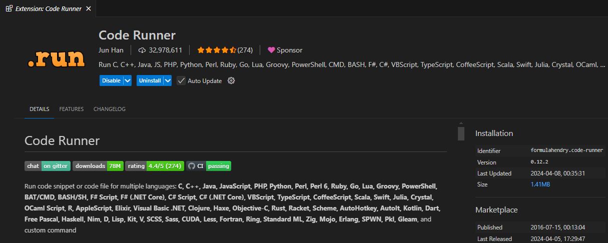

# L01：环境准备

[toc]

## 1 安装 Node.js

中文官网：https://nodejs.org/zh-cn/

验证安装是否成功：

1. 打开命令行终端；
2. 输入命令 `node -v`，如果可以看到版本号，即为安装成功（实操版本：`v17.1.0`）

## 2 用 Node.js 运行 JS 代码

1. 在命令终端中进入 js 文件所在目录
2. 运行命令 `node JS_folder_name`

## 3 安装 code runner 插件

插件名：`code runner`，快速执行命令：<kbd>Ctrl</kbd> + <kbd>Alt</kbd> + <kbd>N</kbd>。

