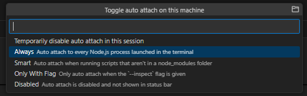

# L06：知识回顾-数据的流程（2）

---

(接上节)

## 1 VSCode 断点调试技巧

进入调试模式：<kbd>Ctrl</kbd> + <kbd>Shift</kbd> + <kbd>D</kbd>

设置下方状态栏的 `Auto Attach`：该选项用于设置 `JavaScript` 运行环境（通常为 `node.js`）的具体关联方式（默认为 `Always`，也可以选择 `Only with Flag`）。在状态栏点击该选项，`VSCode` 顶部会弹出具体的配置项：




## 2 习题点评

**习题3**：

```js
/* 
1. 1~100求和
*/
var sum = 0;
for(var i = 1; i <= 100; i++) {
    sum += i;
}
console.log(sum);
// DIY
var sum = Array.from({length: 100}, (_, i) => i + 1)
	.reduce((a, b) => a + b);

/* 
2. 求某个数的阶乘
*/
var n = 5;
var result = 1;
for(var i = 1; i <= n; i++) {
    result *= i;
}
console.log(result);
// DIY
var fact = n => (n <= 1) ? 1 : n * fact(n - 1);
var fact = (n, acc = 1) => (n <= 1) ? acc : fact(n - 1, acc * n);

/* 
3. 数组求和
*/
var arr = [1,2,3,4,5];
var sum = 0;
for(var i = 0, len = arr.length; i < len; i++) {
    sum += arr[i];
}
console.log(sum); // 15
// DIY
const arrSum = arr => arr.reduce((a, b) => a + b);
arrSum([1,2,3,4,5]); // 15

/* 
4. 求数组中的奇数的个数
*/
var arr = [1,2,3,4,5];
var count = 0;
for(var i = 0, len = arr.length; i < len; i++) {
    if(arr[i] % 2 === 1) {
        count++;
    }
}
console.log(count);
// DIY
var oddCount = arr => arr.filter(n => n % 2 === 1).length;
oddCount([1,2,3,4,5]); // 3

/* 
5. 求数组中的奇数和
*/
var arr = [1,2,3,4,5];
var sumOdd = 0;
for(var i = 0, len = arr.length; i < len; i++) {
    if(arr[i] % 2 === 1) {
        sumOdd += arr[i];
    }
}
console.log(sumOdd); // 9
// DIY
var oddSum = arr => arr.filter(n => n % 2 === 1).reduce((a, b) => a + b);
oddSum([1,2,3,4,5]); // 9
```

**习题4**：

```js
/* 
1. 数组中是否存在某个数，输出 是 或 否
*/
var arr = [1,2,3,4,5],
    target = 4,
    found = false;
for(var i = 0, len = arr.length; i < len; i++) {
    if(arr[i] === target) {
        found = true;
        break;
    }
}
console.log(found ? '是' : '否');
// DIY
const arrIncludes = (array, target) => array.includes(target) ? '是' : '否';
arrIncludes([1,2,3,4,5], 3); // 是

/* 
2. 数组中是否存在某个数，如果存在，则输出它所在的下标，如果不存在，则输出-1
*/
var arr = [1,2,3,4,5],
    target = 4,
    result = -1;
for(var i = 0, len = arr.length; i < len; i++) {
    if(arr[i] === target) {
        result = i;
        break;
    }
}
console.log(result); // 3

/* 
3. 找到数组中第一个奇数和最后一个奇数，将它们求和（数组至少有一个奇数）
*/
var arr = [1,2,3,4,5,6,7,8,9],
    first = null,
    last = null;
for(var i = 0, len = arr.length; i < len; i++) {
    if(arr[i] % 2 === 1) {
        first = arr[i];
        break;
    }
}
for(var j = arr.length - 1; j >= 0; j--) {
    if(arr[j] % 2 === 1) {
        last = arr[j];
        break;
    }
}
console.log(i === j ? first : (first + last));

/* 
4. 有两个数组，看两个数组中是否都存在奇数，输出 是 或 否
*/
var isOdd = n => n % 2 === 1,
    hasOdd = arr => arr.filter(isOdd).length > 0,
    bothHasOdd = (a1, a2) => (hasOdd(a1) && hasOdd(a2)) ? '是' : '否';
var arr1 = [1,2,3],
    arr2 = [4,5,6];
bothHasOdd(arr1, arr2); // '是'
```

