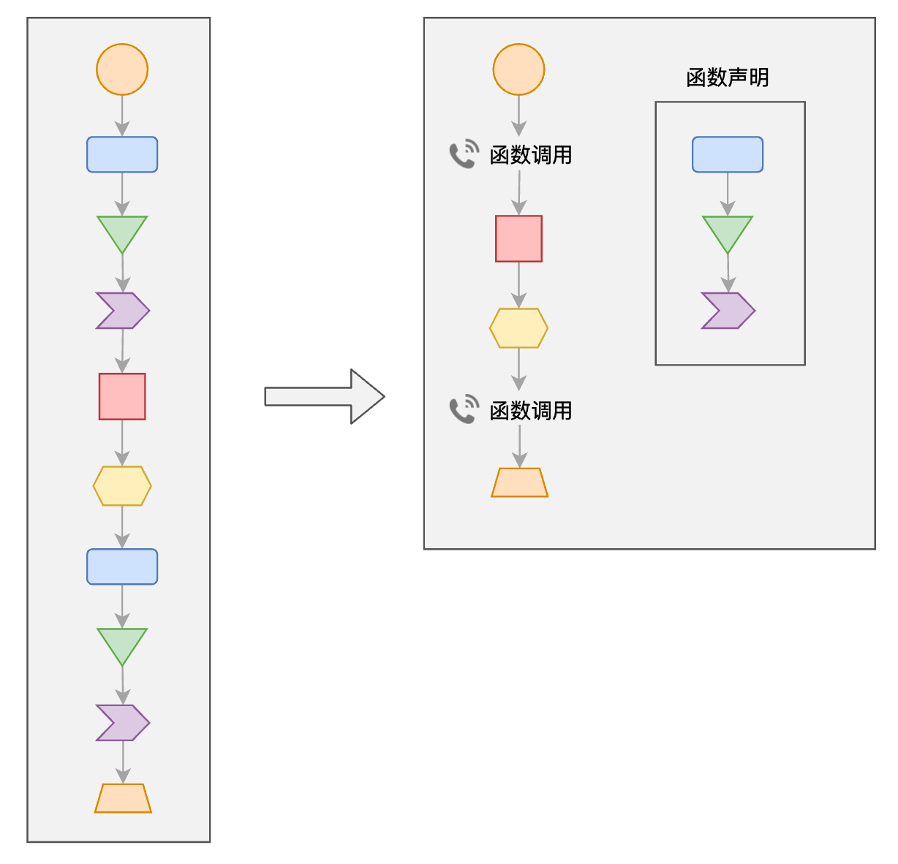
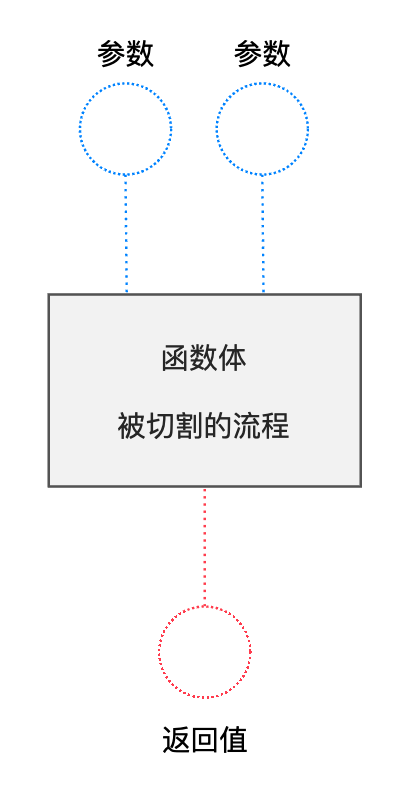

# L07：知识回顾-流程的切割

---


## 1 函数的作用

函数的本质作用在于 **切割流程**：不仅可以减少重复代码（**DIY（Don't Repeat Yourself）** 原则）、还可以有效的降低整体复杂度：




## 2 函数的常见问题

### 2.1 如何理解函数的参数、返回值、函数体？



- 参数：表示完成流程所需的 **必要信息**；
- 返回值：表示完成流程后 **产生的结果**；
- 函数体：表示具体的流程；

**函数的参数、返回值只取决于函数具备的功能，与函数体的具体实现无关**


### 2.2 为什么我觉得有了函数之后，程序反而变得更复杂了？

函数的核心作用，是为了让某一段复杂的流程变得简单。

如果在函数的帮助下，反而觉得流程变得复杂了，极有可能的原因是开发思想没有做相应的切割，导致思想负担过重。

**始终记住以下两点**：

1. 定义函数时，只需要考虑这个函数如何实现即可，**完全不需要考虑** 其他无关的东西。
2. 调用函数时，只需要考虑向其传递什么参数，如何使用它的返回结果，**完全无需考虑** 函数的具体实现。

函数具有 **三要素**：函数名、参数、返回值

只要具备三要素，就能书写函数体；只要具备三要素，就能完成函数调用。


### 2.3 学习函数时不知道该如何切割流程怎么办？

要完成一个函数声明，分为两步：

1. 设计函数

   设计函数就是 **如何切割流程**，具体来说就是设计出函数的三要素，这一步是 **最难的**，目前无须同学们掌握，老师会帮你把函数设计好。

2. 书写函数体

   根据设计的三要素完成函数体，这一步就是现阶段练习的重点。


## 3 函数练习

模块化思维训练：实现的功能就不要再反复纠结，即便有问题也不是调用该函数过程中的核心问题，要学会给自己减负 [^1]。

```js
// 完成下面的函数

/**
 * 得到某个数的阶乘
 * 如果数小于了 1，则得到 0
 * @param {number} n 要求阶乘的数
 * @return {number} 阶乘结果
 */
function factorial(n) {
    if(n < 1) {
        return 0;
    }
    var result = 1;
    for(var i = 2; i <= n; i++) {
        result *= i;
    }
    return result;
}

// 利用上面的函数，完成下面的练习题

/* 
1. 输出5的阶乘
*/
console.log(factorial(5));

/* 
2. 求5和6的阶乘之和，然后输出
*/
console.log(factorial(5) + factorial(6));

/* 
3. 输出阶乘结果不超过1000的所有数字
*/
for(var j = 0; j <= 1000; j++) {
    if(factorial(j) <= 1000) {
        console.log(j);
    } else {
        break;
    }
}
```

再看一例：

```js
// 完成下面的函数

/**
 * 在arr中寻找是否存在target
 * @param {Array} arr 要遍历寻找的数组
 * @param {any} target 要寻找的目标
 * @return {boolean} 是否找到
 */
function includes(arr, target) {
    var found = false;
    for(const val of arr) {
        if(val === target) {
            found = true;
            break;
        }
    }
    return found;
}

// 利用上面的函数，完成下面的练习题
var nums = [1, 3, 8, 2, 5, 1, 9];
/* 
1. 判断nums中是否存在8，输出是或否
*/
console.log(includes(nums, 8) ? '是' : '否');


var nums2 = [6, 3, 2, 7, 11, 33];
/* 
2. 判断数字2是否同时存在于nums和nums2中，输出是或否
*/
console.log(includes(nums, 2) && includes(nums2, 2) ? '是' : '否');


var nums3 = [2, 5, 1];
/* 
3. 思考题：判断nums3中是否所有数字都在nums中存在，输出是或否
*/

// 正向思维1（中途不退出）：
var allInNums = true;
for(var i = 0, len = nums3.length; i < len; i++) {
    allInNums = allInNums && includes(nums, nums3[i]);
    // allInNums &= includes(nums, nums3[i]);
}
console.log(allInNums ? '是' : '否');

// 正向思维2（中途退出）：
var allInNums = true;
for(var i = 0, len = nums3.length; i < len; i++) {
    if(!includes(nums, nums3[i])) {
        allInNums = false;
        break;
    }
}
console.log(allInNums ? '是' : '否');

// 逆向思维：
var notAll = false;
for(var j = 0, len = nums3.length; i < len; j++) {
    if(!includes(nums, nums3[j])) {
        notAll = true;
        break;
    }
}
console.log(notAll ? '否' : '是');
```


---

[^1]: 严格意义上讲，0 的阶乘应该为 1，负数没有阶乘的概念。


