# L08：核心概念-数据的存储和传递

---


重点：

- 值类型和引用类型。
- 学会画变量和值的引用关系图。
- 掌握关系图简写形式。


## 1 引用关系图的绘制

例一：

```js
var a = 1;
var b = {
    n1: 1
    n2: 2
}
```

变量和值的引用关系如下图所示：

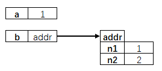


例二：

```js
var user1 = {
    name: 'monica',
    addr: {
        province: '黑龙江',
        city: '哈尔滨',
    },
    hobbies: ['音乐', '电影'],
};
```

对应的关系图：

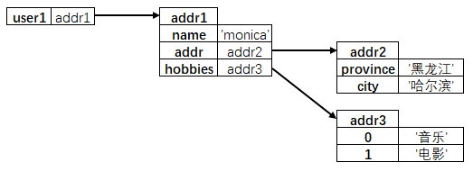


## 2 习题训练

### 2.1 交换两个变量的值

```js
/**
 * 交换两个变量的值
 * @param {*} a 变量1
 * @param {*} b 变量2
 */
function swap(a, b) {
    let temp = a;
    a = b;
    b = temp;
}

var a = 1, b = 2;

console.log(a, b); // 1 2
swap(a, b);
console.log(a, b); // 1 2
```

变量值交换失败，原因是函数内的变量值未能传播到函数外。**此题无解** [^1]。

执行到 L9 时（此时函数调用并未结束）：

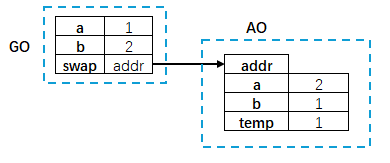

执行到 L16 时（此时函数调用结束）：

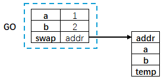

但是交换某对象中的属性值或数组索引位置上的值是可能的：

交换对象属性值：

```js
/**
 * 交换对象两个属性的值
 * @param {Object} obj 对象
 * @param {string} key1 属性名1
 * @param {string} key2 属性名2
 */
function swap(obj, key1, key2) {
    if (obj.hasOwnProperty(key1) && obj.hasOwnProperty(key2)) {
        const temp = obj[key1];
        obj[key1] = obj[key2];
        obj[key2] = temp;
        console.log(temp === 1); // true
    }
}

var obj = {
    a: 1,
    b: 2,
};
swap(obj, "a", "b");
console.log(obj); // { a: 2, b: 1 }
```

交换前：

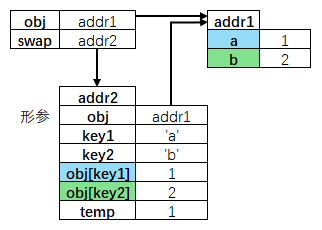

交换后：

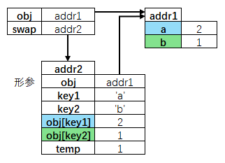

注意：`obj[key1] = obj[key2]` 表示将右侧 `obj[key2]` 引用的值（原始类型为值本身、引用类型为对象地址）复制一份作为左侧 `obj[key1]` 的值。

同理，也可以用同样的方式交换同一个数组不同索引对应的值。


### 2.2 手动实现 pick 函数

```js
/**
 * 修改对象，仅保留需要的属性
 * @param {Object} obj 要修改的对象
 * @param {Array<string>} keys 需要保留的属性名数组
 */
function pick(obj, keys) {
    const result = {};
    keys.forEach(key => {
        if (obj.hasOwnProperty(key)) {
            result[key] = obj[key];
        }
    });
    return result;
}

// 测试用例
const obj = {
    name: 'John',
    age: 30,
    city: 'New York',
    country: 'USA'
};
const pickedObj = pick(obj, ['name', 'city']);
console.log(pickedObj); // { name: 'John', city: 'New York' }
// 修改 pickedObj 的属性
pickedObj.name = 'Jane'; 
console.log(pickedObj.name !== obj.name); // true，说明 pickedObj 和 obj 是不同的对象
```

> **结论**
>
> 如果直接修改函数内的 **同名形参**，对函数外的同名变量 **没有任何影响**。


## 3 原始值和引用面试题点评

### 3.1 面试题（一）

```js
// 下面代码输出什么？
var foo = {
  n: 0,
  k: {
    n: 0,
  },
};
var bar = foo.k;
bar.n++;
bar = {
  n: 10,
};
bar = foo;
bar.n++;
bar = foo.n;
bar++;
console.log(foo.n, foo.k.n);  // 1 1
```

运行 L8 行 `var bar = foo.k` 后的引用关系图：

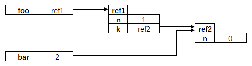

运行 L12 行 `bar = { n: 10 }` 后变为：

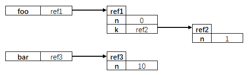

L14 运行后变为：

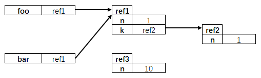

最终变为：

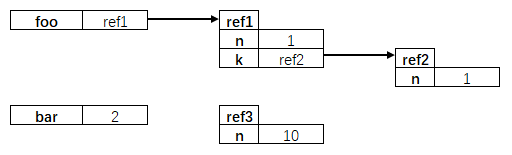


### 3.2 面试题（二）

```js
// 下面的代码输出什么（京东）？
var foo = {
  n: 1,
};

var arr = [foo];

function method1(arr) {
  var bar = arr[0];
  arr.push(bar);
  bar.n++;
  arr = [bar];
  arr.push(bar);
  arr[1].n++;
}
function method2(foo) {
  foo.n++;
}
function method3(n) {
  n++;
}
method1(arr);
method2(foo);
method3(foo.n);

console.log(foo.n, arr.length);  // 4 2
```

L22 执行后的关系图：

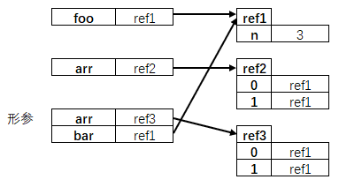

L23 执行后的关系图：

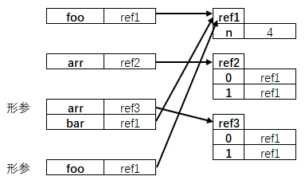

最终，L24 执行后的关系图：

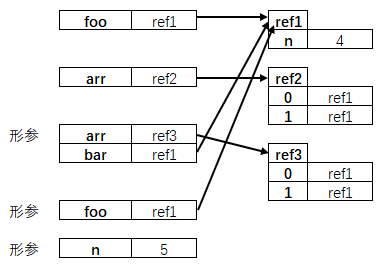

也可以用简写形式表示：

```js
// L22 结束时：
foo: ref1
arr: ref2
(已删除
  形参arr: ref2
  bar: ref1
)
----
ref1 { n: 3 }
ref2 { 0: ref1, 1: ref1 }
ref3 { 0: ref1, ref1 }
```

```js
// L23 结束时：
foo: ref1
arr: ref2
(已删除
  形参foo: ref1
)
----
ref1 { n: 4 }
ref2 { 0: ref1, 1: ref1 }
ref3 { 0: ref1, ref1 }
```

```js
// L24 结束时：
foo: ref1
arr: ref2
(已删除
  形参n: 5
)
----
ref1 { n: 4 }
ref2 { 0: ref1, 1: ref1 }
ref3 { 0: ref1, ref1 }
```


### 3.3 面试题（三）

```js
// 下面的代码输出什么（字节）？
var foo = { bar: 1 };
var arr1 = [1, 2, foo];
var arr2 = arr1.slice(1);
arr2[0]++;
arr2[1].bar++;
foo.bar++;
arr1[2].bar++;
console.log(arr1[1] === arr2[0]);  // false, i.e. 2 === 3
console.log(arr1[2] === arr2[1]);  // true, i.e. { bar: 4 }
console.log(foo.bar);  // 4
```

用简写形式分析如下：

```js
// L8 结束时：
foo: ref1
arr1: ref2
arr2: ref3

----------
ref1 { bar: 4 }
ref2 { 0: 1, 1: 2, 2: ref1 }
ref3 { 0: 3, 1: ref1 }
```


---

[^1]: 除非将交换后的结果返回到外面，让外面决定具体取值。

