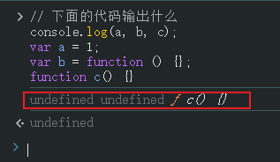

# L09：核心概念-数据的作用域

---

## 1要点归纳

1. JS 有两种作用域：**全局作用域** 和 **函数作用域**

   - 内部的作用域能访问外部，反之不行。访问时从内向外依次查找。

   - 如果在内部的作用域中访问了外部，则会产生 **闭包（Closure）**。

   - 内部作用域能访问的外部，取决于函数定义的位置，和调用无关：

     
   
2. 作用域内定义的变量、函数声明会提升到作用域顶部

 

## 2 面试题点评

### 2.1 面试题（一）

```js
// 下面的代码输出什么

console.log(a, b, c);
var a = 1;
var b = function () {};
function c() {}
// undefined  undefined  function c
```

考点：变量提升。

实测结果：




### 2.2 面试题（二）

```js
// 下面的代码输出什么

var a = 1,
  b = 2;

function m1() {
  console.log(a);
  var a = 3;
  function m2() {
    console.log(a, b);
  }
  m2();
}

m1();

// undefined
// 3 2
```


### 2.3 面试题（三）

```js
// 下面的代码输出什么？(百度)

var a = 1;

function m1() {
  a++;
}

function m2() {
  var a = 2;
  m1();
  console.log(a);
}

m2(); // 2
console.log(a); // 2
/*考点：
  执行 m2() 时，其中的 a 是定义 m2() 函数时的全局变量 a，与具体调用位置无关。*/
```

