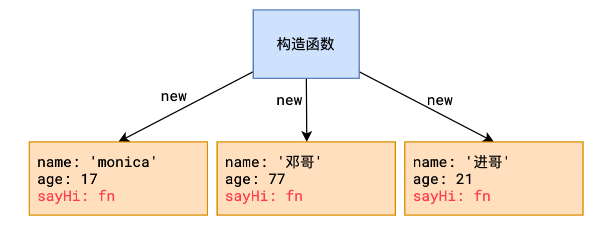
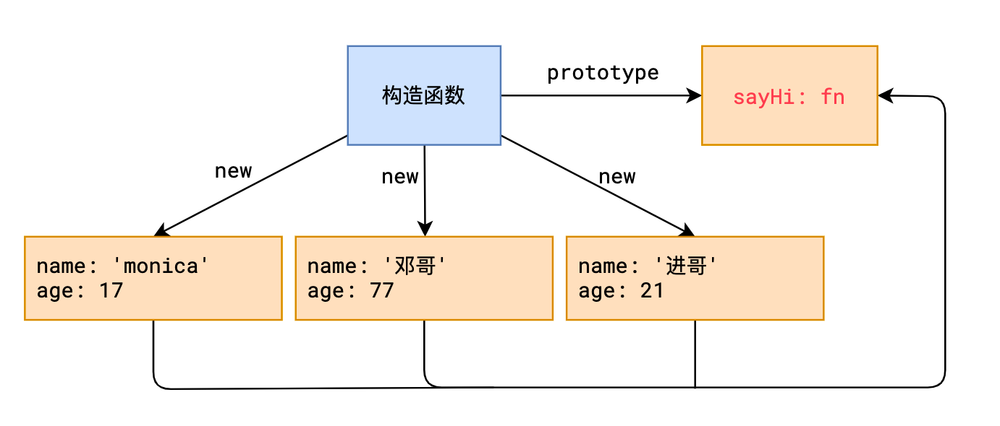

# L12：原型

---

##  1 原型要解决的问题

上图中，通过构造函数可以创建一个用户对象

这种做法有一个严重的缺陷，就是每个用户对象中都拥有一个`sayHi`方法，对于每个用户而言，`sayHi`方法是完全一样的，没必要为每个用户单独生成一个。

要解决这个问题，必须学习原型

## 2 原型是如何解决的

1. **原型**

   每个函数都会自动附带一个属性 `prototype`，这个属性的值是一个普通对象，称之为原型对象

2. **实例**

   其英文为 `instance`，通过 `new` 产生的对象称之为 **实例**。

   > 由于 `JavaScript` 中所有对象都是通过 `new` 产生的，因此，严格来说，`JavaScript` 中所有对象都称之为实例。

3. **隐式原型**

   每个实例都拥有一个特殊的属性 `__proto__`，称之为 **隐式原型**，它指向构造函数的原型

## 3 设计原型的意义

**当访问实例成员时，先找自身，如果不存在，会自动从隐式原型中寻找。**

**这样一来，我们可以把那些公共成员，放到函数的原型中，即可被所有实例共享。**

