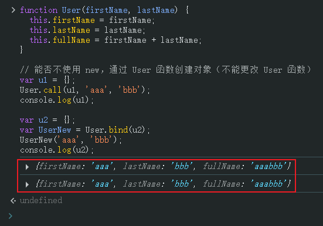

# L13：核心概念- this 的含义

---


## 1 关于 this 的指向


不同的场景，**this** 指代的含义不同，`JavaScript` 中的**this** 关键字也是如此：

- 在全局代码中使用 `this` 指代 **全局对象**；

  > 在真实的开发中，很少在全局代码使用 `this`

- **在函数中使用 this，它的指向完全取决于函数是如何被调用的**

  |     调用方式      |        示例         |  函数中的 this 指向  |
  | :---------------: | :-----------------: | :------------------: |
  | **通过 new 调用** |   `new method()`    |        新对象        |
  |   **直接调用**    |     `method()`      |       全局对象       |
  | **通过对象调用**  |   `obj.method()`    |      前面的对象      |
  |     **call**      | `method.call(ctx)`  | `call` 的第一个参数  |
  |     **apply**     | `method.apply(ctx)` | `apply` 的第一个参数 |
  


> [!tip]
>
> **DIY 补充：通过 bind(thisObj) 手动改 this 绑定**
>
> ```js
> var obj = {
>     a: 1,
>     b: 2,
>     sum: function() {
>         console.log(this.a + this.b);
>     }
> };
> 
> var sum1 = obj.sum;
> sum1(); // NaN
> var sum2 = obj.sum.bind(obj);
> sum2(); // 3
> ```


## 2 练习 this 指向

```js
// Ex1:
var person1 = {
  name: 'monica',
  age: 17,
  sayHi: function () {
    // 完成该方法，打印姓名和年龄
    console.log(this.name, this.age);
  },
};


// Ex2:
// 为所有对象添加方法 print，打印对象的键值对
Object.prototype.print = function() {
    for(var key in this) {
        if(this.hasOwnProperty(key)) {
            console.log(key, this[key]);
        }
    }
}


// Ex3:
function User(firstName, lastName) {
  this.firstName = firstName;
  this.lastName = lastName;
  this.fullName = firstName + lastName;
}

// 能否不使用 new，通过 User 函数创建对象（不能更改 User 函数）
var u1 = {};
User.call(u1, 'aaa', 'bbb');
console.log(u1);

var u2 = {};
var UserNew = User.bind(u2);
UserNew('aaa', 'bbb');
console.log(u2);
```

`Ex3` 实测结果：



