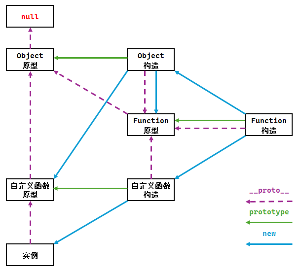

# L14：核心概念-原型链

---


## 1 何为原型链

**所有的对象都是通过 `new 函数` 的方式创建的**：

```js
var u1 = new User('邓', '旭明'); // 对象 u1 通过 new User 创建
var u2 = { // 对象 u2 通过 new Object 创建
  firstName: '莫',
  lastName: '妮卡'
}
// 等效于
var u2 = new Object(); 
u2.firstName = '莫';
u2.lastName = '妮卡';
```

上面的代码形成的原型图如下：


原型对象本身也是一个对象，默认情况下，是通过 `new Object` 创建的，因此，上面的两幅原型图是可以发生关联的：


> `Object.prototype.__proto__` 比较特殊，它固定指向 `null`

可以看出，`u1` 的隐式原型形成了一个链条，称之为 **原型链**

当读取对象成员时，会先看对象自身是否有该成员，如果没有，就依次在其原型链上查找。


## 2 完整的链条


要求：必须能默写出来。


## 3 原型链对开发的影响

### 3.1 在原型上更改会产生多大影响

更改构造函数的原型会对所有原型链上有该构造函数的原型的对象产生影响


### 3.2 学会利用原型链判断类型

1. `instanceof` 关键字【常用】

   ```js
   object instanceof constructor
   // 判断 object 的原型链中，是否存在 constructor 的原型
   // instanceof 读作“是不是”即可
   ```

2. `Object.getPrototypeOf()`【不常用】

   ```js
   Object.getPrototypeOf(object);
   // 返回 object 的隐式原型
   // 相当于 object.__proto__ (getter)
   ```


### 3.3 学会创建空原型的对象

1. 利用 `Object.create()`

   ```js
   Object.create(target);
   // 返回一个新对象，新对象以 target 作为隐式原型
   ```

2. 利用 `Object.setPrototypeOf()`

   ```js
   Object.setPrototypeOf(obj, prototype);
   // 设置 obj 的隐式原型为 prototype
   ```


## 4 原型链习题训练

```js
// Ex1:
// toString 方法属于 Object.prototype，它会把对象转换为字符串的形式 [object Object]。但这种格式并非每个对象想要的。
// 1. 解释数组的 toString 为什么能得到不同的格式
// 2. 如果自己的构造函数希望改变toString，如何改变
function MyConstructor (... args) {
    // ...
}
Object.prototype.toString.call(MyConstructor, ... args);

// Ex2:
// 真数组:
var arr1 = [1, 2, 3, 4];
// 类数组(伪数组):
var arr2 = {
  0: 1,
  1: 2,
  2: 3,
  3: 4,
  length: 4,
};

// 判断arr1和arr2是否是真数组
console.log(arr1 instanceof Array); // true
console.log(arr2 instanceof Array); // false
```


## 5 面试题讲解

```js
// Q1: 下面的代码输出什么？（结合原型链完整图示）
function User() {}
User.prototype.sayHello = function () {};

var u1 = new User();
var u2 = new User();

console.log(u1.sayHello === u2.sayHello); // true
console.log(User.prototype === Function.prototype); // false
console.log(User.__proto__ === Function.prototype); // true
console.log(User.__proto__ === Function.__proto__); // true
console.log(u1.__proto__ === u2.__proto__); // true
console.log(u1.__proto__ === User.__proto__); // false
console.log(Function.__proto__ === Object.__proto__); // true
console.log(Function.prototype.__proto__ === Object.prototype.__proto__); // false
console.log(Function.prototype.__proto__ === Object.prototype); // true


// Q2: 下面的代码输出什么？（字节）
console.log({} instanceof Object); // true
console.log({}.toString instanceof Function); // true
console.log(Object instanceof Function); // true
console.log(Function instanceof Object); // true


// Q3: 下面的代码输出什么？（京东）
Function.prototype.a = 1;
Object.prototype.b = 2;

function A() {}

var a = new A();

console.log(a.a, a.b);  // undefined 2
console.log(A.a, A.b);  // 1 2
```


> [!tip]
>
> **小结**
>
> 本章重点：默写完整版原型链图。
>
> 自行梳理的完整原型链图（基于 `Excel`）：
>
> 

