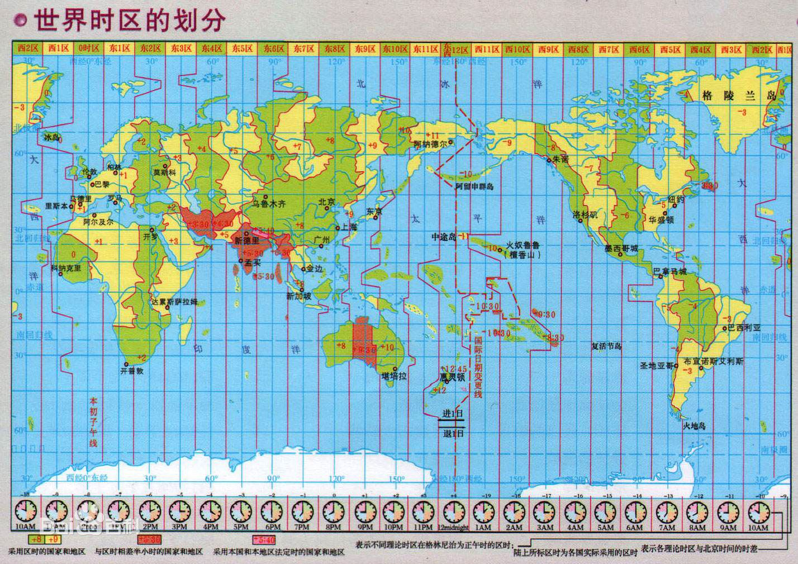

# L18：JS 标准库：Date 日期

---


## 1 Date

### 时间基础知识

#### 单位

| 单位               | 名称 | 换算                  |
| ------------------ | ---- | --------------------- |
| hour               | 小时 | 1 day = 24 hours      |
| minute             | 分钟 | 1 hour = 60 minutes   |
| second             | 秒   | 1 minute = 60 seconds |
| millisecond （ms） | 毫秒 | 1 second = 1000 ms    |
| microsecond （μs） | 微秒 | 1 ms = 1000 μs        |
| nanosecond （ns）  | 纳秒 | 1 ms = 1000 ns        |

#### GMT 和 UTC

世界划分为 24 个时区，北京在东 8 区，格林威治在 0 时区。



**GMT**：Greenwish Mean Time 格林威治世界时。太阳时，精确到毫秒。

**UTC**：Universal Time Coodinated 世界协调时。以原子时间为计时标准，精确到纳秒。

> 国际标准中，已全面使用 UTC 时间，而不再使用 GMT 时间

GMT 和 UTC 时间在文本表示格式上是一致的，均为 `星期缩写, 日期 月份 年份 时间 GMT`，例如：

```
Thu, 27 Aug 2020 08:01:44 GMT
```

另外，ISO 8601标准规定，建议使用以下方式表示时间：

```
YYYY-MM-DDTHH:mm:ss.msZ
例如：
2020-08-27T08:01:44.000Z
```

**GMT、UTC、ISO 8601都表示的是零时区的时间**

#### Unix 时间戳

> Unix 时间戳（Unix Timestamp）是Unix系统最早提出的概念

它将UTC时间1970年1月1日凌晨作为起始时间，到指定时间经过的秒数（毫秒数）

#### 程序中的时间处理

**程序对时间的计算、存储务必使用UTC时间，或者时间戳**

**在和用户交互时，将UTC时间或时间戳转换为更加友好的文本**


思考下面的问题：

1. 用户的生日是本地时间还是 UTC 时间？（本地）
2. 如果要比较两个日期的大小，是比较本地时间还是比较 UTC 时间？（UTC）
3. 如果要显示文章的发布日期，是显示本地时间还是显示 UTC 时间？（本地）
4. `北京时间2020-8-28 10:00:00` 和 `格林威治2020-8-28 02:00:00`，两个时间哪个大，哪个小？（一样）
5. `北京的时间戳为0` 和 `格林威治的时间戳为0`，它们的时间一样吗？（一样）
6. 一个中国用户注册时填写的生日是 `1970-1-1`，它出生的 UTC 时间是多少？时间戳是多少？（`Wed, 31 Dec 1969 16:00:00 GMT`，`-28800000`）

```js
var birthday = new Date('1970-1-1');
var utc = birthday.toUTCString();  // Wed, 31 Dec 1969 16:00:00 GMT
var ts = birthday.getTime();  // -28800000
```


### 日期 API

https://developer.mozilla.org/zh-CN/docs/Web/JavaScript/Reference/Global_Objects/Date

构造函数：

```js
new Date(); // 得到一个当前日期对象
new Date(value); // 根据时间戳得到一个日期对象
new Date(dateString); // 根据一个标准日期字符串得到一个日期对象
new Date(year, monthIndex [, day [, hours [, minutes [, seconds [, milliseconds]]]]]); // 根据年、月、日、小时、分钟、秒、毫秒得到一个日期对象
```

| API                                                          | 含义                   | 备注                     |
| ------------------------------------------------------------ | ---------------------- | ------------------------ |
| [Date.now()](https://developer.mozilla.org/zh-CN/docs/Web/JavaScript/Reference/Global_Objects/Date/now) | 得到当前时间戳         | 无参，单位：`ms`         |
| [Date.prototype.getFullYear()](https://developer.mozilla.org/zh-CN/docs/Web/JavaScript/Reference/Global_Objects/Date/getFullYear) | 得到年                 | 无参；本地时间；         |
| [Date.prototype.getMonth()](https://developer.mozilla.org/zh-CN/docs/Web/JavaScript/Reference/Global_Objects/Date/getMonth) | 得到月                 | 无参；本地时间；范围0-11 |
| [Date.prototype.getDate()](https://developer.mozilla.org/zh-CN/docs/Web/JavaScript/Reference/Global_Objects/Date/getDate) | 得到日                 | 无参；本地时间；         |
| [Date.prototype.getHours()](https://developer.mozilla.org/zh-CN/docs/Web/JavaScript/Reference/Global_Objects/Date/getHours) | 得到小时               | 无参；本地时间；         |
| [Date.prototype.getMinutes()](https://developer.mozilla.org/zh-CN/docs/Web/JavaScript/Reference/Global_Objects/Date/getMinutes) | 得到分钟               | 无参；本地时间；         |
| [Date.prototype.getSeconds()](https://developer.mozilla.org/zh-CN/docs/Web/JavaScript/Reference/Global_Objects/Date/getSeconds) | 得到秒                 | 无参；本地时间；         |
| [Date.prototype.getMilliseconds()](https://developer.mozilla.org/zh-CN/docs/Web/JavaScript/Reference/Global_Objects/Date/getMilliseconds) | 得到毫秒               | 无参；本地时间；         |
| [Date.prototype.toLocaleString()](https://developer.mozilla.org/zh-CN/docs/Web/JavaScript/Reference/Global_Objects/Date/toLocaleString) | 得到日期本地的表示方式 |                          |


## 2 练习

```js
/**
 * 将日期格式化为字符串
 * @param {Date} date 要格式化的日期对象
 * @param {string} format 格式化字符串 yyyy-年  MM-月  dd-日 HH-小时 mm-分钟 ss-秒 ms-毫秒
 * @return {string} 日期字符串
 */
function formatDate(date, format) {
    const fmt = (n = 2) => value => `${value}`.padStart(n, '0');
    const fmtYr = fmt(4);
    const fmtDt = fmt(2);
    var year = fmtYr(date.getFullYear());
    var month = fmtDt(date.getMonth() + 1);
    var day = fmtDt(date.getDate());

    var hour = fmtDt(date.getHours());
    var minute = fmtDt(date.getMinutes());
    var second = fmtDt(date.getSeconds());
    var millisecond = fmt(3)(date.getMilliseconds());

    return format
        .replace('yyyy', year)
        .replace('MM', month)
        .replace('dd', day)
        .replace('HH', hour)
        .replace('mm', minute)
        .replace('ss', second)
        .replace('SSS', millisecond);
}

var d = new Date();
console.log(formatDate(d, 'yyyy年MM月dd日 HH时mm分ss秒SSS毫秒'));
```


