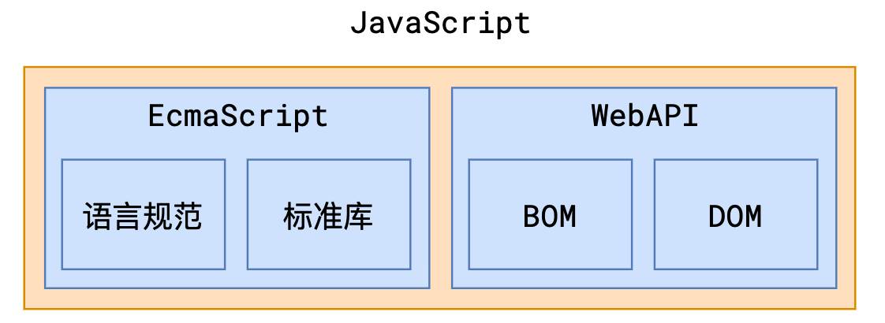

# L20：WebAPI-BOM

---

和标准库不同，WebAPI 是 **浏览器** 提供的一套 API，用于操作浏览器窗口和界面。

WebAPI 中包含两个部分：

- `BOM`：Browser Object Model，浏览器模型，提供和浏览器相关的操作
- `DOM`：Document Object Model，文档模型，提供和页面相关的操作




## 1 BOM

`BOM` 提供了一系列的对象和函数，提供和浏览器本身相关的操作

### window

全局对象

https://developer.mozilla.org/zh-CN/docs/Web/API/Window/window

| API                                                          | 含义                                             | 备注                                                         |
| ------------------------------------------------------------ | ------------------------------------------------ | ------------------------------------------------------------ |
| [`open()`](https://developer.mozilla.org/zh-CN/docs/Web/API/Window/open) | 打开一个新的浏览器窗口                           | 返回新窗口的 window 对象                                     |
| [`close()`](https://developer.mozilla.org/zh-CN/docs/Web/API/Window/close) | 关闭浏览器窗口                                   | 只能关闭使用 open 打开的浏览器窗口                           |
| [==setTimeout()==](https://developer.mozilla.org/en-US/docs/Web/API/Window/setTimeout) | 设置一个计时器<br />在一段时间后自动执行某个函数 | 参数 1：函数，无参，this 指向 window<br />参数 2：时间，毫秒<br />返回：计时器的 ID |
| [==clearTimeout()==](https://developer.mozilla.org/zh-CN/docs/Web/API/Window/clearTimeout) | 清除指定 ID 的计时器                             | 传入计时器的 ID                                              |
| [==setInterval()==](https://developer.mozilla.org/zh-CN/docs/Web/API/Window/setInterval) | 设置一个计时器<br />每隔一段时间自动执行某个函数 | 参数 1：函数，无参，this 指向 window<br />参数 2：时间，毫秒<br />返回：计时器的 ID |
| [==clearInterval()==](https://developer.mozilla.org/zh-CN/docs/Web/API/Window/clearInterval "click to MDN doc") | 清除指定 ID 的计时器                             | 传入计时器的 ID                                              |
| [`alert()`](https://developer.mozilla.org/zh-CN/docs/Web/API/Window/alert) | 弹出提示框                                       | 不同的操作系统外观有差异                                     |
| [`confirm()`](https://developer.mozilla.org/zh-CN/docs/Web/API/Window/confirm) | 弹出确认框                                       | 不同的操作系统外观有差异                                     |

> [!tip]
>
> **关于启用/暂停计时的实现**
>
> `start` 与 `end` 需同时控制全局变量 `timerId`：
>
> ```js
> // 实现一
> var timerId;
> // 开始
> function start() {
>   if (timerId) {
>     // 当前已经有计时器了
>     return;
>   }
>   timerId = setInterval(function () {
>     console.clear();
>     console.log(new Date().toLocaleString());
>   }, 1000);
> }
> // 停止
> function stop() {
>   clearInterval(timerId);
>   timerId = null;
> }
> ```
>
> 另外，也可以通过 `IIFE` + 闭包实现对 `timerId` 的隐藏：
>
> ```js
> const {start, end} = (function(itvl){
>     let timer;
>     function start() {
>         if(timer) return;
>         timer = setInterval(function() {
>             console.clear();
>             console.log(new Date().toLocaleTimeString());
>         }, itvl);
>     }
>     function end() {
>         if(timer) {
>             clearTimeout(timer);
>             timer = null;
>         }
>     }
>     return {
>         start,
>         end
>     };
> }(1000));
> ```


### window.location

https://developer.mozilla.org/zh-CN/docs/Web/API/Location

提供地址栏的相关操作

| API                                                          | 含义                             | 备注                   |
| ------------------------------------------------------------ | -------------------------------- | ---------------------- |
| [Location.href](https://developer.mozilla.org/zh-CN/docs/Web/API/Location/href) | 获取或设置页面当前地址           | 设置地址回导致页面跳转 |
| [`Location.protocol`](https://developer.mozilla.org/en-US/docs/Web/API/Location/protocol) | 获取或设置地址中的协议部分       |                        |
| [`Location.host`](https://developer.mozilla.org/zh-CN/docs/Web/API/Location/host) | 获取或设置地址中的主机名和端口号 |                        |
| [`Location.hostname`](https://developer.mozilla.org/zh-CN/docs/Web/API/Location/hostname) | 获取或设置地址中的主机名         |                        |
| [`Location.port` ](https://developer.mozilla.org/en-US/docs/Web/API/Location/port) | 获取或设置地址中的端口号         |                        |
| [`Location.pathname` ](https://developer.mozilla.org/en-US/docs/Web/API/Location/pathname) | 获取或设置地址中的路径部分       |                        |
| [`Location.search`](https://developer.mozilla.org/zh-CN/docs/Web/API/Location/search) | 获取或设置地址中的参数部分       |                        |
| [`Location.hash`](https://developer.mozilla.org/zh-CN/docs/Web/API/Location/hash) | 获取或设置地址中的 hash 部分     |                        |
| [`Location.reload()`](https://developer.mozilla.org/zh-CN/docs/Web/API/Location/reload) | 刷新页面                         |                        |

### window.history

https://developer.mozilla.org/zh-CN/docs/Web/API/History

提供当前窗口历史记录的操作

| API                                                                                               | 含义                                             | 备注       |
| ------------------------------------------------------------------------------------------------- | ------------------------------------------------ | ---------- |
| [`History.back()`](https://developer.mozilla.org/zh-CN/docs/Web/API/History/back)                 | 后退                                             |            |
| [`History.forward()`](https://developer.mozilla.org/zh-CN/docs/Web/API/History/forward)           | 前进                                             |            |
| [`History.go()`](https://developer.mozilla.org/zh-CN/docs/Web/API/History/go)                     | 根据相对当前页面的偏移量，<br />进入指定的记录页 |            |
| [`History.pushState()`](https://developer.mozilla.org/zh-CN/docs/Web/API/History/pushState)       | 在历史记录中添加一条记录                         | 页面不刷新 |
| [`History.replaceState()`](https://developer.mozilla.org/zh-CN/docs/Web/API/History/replaceState) | 替换当前记录                                     | 页面不刷新 |


