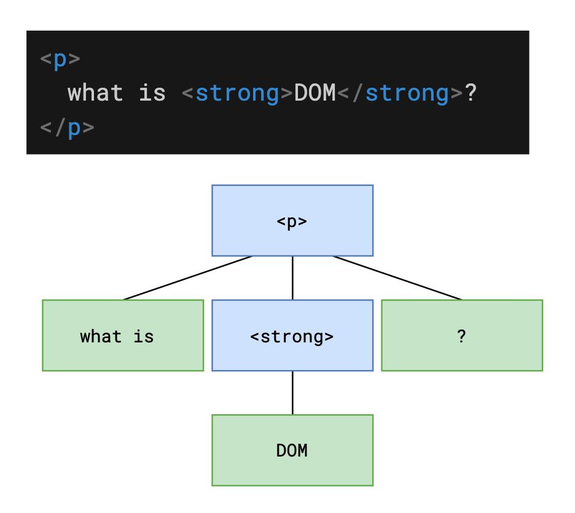

# L20：WebAPI-BOM

---

和标准库不同，WebAPI 是 **浏览器** 提供的一套 API，用于操作浏览器窗口和界面。

WebAPI 中包含两个部分：

- `BOM`：Browser Object Model，浏览器模型，提供和浏览器相关的操作
- `DOM`：Document Object Model，文档模型，提供和页面相关的操作


## 1 BOM

`BOM` 提供了一系列的对象和函数，提供和浏览器本身相关的操作

### window

全局对象

https://developer.mozilla.org/zh-CN/docs/Web/API/Window/window

| API                                                          | 含义                                             | 备注                                                         |
| ------------------------------------------------------------ | ------------------------------------------------ | ------------------------------------------------------------ |
| [`open()`](https://developer.mozilla.org/zh-CN/docs/Web/API/Window/open) | 打开一个新的浏览器窗口                           | 返回新窗口的 window 对象                                     |
| [`close()`](https://developer.mozilla.org/zh-CN/docs/Web/API/Window/close) | 关闭浏览器窗口                                   | 只能关闭使用 open 打开的浏览器窗口                           |
| [==setTimeout()==](https://developer.mozilla.org/en-US/docs/Web/API/Window/setTimeout) | 设置一个计时器<br />在一段时间后自动执行某个函数 | 参数 1：函数，无参，this 指向 window<br />参数 2：时间，毫秒<br />返回：计时器的 ID |
| [==clearTimeout()==](https://developer.mozilla.org/zh-CN/docs/Web/API/Window/clearTimeout) | 清除指定 ID 的计时器                             | 传入计时器的 ID                                              |
| [==setInterval()==](https://developer.mozilla.org/zh-CN/docs/Web/API/Window/setInterval) | 设置一个计时器<br />每隔一段时间自动执行某个函数 | 参数 1：函数，无参，this 指向 window<br />参数 2：时间，毫秒<br />返回：计时器的 ID |
| [==clearInterval()==](https://developer.mozilla.org/zh-CN/docs/Web/API/Window/clearInterval "click to MDN doc") | 清除指定 ID 的计时器                             | 传入计时器的 ID                                              |
| [`alert()`](https://developer.mozilla.org/zh-CN/docs/Web/API/Window/alert) | 弹出提示框                                       | 不同的操作系统外观有差异                                     |
| [`confirm()`](https://developer.mozilla.org/zh-CN/docs/Web/API/Window/confirm) | 弹出确认框                                       | 不同的操作系统外观有差异                                     |

> [!tip]
>
> **关于启用/暂停计时的实现**
>
> `start` 与 `end` 需同时控制全局变量 `timerId`：
>
> ```js
> // 实现一
> var timerId;
> // 开始
> function start() {
>   if (timerId) {
>     // 当前已经有计时器了
>     return;
>   }
>   timerId = setInterval(function () {
>     console.clear();
>     console.log(new Date().toLocaleString());
>   }, 1000);
> }
> // 停止
> function stop() {
>   clearInterval(timerId);
>   timerId = null;
> }
> ```
>
> 另外，也可以通过 `IIFE` + 闭包实现对 `timerId` 的隐藏：
>
> ```js
> const {start, end} = (function(itvl){
>     let timer;
>     function start() {
>         if(timer) return;
>         timer = setInterval(function() {
>             console.clear();
>             console.log(new Date().toLocaleTimeString());
>         }, itvl);
>     }
>     function end() {
>         if(timer) {
>             clearTimeout(timer);
>             timer = null;
>         }
>     }
>     return {
>         start,
>         end
>     };
> }(1000));
> ```


### window.location

https://developer.mozilla.org/zh-CN/docs/Web/API/Location

提供地址栏的相关操作

| API                                                          | 含义                             | 备注                   |
| ------------------------------------------------------------ | -------------------------------- | ---------------------- |
| [Location.href](https://developer.mozilla.org/zh-CN/docs/Web/API/Location/href) | 获取或设置页面当前地址           | 设置地址回导致页面跳转 |
| [`Location.protocol`](https://developer.mozilla.org/en-US/docs/Web/API/Location/protocol) | 获取或设置地址中的协议部分       |                        |
| [`Location.host`](https://developer.mozilla.org/zh-CN/docs/Web/API/Location/host) | 获取或设置地址中的主机名和端口号 |                        |
| [`Location.hostname`](https://developer.mozilla.org/zh-CN/docs/Web/API/Location/hostname) | 获取或设置地址中的主机名         |                        |
| [`Location.port` ](https://developer.mozilla.org/en-US/docs/Web/API/Location/port) | 获取或设置地址中的端口号         |                        |
| [`Location.pathname` ](https://developer.mozilla.org/en-US/docs/Web/API/Location/pathname) | 获取或设置地址中的路径部分       |                        |
| [`Location.search`](https://developer.mozilla.org/zh-CN/docs/Web/API/Location/search) | 获取或设置地址中的参数部分       |                        |
| [`Location.hash`](https://developer.mozilla.org/zh-CN/docs/Web/API/Location/hash) | 获取或设置地址中的 hash 部分     |                        |
| [`Location.reload()`](https://developer.mozilla.org/zh-CN/docs/Web/API/Location/reload) | 刷新页面                         |                        |

### window.history

https://developer.mozilla.org/zh-CN/docs/Web/API/History

提供当前窗口历史记录的操作

| API                                                                                               | 含义                                             | 备注       |
| ------------------------------------------------------------------------------------------------- | ------------------------------------------------ | ---------- |
| [`History.back()`](https://developer.mozilla.org/zh-CN/docs/Web/API/History/back)                 | 后退                                             |            |
| [`History.forward()`](https://developer.mozilla.org/zh-CN/docs/Web/API/History/forward)           | 前进                                             |            |
| [`History.go()`](https://developer.mozilla.org/zh-CN/docs/Web/API/History/go)                     | 根据相对当前页面的偏移量，<br />进入指定的记录页 |            |
| [`History.pushState()`](https://developer.mozilla.org/zh-CN/docs/Web/API/History/pushState)       | 在历史记录中添加一条记录                         | 页面不刷新 |
| [`History.replaceState()`](https://developer.mozilla.org/zh-CN/docs/Web/API/History/replaceState) | 替换当前记录                                     | 页面不刷新 |


## 2 DOM

`DOM` 是一个对象，它对应到 `HTML` 中的节点



### 获取 dom

| API                                                                 | 含义                    | 备注                                                                                                   |
| ------------------------------------------------------------------- | ----------------------- | ------------------------------------------------------------------------------------------------------ |
| document.getElementById()                                           | 根据元素 id 获取 dom    | 得到单个 dom                                                                                           |
| document.getElementsByTagName()<br />dom.getElementsByTagName()     | 根据元素名称获取 dom    | 得到 dom 的伪数组                                                                                      |
| document.getElementsByClassName()<br />dom.getElementsByClassName() | 根据元素类样式获取 dom  | 得到 dom 的伪数组                                                                                      |
| ==document.querySelector()==<br />==dom.querySelector()==           | 根据 CSS 选择器获取 dom | 得到第一个匹配的 dom                                                                                   |
| ==document.querySelectorAll()==<br />==dom.querySelectorAll()==     | 根据 CSS 选择器获取 dom | 得到所有匹配的 dom<br />伪数组                                                                         |
| ==document.documentElement==                                        | 获取 html 元素          |                                                                                                        |
| document.body                                                       | 获取 body               |                                                                                                        |
| document.head                                                       | 获取 head               |                                                                                                        |
| ==dom.children==                                                    | 获取 dom 的子元素       | 得到 dom 的伪数组                                                                                      |
| dom.childNodes                                                      | 获取 dom 的子节点       | 得到 dom 节点的伪数组<br />关于节点对象点[这里](https://developer.mozilla.org/zh-CN/docs/Web/API/Node) |
| dom.previousElementSibling                                          | 得到 dom 前一个兄弟元素 |                                                                                                        |
| dom.nextElementSibling                                              | 得到 dom 后一个兄弟元素 |                                                                                                        |
| ==dom.parentElement==                                               | 得到 dom 的父元素       |                                                                                                        |

### 创建 dom

| API                          | 含义                | 备注         |
| ---------------------------- | ------------------- | ------------ |
| ==document.createElement()== | 创建一个 dom 并返回 | 传入元素名称 |

### 更改 dom 结构

这里是指更改文档树（DOM 树）

| API                                                                                        | 含义                                              | 备注          |
| ------------------------------------------------------------------------------------------ | ------------------------------------------------- | ------------- |
| ==dom.remove()==                                                                           | 从文档树中删除 dom                                | 不是删除对象  |
| dom.removeChild()                                                                          | 删除 dom 的某个子节点                             | 传入 dom 对象 |
| [`dom.insertBefore()`](https://developer.mozilla.org/zh-CN/docs/Web/API/Node/insertBefore) | 在 dom 的子节点中，添加一个新节点到另一个节点之前 |               |
| ==dom.appendChild()==                                                                      | 添加一个新节点到 dom 的子节点末尾                 | 传入 dom 对象 |

### dom 属性

本节的「属性」，是指 HTML 元素的「属性」

属性有两种：

- 标准属性：HTML 元素本身拥有的属性，例如：
  - a 元素的 href、title
  - input 的 value
  - img 的 src
  - ......
- 自定义属性：HTML 元素标准中未定义的属性

**所有标准属性均可通过 `dom.属性名` 得到，其中：**

- 布尔属性会被自动转换为 boolean

- 路径类的属性会被转换为绝对路径

- 标准属性始终都是存在的，不管你是否有在元素中属性该属性

- class 由于和关键字重名，因此需要使用 className

**所有的自定义属性均可通过下面的方式操作：**

- `dom.setAttribute(name, value)`，设置属性键值对
- `dom.getAttribute(name)`，获取属性值

自定义属性和元素源码书写是对应的，可以尝试获取 a 元素的 href 属性对比标准属性，看看有什么不同。

### dom 内容

| API               | 含义                       | 备注                           |
| ----------------- | -------------------------- | ------------------------------ |
| ==dom.innerText== | 获取或设置元素文本内容     | 设置时会自动进行 HTML 实体编码 |
| ==dom.innerHTML== | 获取或设置元素的 HTML 内容 |                                |

### dom 样式

在 JS 中，有两种样式：

- 内联样式：元素的 style 属性中书写的样式
- 计算样式（最终样式）：元素最终计算出来的样式

**JS 可以获取内联样式和计算样式，但只能设置内联样式**

下面罗列了样式的常见操作：

- `dom.style`：获取元素的内联样式，得到样式对象
  - 对象中的所有样式属性均可以被赋值，赋值后即可应用样式到元素的 style 中
- `getComputedStyle(dom)`：获取元素的计算样式，得到一个样式对象
  - 该样式对象中的属性是只读的，无法被重新赋值

关于**样式对象**，注意：

- 当给样式赋值为空字符串时，相当于删除内联样式
- 当给样式的赋值不合法时，赋值语句无效，不会报错
- CSS 的短横线命名法，在属性名中表现为驼峰命名法


