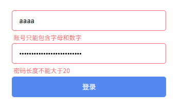
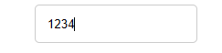

# L23：WebAPI-事件默认行为

---

## dom 进阶

### 1 事件默认行为

某些元素的某些事件，浏览器会有自己的默认行为

比如：

- `a` 元素的 `click` 事件，浏览器会跳转页面
- `form` 元素的 `submit` 事件，浏览器会提交表单，最终导致页面刷新
- 文本框的 `keydown` 事件，浏览器会将按键文本显示到文本框中
- ......

如果我们要阻止浏览器的默认行为，就需要在对应时间中加入以下代码：

```js
// e为事件对象
e.preventDefault();
```


### 2 习题训练

#### 2.1 表单验证

几种元素隐藏效果的区别和联系：

|       样式声明       |    生成 DOM 盒     |    占用页面空间    |     可注册事件     |
| :------------------: | :----------------: | :----------------: | :----------------: |
|   `display: none`    |        :x:         |        :x:         |        :x:         |
| `visibility: hidden` | :heavy_check_mark: | :heavy_check_mark: |        :x:         |
|     `opacity: 0`     | :heavy_check_mark: | :heavy_check_mark: | :heavy_check_mark: |

实测效果图：



校验 JS：

```js
// 完成表单验证
function validateForm() {
    const r1 = validateId();
    const r2 = validatePwd();
    return r1 && r2;
}

function validateId() {
    const field1 = document.getElementById("field1"),
        input = field1.querySelector("input"),
        msg = field1.querySelector(".msg");

    let errMsg = '';
    if (input.value === "") {
        errMsg = "账号不能为空";
    } else if (input.value.length < 6) {
        errMsg = "账号长度不能小于6";
    } else if (input.value.length > 20) {
        errMsg = "账号长度不能大于20";
    } else if (!/^[a-zA-Z0-9]+$/.test(input.value)) {
        errMsg = "账号只能包含字母和数字";
    }

    renderErr(errMsg, msg, field1);

    return !errMsg;
}

function validatePwd() {
    const field2 = document.getElementById("field2"),
        input = field2.querySelector("input"),
        msg = field2.querySelector(".msg");

    let errMsg = '';
    if (input.value === "") {
        errMsg = "密码不能为空";
    } else if (input.value.length < 6) {
        errMsg = "密码长度不能小于6";
    } else if (input.value.length > 20) {
        errMsg = "密码长度不能大于20";
    }
    
    renderErr(errMsg, msg, field2);

    return !errMsg;
}

function renderErr(errMsg, msg, field2) {
    if (errMsg) {
        msg.innerText = errMsg;
        field2.classList.add('err');
    } else {
        msg.innerText = '';
        field2.classList.remove('err');
    }
}


const username = document.querySelector('#field1 input'),
    password = document.querySelector('#field2 input'),
    form = document.querySelector('form');

form.addEventListener('submit', (e) => {
    const pass = validateForm();
    if (!pass) {
        e.preventDefault();
    } else {
        alert('登录成功');
    }
});
username.addEventListener('change', validateId);
password.addEventListener('change', validatePwd);
```


#### 2.2 文本框只能输入数字

```js
// <input type="text" placeholder="请输入商品价格" />
// 上面的文本框只能输入数字
const input = document.querySelector("input");
input.addEventListener("input", e => 
    // 只允许输入数字
    e.target.value = e.target.value.replace(/[^0-9]/g, ''));
```

实测效果：


