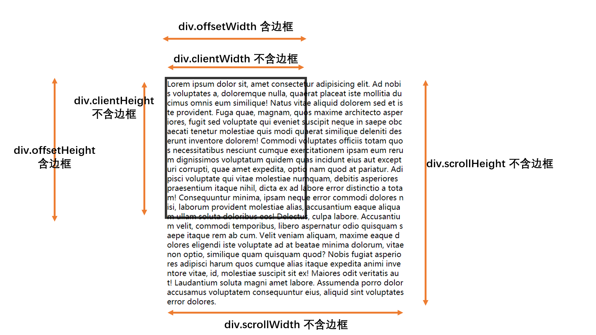

# L24：WebAPI-DOM 尺寸和位置

---

## dom 进阶

### dom 尺寸和位置





> 调用 `dom.scrollTo(x, y)` 可以设置元素的滚动位置，`x` 和 `y` 分别表示 `scrollLeft` 和 `scrollTop`
>
> 该方法通用元素回到元素顶部 `dom.scrollTo(0, 0)`
>
> 如果要监听元素的滚动，可以监听事件类型：==scroll==

[Element.getBoundingClientRect()](https://developer.mozilla.org/zh-CN/docs/Web/API/Element/getBoundingClientRect)


> 上图中的 `top`、`left`、`right`、`bottom` 均相对于视口

### 事件传播机制


```js
// 在冒泡阶段触发
div.onclick = function () {};

// 在捕获阶段触发事件
div.addEventListener('click', function () {}, true);

// 在冒泡阶段触发事件（默认）
div.addEventListener('click', function () {}, false);
```

```js
// 事件处理函数
function handler(e) {
  e.target; // 获取事件源（目标阶段的dom）
  e.stopPropagation(); // 阻止事件继续冒泡
}
```
