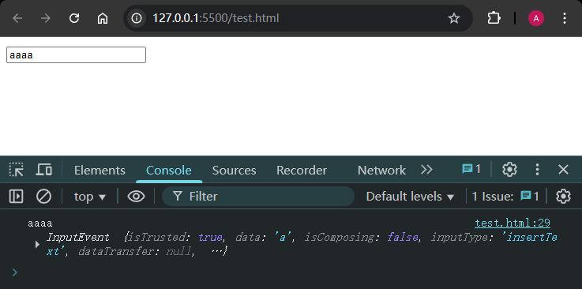

# L28：JS 函数防抖

---

ES5 版：

```js
// <input type="text" >
const input = document.querySelector('input[type="text"]');
const debounce = function(fn, duration) {
    var timerId = null;
    return function() {
        if(timerId) {
            clearTimeout(timerId);
        }
        var that = this;
        var args = Array.prototype.slice.call(arguments, 0);
        timerId = setTimeout(function() {
            fn.apply(that, args);
        }, duration);
    }
};

const inputHandler = debounce(function(e){
    console.log(this.value, e);
}, 1000);
input.addEventListener('input', inputHandler);
```

实测效果：



