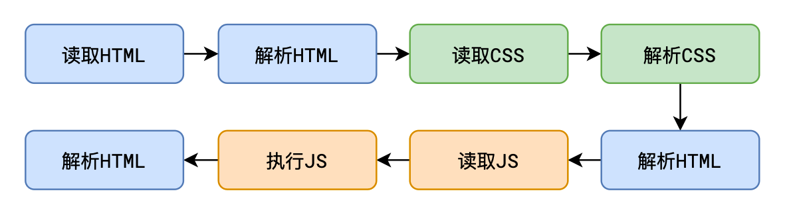
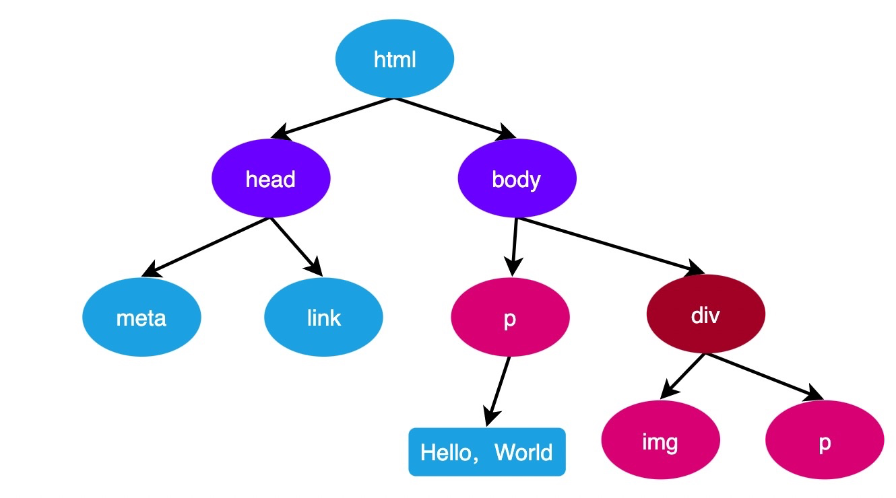
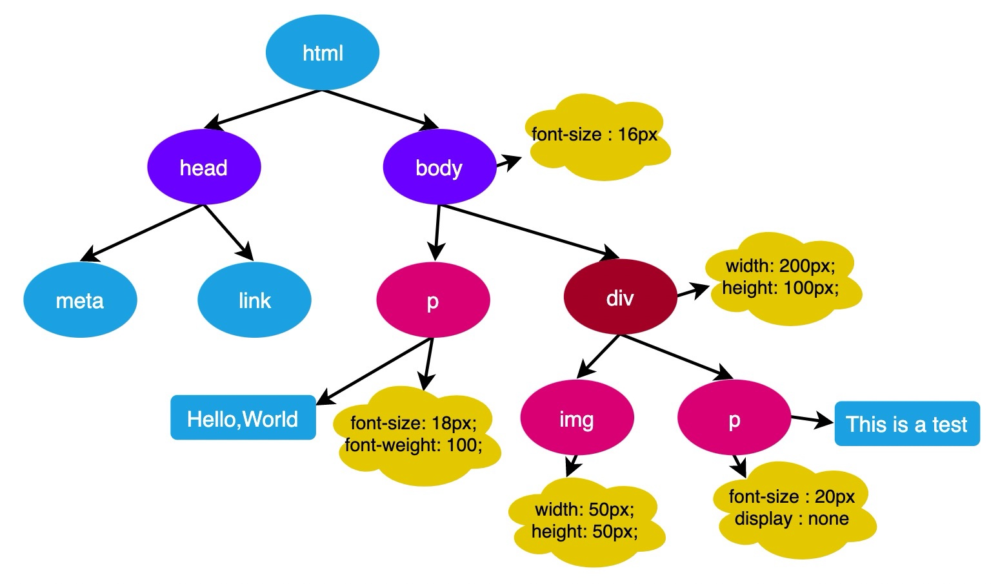
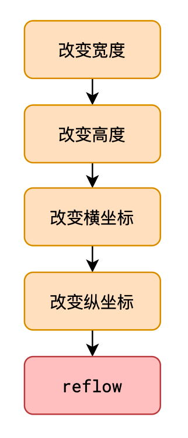
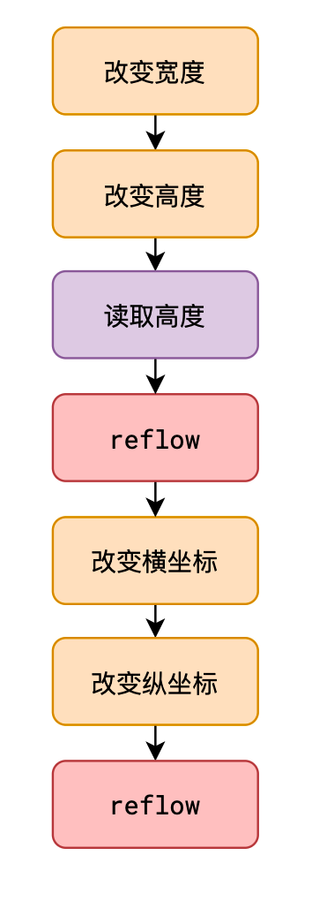

# L30：JS 核心概念-浏览器的渲染流程（简版）

---

## 1 解析 HTML

浏览器从网络或本地文件中获取到 `HTML` 源代码，然后从上到下的解析源代码

若解析过程中，读取到 `CSS` 或 JS，**停止解析（阻塞）**，转而解析 `CSS` 或执行 JS：

```html
<!DOCTYPE html>
<html lang="en">
<head>
  <meta charset="UTF-8">
  <meta http-equiv="X-UA-Compatible" content="IE=edge">
  <meta name="viewport" content="width=device-width, initial-scale=1.0">
  <title>Document</title>
  <link rel="stylesheet" href="./css/index.css">
</head>
<body>
  <h1>Hello World!</h1>
  <script src="./js/index.js"></script>
  <p>Lorem</p>
</body>
</html>
```



> **为什么要将 CSS 写到页面的开头，而 JS 写到页面的最后？**
>
> 将 `CSS` 写到页面开头，是为了让浏览器尽快读取并解析样式，避免给用户看到丑陋的页面，也是为了避免页面闪烁
>
> 将 `JavaScript` 代码写到最后，是为了让浏览器尽快呈现页面给用户，然后再执行JS完成交互功能


## 2 生成 DOM 树

**浏览器会一边解析HTML，一边生成DOM树**，我们在JS中获取到的 DOM 就是 DOM 树中的 DOM：



> 当 `DOM` 树完全生成好后，会触发 `DOMContentLoaded` 事件
>
> ```js
> document.addEventListener("DOMContentLoaded", function() {
> console.log("DOM树已全部生成完毕");
> });
> ```
>
> 当页面中的所有外部资源全部加载完毕后，会触发 `load` 事件
>
> ```js
> window.onload = function(){
> console.log("所有资源已加载完成");
> }
> ```
>
> `load` 事件也可以针对单个外部资源使用，资源加载完成后触发


## 3 生成渲染树

**浏览器一边生成 DOM 树，一边计算 DOM 树中每个节点的样式规则，最终形成渲染树**。

`CSS` 属性的计算过程，发生在这一个步骤：




## 4 布局 layout / 重排 reflow

这个步骤又称之为 **reflow（回流、重排）**，是指浏览器一边生成渲染树，一边计算每个元素最终的尺寸和位置

完成后，页面中的所有元素的位置和尺寸就确定下来了，即将被渲染到页面。

这个步骤会在页面之后的运行过程中不断的重复，**下面的 JS 操作均会导致 reflow**：

- 获取元素的尺寸和位置
- 直接或间接改变元素的尺寸和位置

> `reflow` 非常耗时，浏览器为了提升性能，对 JS 中 **连续** 导致 `reflow` 的代码，把 `reflow` 的时间点延迟到结束后进行，但在此过程中，如果遇到了获取尺寸和位置的代码，浏览器会迫不得已立即 `reflow`
>
> ```js
> dom.style.width = '100px'
> dom.style.height = '200px'
> dom.style.left = '10px'
> dom.style.top = '10px'
> ```
>
> 
>
> ```js
> dom.style.width = '100px'
> dom.style.height = '200px'
> dom.clientHeight; // 读取高度，导致强行reflow
> dom.style.left = '10px'
> dom.style.top = '10px'
> ```
>
> 


## 5 重绘 repaint

浏览器一边 `reflow`，一边进行生成对应的图形绘制到页面，绘制的过程称之为 `repaint`

**所有会导致 reflow 的代码，均会导致 repaint**

绘制的过程是靠 `GPU` 完成的，速度非常快，因此，**相对于导致 reflow 的代码，仅会导致 repaint 的代码效率会高出很多**

凡是不会影响盒子排列，仅影响盒子外观的代码都不会导致 `reflow`，仅导致 `repaint`，例如：

- 改变背景颜色
- 改变字体颜色
- 圆角边框
- 背景图
- ......
