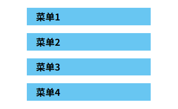
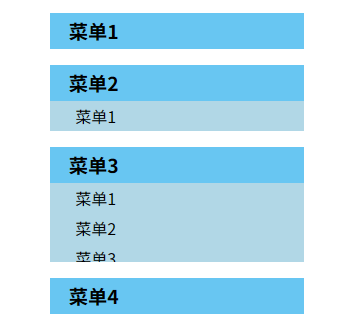

# L02 手风琴效果

---

## 1 需求描述

1. 点击一级菜单项，可以展开对应的二级子菜单列表；
2. 若已经打开则匀速关闭；
3. 每次单击后页面只保留一个展开的子菜单；
4. 使用自定义函数 + 配置选项实现该效果；
5. 动画过程中不可再次点击。

初始效果如下：



展开过程中的效果图：




## 2 要点提示

1. 将底层动画逻辑的实现封装为一个工具函数 `createAnimation(options)`，返回一个新的动画函数，接收一个需要设置动画的 `DOM` 元素；
2. 由于配置项是动态的（子菜单项总数不固定），因此配置参数对象 `options` 也应该是目标 `DOM` 元素的函数，因此需要二次抽离工具函数 `animateHide` 和 `animateShow`；
3. 为了便于管理状态，需新增三个回调函数 `onStart`、`onMove`、`onEnd`，主要控制两个状态：
   1. 该菜单是否已选中：涉及上个菜单的取消和当前菜单的标注；
   2. 当前动画是否结束：
      1. 若结束，方可继续点击；
      2. 若动画正在进行中，则取消菜单的开启或关闭。
   3. 状态的切换对应样式的变更，因此改为切换 CSS 样式类，而非视频中的自定义属性。

最初实测时漏掉了一点：**动画执行过程中取消新的点击逻辑。**

核心 `JS` 代码：

`index.js`：

```js
const onMove = (n, elem) => elem.style.height = `${n}px`;

const animateShow = (to = 120) => createAnimate({
    from: 0,
    to,
    duration: 300,
    onStart(elem) {
        elem.classList.add('playing');
        elem.classList.remove('hidden');
    },
    onMove,
    onEnd(elem) {
        elem.classList.remove('playing');
    },
});

const animateHide = (from = 120) => createAnimate({
    from,
    to: 0,
    duration: 300,
    onStart(elem) {
        elem.classList.add('playing');
    },
    onMove,
    onEnd(elem) {
        elem.classList.remove('playing');
        elem.classList.add('hidden');
    },
});

const rowHeight = 30;
const totalHeight = (box, H = rowHeight) => box.querySelectorAll('li').length * H;

const container = document.querySelector('.menu-container');
container.addEventListener('click', function({target}) {

    if(target.tagName !== 'H2') return;

    // 上一个打开的子菜单存在，且动画已结束
    const prev = this.querySelector('.submenu.active');
    if(prev && !prev.classList.contains('playing')) {
        prev.classList.remove('active');
        const hiding = animateHide(totalHeight(prev));
        hiding(prev);
    }
    
    // 当前子菜单并非上一子菜单，且动画已结束
    const submenu = target.parentElement.querySelector('.submenu');
    if(prev !== submenu && !submenu.classList.contains('playing')) {
        submenu.classList.add('active');
        const showing = animateShow(totalHeight(submenu));
        showing(submenu);
    }
});
```

`animate.js`：

```js
const createAnimate = function(options){
    'use strict';

    const defaults = {
        duration: 1000,
        frames: 50,
        from: 0,
        to: 1,
        onStart: function(elem){
            console.log('animation start, element:', elem);
        },
        onMove: function(n, elem){
            console.log('animation playing, element:', elem, ', target value:', n);
        },
        onEnd: function(elem){
            console.log('animation ended, element:', elem);
        }
    };

    options = Object.assign({}, defaults, options);

    return elem => {
        const {onStart, onMove, onEnd, duration, frames, from, to } = options;
        const step = (to - from) / frames;
        const interval = duration / frames;
        let curIdx = 0;
        let curVal = from;

        onStart(elem);
        const timer = setInterval(function(){
            curIdx++;
            curVal += step;
            onMove(curVal, elem);
            if (curIdx >= options.frames) {
                clearInterval(timer);
                onEnd(elem);
            }
        }, interval);
    };
};
```

