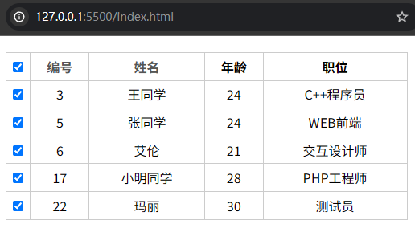

# L03 动态排序表格

---

主讲人：韩刚


## 1 需求描述

对表格数据进行两类动态排序：

1. 按编号升序排序；
2. 按姓名字典序排序；

此外，首列支持全选/取消操作。、

效果图：




## 2 要点梳理

自测主要问题：排序时无需清除原有 `tr` 元素，直接通过 `tbody.appendChild(tr)` 即可。

针对两类排序方法反复实现，利用函数式编程进行代码去重。

通过全局状态变量 `orderByAsc` 实现升/降序的切换。

调用本土化排序处理中文字段的升降序：`'小'.localeCompare('明', 'zh')`（结果为 `1`，表示 `小` 应该排在 `明` 的后面）；

`NodeList` 本就原生支持 `forEach` 方法，只是调用其他数组方法（如）时需要通过 `Array.from` 或 `Array.prototype.slice` 转成真正的数组。

关于选择器中的计数规则：`td:nth-child(i)` 中的 `i` 是从 `1` 开始计数的（简化版出现的大 Bug）。

本地简化 `document.querySelector` 以及 `document.querySelectorAll` 方法：

```js
const container = document.querySelector('.table-container');
const $ = container.querySelector.bind(container);
const $$ = selector => container.querySelectorAll(`tbody ${selector}`);
```


核心 JS 代码：

`index.js`：

```js
let orderByAsc = true;
function makeSortHandler(sortFn) {
    return ev => {
        const sorted = Array.from($$('tr'))
            .sort((t1, t2) => {
                const ascResult = sortFn.call(null, t1, t2);
                return orderByAsc ? ascResult : -ascResult;
            });

        // toggle the sorting order
        orderByAsc = !orderByAsc;
        doms.checkAll.checked = false;
        doms.elems.forEach(chbox => chbox.checked = false);

        // update the table body with sorted rows
        sorted.forEach(tr => doms.tbody.appendChild(tr));
    };
}

function extractId(tr) {
    const idStr = tr.querySelector('td:nth-child(2)');
    return parseInt(idStr.innerText.trim(), 10);
}

function compareNumWith(extractFn) {
    return (a, b) => extractFn(a) - extractFn(b);
}

function sortByNameHandler(ev) {
    const compFn = compareStrWith(extractName);
    const _handler = makeSortHandler(compFn);
    _handler(ev);
}

doms.nameHeader.addEventListener('click', sortByNameHandler);
```

根据老师提供的版本完善的简化版：

```js
(function () {
    const container = document.querySelector('.table-container');
    const $ = container.querySelector.bind(container);
    const $$ = selector => container.querySelectorAll(`tbody ${selector}`);
    
    const doms = {
        checkAll: $('.checkAll'),
        tbody: $('tbody'),
        chboxes: $$('input[type="checkbox"]'),
        ths: container.querySelectorAll('th'),
    };

    function toggleCheckAll({target}) {
        const checked = target.checked;
        Array.from(doms.chboxes).forEach(chbox => 
            chbox.checked = checked);
    }

    function chbxClickHandler(chboxes) {
        return ({target}) => {
            const checked = target.checked;
            const allChecked = Array.from(chboxes)
                .every(chbox => chbox.checked);
            doms.checkAll.checked = (checked && allChecked);
        }
    }

    const extractStr = (tr, index) => tr.querySelector(`td:nth-child(${index})`).innerText.trim();
    
    const extractNum = (tr, index) => parseInt(extractStr(tr, index), 10);
    
    let orderByAsc = true;
    function headerSortHandlerWith(index) {
        return ev => {
            if(index === 0) return; // skip the first header (checkbox)
            const trs = Array.from($$('tr'))
                .sort((t1, t2) => {
                    let res = (index % 2 === 0) // column with string data
                        ? extractStr(t1, index + 1).localeCompare(extractStr(t2, index + 1), 'zh')
                        : extractNum(t1, index + 1) - extractNum(t2, index + 1);
                    return orderByAsc ? res : -res;
                });
            orderByAsc = !orderByAsc;
            trs.forEach(tr => doms.tbody.appendChild(tr));
        };
    }

    function init() {
        // 1. 注册标题行复选框点击事件
        doms.checkAll.addEventListener('click', toggleCheckAll);
        // 2. 注册正文行复选框点击事件
        doms.chboxes.forEach((chbox, _ ,arr) => chbox.addEventListener('click', chbxClickHandler(arr)));
        // 3. 批量注册表头字段点击事件
        doms.ths.forEach((th, index) => th.addEventListener('click', headerSortHandlerWith(index)));
    }

    init();
}());
```

