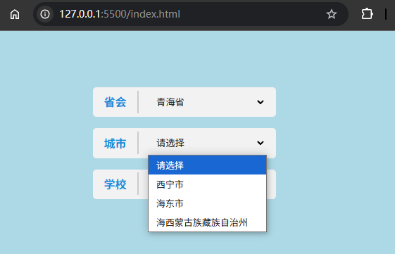

# L04：JavaScript 原生实现三级联动下拉菜单效果

---


## 1 需求描述

用原生 `JavaScript` 实现一版省、市与当地学校下拉框三级联动的效果。

效果图：




## 2 要点提示

1. 注意联动数据的内在关联：
   1. 市级数据的一级 `key` 为省编码，二级 `key` 为对应市级编码；
   2. 学校数据的一级 `key` 为市编码，二级 `key` 为数组索引（学校信息为一个校名数组）；
2. 下拉框渲染方式创新：先刷新，再根据传入的 `code` 编码是否有效决定是否追加 `HTML`；
3. 全程使用函数式编程简化代码；
4. 让每个下拉框的默认选项为固定值（`value="0000"`），并据此构建工具函数，进一步提高代码复用性。
5. **更正**：根据示例版本，切换省时需要自动选中第一个市级选项、以及该市下的第一所学校；并且切换到不同的市时，需要自动选中该市的第一所学校。因此渲染省市下拉框时还需要 **指定默认值**。


核心 JS 逻辑：

`index.js`：

```js
(function(){
    const content = document.querySelector('.content');
    const $ = content.querySelector.bind(content);

    const doms = {
        province: $('#province'),
        city: $('#city'),
        school: $('#school'),
    };

    const notDefault = code => code !== '0000';

    const buildOptionsWith = data => Object.entries(data)
        .map(([code, label]) => `<option value="${code}">${label}</option>`)
        .join('');

    const defaultOption = () => buildOptionsWith({"0000": "请选择"});

    const resetSchoolBar = () => doms.school.innerHTML = defaultOption();

    const resetCityBar = () => {
        doms.city.innerHTML = defaultOption();
        resetSchoolBar();
    };

    const renderSchoolBar = cityCode => {
        resetSchoolBar();
        if(notDefault(cityCode)) {
            const schoolData = allschool[cityCode] || {};
            doms.school.innerHTML += buildOptionsWith(schoolData);
            if(schoolData && schoolData.length > 0) {
                doms.school.value = '0';  // 更正：级联选中该市第一个学校
            }
        }
    };

    const renderCityBar = provCode => {
        resetCityBar();
        if (notDefault(provCode)) {
            const cityData = city[provCode] || {};
            doms.city.innerHTML += buildOptionsWith(cityData);
            const firstSchool = Object.keys(cityData)[0] || '0000'; // Get first city code or default
            if(notDefault(firstSchool)) { // 更正：级联选中第一个市、以及该市第一个学校
                doms.city.value = firstSchool;
                renderSchoolBar(firstSchool);
            }
        }
    };

    const renderProvinceBar = () => {
        doms.province.innerHTML = defaultOption() + buildOptionsWith(province);
        resetCityBar();
    };

    const init = () => {
        // 1. init all bars
        renderProvinceBar();

        // 2. bind change event to province bar
        doms.province.addEventListener('change', ({target}) => renderCityBar(target.value));
        
        // 3. bind change event to city bar
        doms.city.addEventListener('change', ({target}) => renderSchoolBar(target.value));
    };

    init();
}())
```

