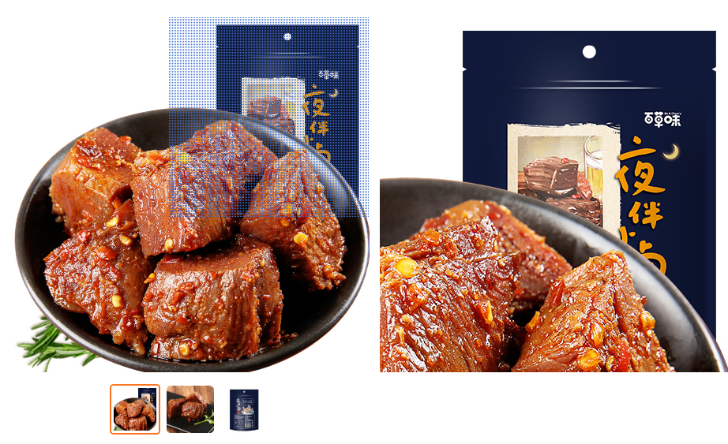

# L06：图片放大镜

---

## 1 需求描述

仿照淘宝京东商城的商品详情页，手动实现一版图片放大镜效果。要求：

1. 鼠标悬停到小图上时，将该图片同步更新到主图区（原视频要求点击选中，自我提升难度）；
2. 鼠标移入主图区后，在右侧同步展示放大区域，并跟随鼠标移动；
3. 鼠标移入主图区后，应按比例（原视频未要求，自我提升难度）显示遮罩层；
4. 移出主图区后，遮罩层及右边放大区域均消失。

效果图：




## 2 要点梳理

1. 模仿元素拖动效果，给主图区和遮罩层分别注册鼠标事件：

   1. 主图区事件：
      1. 注册 `mouseenter` 事件：用于初始化遮罩位置，同时注册遮罩 `mousemove` 事件；
      2. 注册 `mouseleave` 事件，用于鼠标移出后的清理工作（注销遮罩 `mousemove`，重置放大区域）；
   2. 遮罩层事件：即 `mousemove` 事件，用于同步鼠标位置，并同步更新放大区域的背景坐标。

2. 鼠标在遮罩上方时，应使用 `cursor: move;`；

3. 切换小图时，应同时使用 `border` 边框和 `outline` 轮廓样式，确保小图尺寸始终不变。

4. 抽离工具函数 `clamp()`，提高代码可读性：

   ```js
   function clamp (value, min, max) {
       return Math.max(min, Math.min(value, max));
   }
   ```

5. 要让遮罩移动，需使用 **绝对定位**；

6. 总思路：

   1. 先计算鼠标在主图框的相对坐标（`ev.clientX - outerX`）；
   2. 再计算遮罩层的顶点坐标（`x - HALF_MASK_SIZE`）；
   3. 最后计算放大区域的偏移量（`X = -x * SCALE_SIZE`）。


核心 JS：

```js
function bindHoverEventForCurrImg() {
    const box = $('.left-img');
    const {
        width: boxWidth, 
        height: boxHeight, 
        left: boxLeft, 
        top: boxTop
    } = box.getBoundingClientRect();
    const MASK_SIZE = 450 / SCALE_RATIO;
    const HALF_MASK_SIZE = MASK_SIZE / 2;

    function clamp (value, min, max) {
        return Math.max(min, Math.min(value, max));
    }
    
    function syncImageLens(x, y) {
        const lens = $('.right-img');
        lens.style.background = `url(${data[curIdx].l})`;
        const [X, Y] = [x, y].map(v => v * SCALE_RATIO);
        lens.style.backgroundPosition = `-${X}px -${Y}px`;
    }

    function getCenterCoordinates({clientX, clientY}) {
        const x = clientX - boxLeft; // 鼠标在图片框内的横坐标
        const y = clientY - boxTop;  // 鼠标在图片框内的纵坐标
        
        const maxLeft = boxWidth - MASK_SIZE;
        const maxTop = boxHeight - MASK_SIZE;
        
        const left = clamp(x - HALF_MASK_SIZE, 0, maxLeft);
        const top = clamp(y - HALF_MASK_SIZE, 0, maxTop);

        return [left, top];
    }

    function handleMaskAndLensImg(maskDom, ev) {
        const [x, y] = getCenterCoordinates(ev);

        maskDom.style.left = `${x}px`;
        maskDom.style.top = `${y}px`;

        syncImageLens(x, y);
    }

    box.addEventListener('mouseenter', e1 => {
        // 鼠标初始移入时图片框时定位遮罩坐标（以及放大位置）
        const elMask = $('.mask');
        handleMaskAndLensImg(elMask, e1);

        // 鼠标移入遮罩后根据实时移动坐标更新遮罩（以及放大位置）
        const mouseMoveHandler = ev => handleMaskAndLensImg(elMask, ev);
        elMask.addEventListener('mousemove', mouseMoveHandler);

        box.addEventListener('mouseleave', e2 => {
            elMask.removeEventListener('mousemove', mouseMoveHandler);
            // 鼠标移出图片框，放大区域消失（重置）
            $('.right-img').style.background = ``;
        });
    });
}
```

