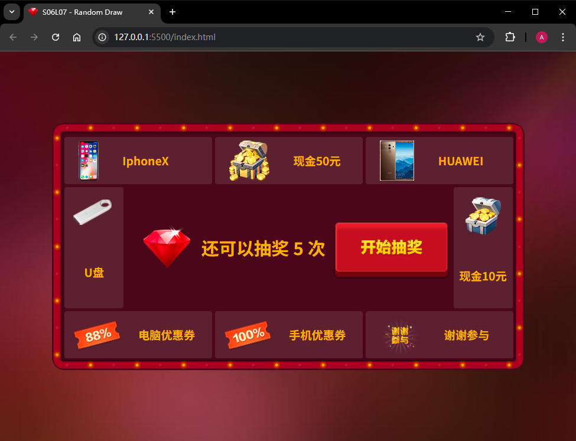

# L07：积分抽奖效果

---

## 1 需求描述

用原生 `JavaScript` 实现一版积分抽奖效果，要求：

1. 初始抽奖次数为五次，点击开始按钮或弹窗中的再来一次按钮继续抽奖，同时次数递减；
2. 可用次数为零时抽奖结束，禁用按钮相关逻辑；
3. 根据抽中的不同奖项在弹窗中显示具体的奖品名称（例如“恭喜您获得XXX”），若为抽中则显示“很遗憾您没有中奖”。

最终效果：




## 2 要点梳理

1. 不宜使用 `table` 元素构建主页面；
2. 思路：
   1. 先实现奖品轮转效果 `nextMove()`；
   2. 再结合 `setInterval()` 方法串联成一次完整的抽奖，并设置随机参数；
   3. 放入主流程。
3. 当前可用次数应该在点击抽奖按钮后立即减少一次；
4. 最后一次弹窗提示信息必须正常显示抽中的奖品名称；
5. **BUG 修复**：抽奖过程中不可重复抽奖，因此必须考虑 `timer` 的状态。

视频中居中块级元素的方法（使用 `CSS3` 的 `transform` 平移属性）：

```css
.main-content-container {
    width: 874px;
    height: 458px;
    background-image: url('../img/center_bg.png');
    position: absolute;
    top: 50%;
    left: 50%;
    transform: translate(-50%, -50%);
}
```


核心 `JS` 逻辑：

```js
// 顺次移动一格
function nextMove() {
    const prev = selectPrize(curIdx, true);
    prev && prev.classList.remove('active');
    
    const nextIdx = (curIdx + 1) % total;
    const next = selectPrize(nextIdx);
    next.classList.add('active');
    
    curIdx = nextIdx; // 更新当前索引
}

function getRandom(min, max) {
    return Math.floor(Math.random() * (max - min + 1)) + min; // 随机数
}

function runOnce(speed = 40) {
    let innerCount = 0,
        limit = getRandom(10, 50), // 随机抽奖次数
        timer = setInterval(() => {
        nextMove(); // 转到下一个奖品
        if (++innerCount >= limit) {
            clearInterval(timer); // 停止抽奖
            showResult(msgs[curIdx]); // 显示抽奖结果
        }
    }, speed);
}

function showResult(msg) {
    const bingo = curIdx !== 4;
    const gameOver = count < 0;
    const lastChance = count === 0;
    
    const result = gameOver ? '抽奖次数已用完' 
        : bingo ? `恭喜您获得${msg}` : `很遗憾您没有中奖`;
    const btnTxt = gameOver || lastChance ? '确定' : '再来一次';

    $('.mask').classList.add('show'); // 显示遮罩层
    $('.popup .msg').innerText = result; // 显示抽奖结果
    $('.popup .btn').innerText = btnTxt; // 显示按钮文本
}
```

