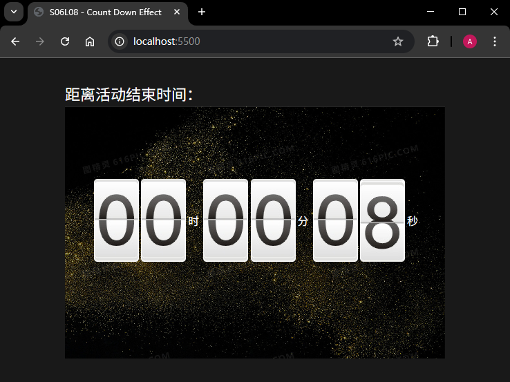

# L08：JavaScript 倒计时特效

---

## 1 需求描述

用原生 `JavaScript` 实现一个倒计时页面特效，要求：

1. 时间每秒变动一次；
2. 倒计时为零时，停止所有页面动画。

最终效果：




## 2 要点梳理

1. 总思路：配合 `transition` 对 `margin-top` 属性进行状态过渡，结束时禁用特效，并切换不用的样式类，为下一次过渡特效做准备。
2. 时分秒分别需要区分个位和十位的处理，分别记为 `hour1`、`hour2`、`minute1`、`minute2`、`second1`、`second2`。其中 `hour1` 为 3 进制（逢 3 进 1、逢 0 退 2），`minute1` 和 `second1` 为六进制，其余均为十进制；
3. 个位秒的停止与否，取决于前面所有位数是否同时为零，十位秒的停止与否，取决于前面所有位数是否为零；
4. 倒计时状态的切换，本质是切换该数位上两个 `li` 元素的 `CSS` 样式类的值。

视频中讲师采用的是 `parentDom.appendChild(childDom)` 的方式自动将首个子元素剪切到父容器的最后一个，虽然代码更少，但没有停止计时的判定逻辑，问题较严重。

核心 JS 逻辑：

```js
/**
 * Generates a `transitionend` event handler with the specific dictionary map of class names.
 * @param {Map<currCls, [nextCls1, nextCls2]>} dictMap - A map of class names to their next group of class names.
 * @returns {Function} - Event handler function attached to the `transitionend` event.
 */
function generateEventHandlerBy(dictMap) {
    return ({target}) => {
        // 1. Remove the transition effect
        target.style.transition = 'none';
        // 2. Update the next group of classes
        updateClasses(target, dictMap);
        // 3. Reset margin-top
        target.style.marginTop = '0px';
    };
}

function updateClasses(target, dictMap) {
    const li1 = $(CURRENT_ITEM_SELECTOR, target);
    const li2 = $(NEXT_ITEM_SELECTOR, target);
    const old1 = li1.className;
    const [new1, new2] = dictMap[old1];
    li1.classList.remove(old1) || li1.classList.add(new1);
    li2.classList.remove(new1) || li2.classList.add(new2);
}

function comeToZero(digit) {
    const currentLi = $(CURRENT_ITEM_SELECTOR, digit);
    const index = currentLi.className.slice(-1);
    return parseInt(index, 10) === 0;
}

function prevDigitsAllZero(digits) {
    return digits.every(digit => {
        const currentItem = $(CURRENT_ITEM_SELECTOR, digit);
        return currentItem.className === 'num0';
    });
}

function countDownNext(ul) {
    ul.style.transition = 'margin-top 0.5s linear';
    ul.style.marginTop = '-120px';
}

// 1st digit of hours
function countDownH1() {
    countDownNext(hour1);
    if(comeToZero(hour1)) {
        return;
    }
}

// 2nd digit of hours
function countDownH2() {
    countDownNext(hour2);
    if(comeToZero(hour2)) {
        if(prevDigitsAllZero(digits.slice(0, 1))) {
            return;
        }
        countDownH1();
    }
}

// 1st digit of minutes
function countDownM1() {
    countDownNext(minute1);
    if(comeToZero(minute1)) {
        if(prevDigitsAllZero(digits.slice(0, 2))) {
            return;
        }
        countDownH2();
    }
}

// 2nd digit of minutes
function countDownM2() {
    countDownNext(minute2);
    if(comeToZero(minute2)) {
        if(prevDigitsAllZero(digits.slice(0, 3))) {
            return;
        }
        countDownM1();
    }
}

// 1st digit of seconds
function countDownS1() {
    countDownNext(second1);
    if(comeToZero(second1)) {
        if(prevDigitsAllZero(digits.slice(0, 4))) {
            return;
        }
        countDownM2();
    }
}

// 2nd digit of seconds
function countDownS2() {
    countDownNext(second2);
    if(comeToZero(second2)) {
        if(prevDigitsAllZero(digits.slice(0, 5))) {
            return;
        }
        countDownS1();
    }
}
```

