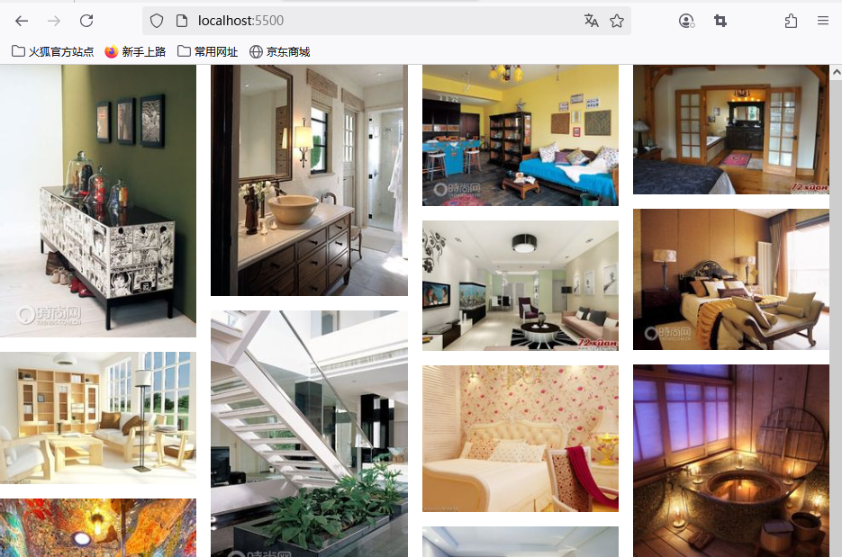
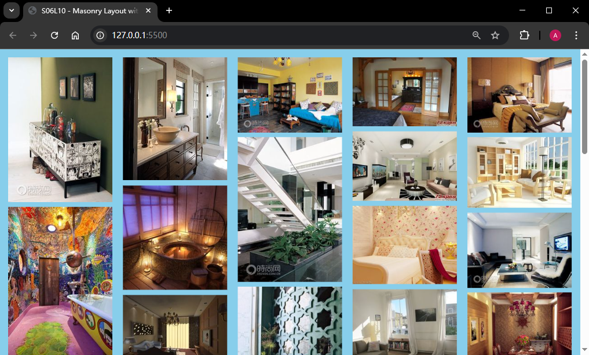
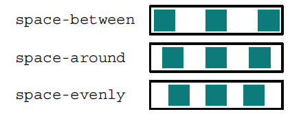

# L10：图片瀑布流效果

---

## 1 需求描述

利用原生 JS 实现一版图片瀑布流布局（也叫 **masonry layout**，砖石布局，目前仅 `Firefox` 预览版支持该样式布局）。

效果图：



**图 1：Firefox 启用实验特性 layout.css.grid-template-masonry-value.enabled 后的布局效果**

原生 `JavaScript` 手动实现版：



**图 2：利用原生 JavaScript 手动实现的图片瀑布流布局**


## 2 要点梳理

1. 项目难点：实时获取每张图片的真实高度：要么从 `img` 元素的 `onload` 获取，要么从 `window` 的 `onload` 实时计算。

2. `clientWidth` 和 `offsetWidth` 的主要区别：

|    属性     | 内容宽度 | 内边距 | 滚动条宽度 | 边框宽度 | 外边距 |
| :---------: | :------: | :----: | :--------: | :------: | :----: |
| offsetWidth |    ✅     |   ✅    |     ✅      |    ✅     |   ❌    |
| clientWidth |    ✅     |   ✅    |     ❌      |    ❌     |   ❌    |

3. 关于列间隙的舍入计算：DIY 考虑的 `justify-content: space-between`，而视频考虑的是 `justify-content: space-evenly`，此外还可以有 `space-around` 的情况：



**图 3：Flexbox 中的三种主轴对齐方式**

因此，在计算当前视口可以容纳几列图片轨道时，初始算得的小数点，其实代表的是总间隙宽度 `totalGap` 占单位宽度 `unitWidth` 的百分比，分别为：

1. `space-between`：即 `totalGap` 在单位宽度 `unitWidth = (totalWidth + gap) / N` 中的百分比；
2. `space-around`：即 `totalGap` 在单位宽度 `unitWidth = totalWidth / N` 中的百分比；
3. `space-evenly`：即 `totalGap` 在单位宽度 `unitWidth = (totalWidth - gap) / N` 中的百分比；

因此，`space-evenly` 的实际宽度最小（间隙的完整个数最大）。

实际操作中，无需使用初始间隙算一个近似值，然后再修正；直接用总宽度除以图片宽度，然后按预定方式确定间隙的有效数量，一步计算即可。

4. DIY 实战时漏掉了给外围容器添加总高度的步骤（图片全为绝对定位，已脱离常规文档流）。
5. 视频是在渲染图片时通过注册 `img.onload` 确定每个图片的实时大小的；DIY 方案则是在 `window.onload` 中确定。后者性能更好。
6. 节流功能最好单独创建一个工具函数实现，通用性更好。


核心 JS 逻辑：

```js
function debounce(fn, delay) {
    let timer = null;
    return (...args) => {
        if(timer) {
            clearInterval(timer);
        }
        timer = setTimeout(() => 
            fn.apply(this, args), delay);
    };
}

function setPosition() {
    const WIDTH = container.clientWidth - 32;
    const size = Math.floor((WIDTH + gap0) / (COLUMN_WIDTH + gap0));
    const colGap = Math.round((WIDTH - size * COLUMN_WIDTH) * 10 / (size - 1)) / 10;
    const unitOffsetLeft = colGap + COLUMN_WIDTH;
    const rowGap = Math.min(gap0, colGap);

    columns.length = size;
    columns.fill(0, 0, size);
    
    Array.from($$('.canvas img')).forEach(img => {
        const iTop = Math.min(...columns);
        const colIdx = columns.indexOf(iTop);
        const iLeft = colIdx * unitOffsetLeft;
        img.style.transform = `translate(${iLeft}px, ${iTop}px)`;

        img.style.width = `${COLUMN_WIDTH}px`;
        const iHeight = img.clientHeight; // real-time height
        columns[colIdx] += iHeight + rowGap;
    });

    const maxHeight = Math.max(...columns);
    container.style.height = `${maxHeight + rowGap + 16}px`;
}
```

启用 `Firefox` 砖石布局的版本（L13）：

```html
<style>
  * {
    box-sizing: border-box;
    margin: 0;
    padding: 0;
  }
  .container {
    padding: 1em;
  }
  .canvas {
    display: grid;
    grid-template-columns: repeat(auto-fill, minmax(200px, 1fr));
    grid-template-rows: masonry;
    gap: 1em;
    
    & > img{
      object-fit: cover;
      width: 100%;
    }
  }
</style>
<main class="container">
  <article class="canvas"></article>
</main>
<script>
  const canvas = document.querySelector('.canvas');
  const renderImgs = () => {
    const frag = document.createDocumentFragment();
    Array.from({length: 41}, (_, i) => {
      const img = document.createElement('img');
      img.src = `./img/${i}.jpg`;
      img.alt = `demo image_${i}`;
      frag.appendChild(img);
    });
    canvas.appendChild(frag);
  };
  renderImgs();
</script>
```

