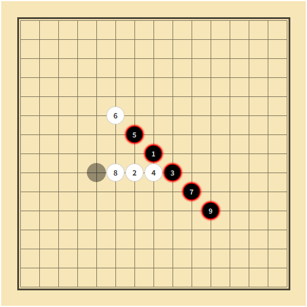
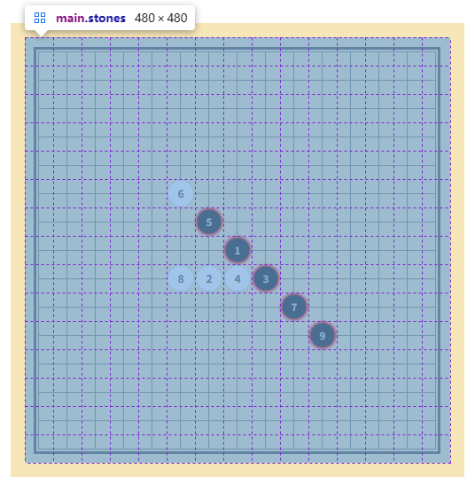

# L12：用 JS 实现五子棋游戏

---

## 1 需求描述

外网参考页面：[五子棋小游戏](https://gomoku.yjyao.com/)。

用原生 `JavaScript` 实现一版五子棋游戏，要求：

1. 黑棋先手，自动交替落子；
2. 获胜时五子连珠应有带红色阴影边框的强调效果；
3. 获胜时，每个棋子的正中要展示该局黑白两方交替落子的顺序编号；
4. 一方获胜后，除非重新开始，否则无法继续游戏；
5. （补充）平局的判定：棋盘无空余位置落子，但双方均未形成五子连珠；
6. （补充）落子前，应有透明棋子提示当前落子的颜色；
7. （补充）落子后，应用其他边框效果（如蓝色带阴影边框）高亮展示当前棋子；
8. 该五子棋不考虑黑方三三禁手，也不考虑交换棋子、操作计时等辅助功能。

最终效果：



**图 1 使用 Flexbox 和 Grid 布局按新思路实现的五子棋效果图**



**图 2 用 Grid 网格布局实现的落子矩阵效果图，省去了视频中各种边界条件的讨论**


## 2 要点梳理

1. 总思路：棋盘和落子矩阵相互独立，棋盘只负责产生 `14 × 14` 网格，不注册鼠标事件；落子矩阵只负责安插棋子，须注册鼠标事件；
2. 判定获胜的条件：从当前棋子出发，分别按同一行、同一列、正对角线、反对角线四个大类进行讨论，每个大类又分下边界和上边界两种情况讨论，最终得到包含当前棋子在内的五子连珠情况；
3. 使用函数式编程优化获胜判定逻辑，抽离出九种判定条件和八种相邻棋子定位方式；
4. 使用 `HTML5` 语义化标签，增强页面可读性以及无障碍访问体验；
5. 页面元素嵌入 `data-id="r,c"` 的形式与影子矩阵 `stones` 一一映射，以便快速定位。
6. 视频采用 `table` 构建棋盘，并将棋子以 `td` 子元素的形式嵌入单元格，需要考虑的判定条件较多，容易出错；但获胜条件的判定逻辑值得参考，通过将所有落子放入一个数组，然后从左至右考察四个方向上的五子连珠情况，比从当前落子判定简单很多。

核心 JS 逻辑：

DIY 方案中五子连珠的判定：从当前落子判定五子连珠：

```js
function winningTheGame(stones, {id, isBlack: targetColor}) {
    const {row, col} = convertToRowCol(id),
        validator = {
            topLeft: i => row - i >= 0 && col - i >= 0,
            top: i => row - i >= 0,
            topRight: i => row - i >= 0 && col + i <= 14,
            left: i => col - i >= 0,
            middle: iStone => iStone.placed && iStone.isBlack === targetColor,
            right: i => col + i <= 14,
            bottomLeft: i => row + i <= 14 && col - i >= 0,
            bottom: i => row + i <= 14,
            bottomRight: i => row + i <= 14 && col + i <= 14,
        },
        picker = {
            topLeft: i => stones[row - i][col - i],
            top: i => stones[row - i][col],
            topRight: i => stones[row - i][col + i],
            left: i => stones[row][col - i],
            right: i => stones[row][col + i],
            bottomLeft: i => stones[row + i][col - i],
            bottom: i => stones[row + i][col],
            bottomRight: i => stones[row + i][col + i],
        };

    // 1. horizontal check
    const rowChecker = buildChecker(validator.middle, validator.left, validator.right);
    const rowCount = rowChecker(picker.left, picker.right);
    if(rowCount >= WINNING_COUNT) {
        return true;
    }
    // 2. vertical check
    const colChecker = buildChecker(validator.middle, validator.top, validator.bottom);
    const colCount = colChecker(picker.top, picker.bottom);
    if(colCount >= WINNING_COUNT) {
        return true;
    }
    // 3. \\ diagonal ((1,1) to (n,n))
    const diag1Checker = buildChecker(validator.middle, validator.topLeft, validator.bottomRight);
    const diag1Count = diag1Checker(picker.topLeft, picker.bottomRight);
    if(diag1Count >= WINNING_COUNT) {
        return true;
    }
    // 4. // diagonal ((n,1) to (1,n))
    const diag2Checker = buildChecker(validator.middle, validator.bottomLeft, validator.topRight);
    const diag2Count = diag2Checker(picker.bottomLeft, picker.topRight);
    return diag2Count >= WINNING_COUNT;
}

function buildChecker(coreValidator, leftValidator, rightValidator) {
    return (leftPicker, rightPicker) => {
        winIds.length = 0;
        let validCount = 0;
        // lefthand side
        for(let i = 0; i <= 4; i++) {
            if(leftValidator(i)) {
                const iStone = leftPicker(i);
                if (coreValidator(iStone)) {
                    validCount++;
                    winIds.push(iStone.id);
                } else {
                    break;
                }
            }
        }
        // righthand side
        for(let j = 1; j <= 4; j++) {
            if(rightValidator(j)) {
                const iStone = rightPicker(j);
                if (coreValidator(iStone)) {
                    validCount++;
                    winIds.push(iStone.id);
                } else {
                    break;
                }
            }
        }
        return validCount;
    };
}
```

视频中五子连珠的判定：从所有落子数组中判定

```js
// 视频判定获胜的逻辑：其实就是遍历数组里面的每一个棋子
function check(){
    // 这里分为 4 种情况：横着、竖着、斜着（2 种）
    for(var i=0; i< chessArr.length; i++){
        var curChess = chessArr[i];
        var chess2, chess3, chess4, chess5;
        // 检查有没有横着的 5 个颜色一样的棋子
        chess2 = chessArr.find(item => curChess.x === item.x + 1 && curChess.y === item.y && curChess.c === item.c);
        chess3 = chessArr.find(item => curChess.x === item.x + 2 && curChess.y === item.y && curChess.c === item.c);
        chess4 = chessArr.find(item => curChess.x === item.x + 3 && curChess.y === item.y && curChess.c === item.c);
        chess5 = chessArr.find(item => curChess.x === item.x + 4 && curChess.y === item.y && curChess.c === item.c);
        if([chess2, chess3, chess4, chess5].every(e => e !== undefined)){ // 五子连珠，游戏结束
            end(curChess, chess2, chess3, chess4, chess5);
        }
        // 检查有没有竖着的 5 个颜色一样的棋子
        chess2 = chessArr.find(item => curChess.x === item.x && curChess.y === item.y + 1 && curChess.c === item.c);
        chess3 = chessArr.find(item => curChess.x === item.x && curChess.y === item.y + 2 && curChess.c === item.c);
        chess4 = chessArr.find(item => curChess.x === item.x && curChess.y === item.y + 3 && curChess.c === item.c);
        chess5 = chessArr.find(item => curChess.x === item.x && curChess.y === item.y + 4 && curChess.c === item.c);
        if([chess2, chess3, chess4, chess5].every(e => e !== undefined)){ // 五子连珠，游戏结束
            end(curChess, chess2, chess3, chess4, chess5);
        }
        // 检查有没有斜着的 5 个颜色一样的棋子
        chess2 = chessArr.find(item => curChess.x === item.x + 1 && curChess.y === item.y + 1 && curChess.c === item.c);
        chess3 = chessArr.find(item => curChess.x === item.x + 2 && curChess.y === item.y + 2 && curChess.c === item.c);
        chess4 = chessArr.find(item => curChess.x === item.x + 3 && curChess.y === item.y + 3 && curChess.c === item.c);
        chess5 = chessArr.find(item => curChess.x === item.x + 4 && curChess.y === item.y + 4 && curChess.c === item.c);
        if([chess2, chess3, chess4, chess5].every(e => e !== undefined)){ // 五子连珠，游戏结束
            end(curChess, chess2, chess3, chess4, chess5);
        }
        // 检查有没有斜着的 5 个颜色一样的棋子
        chess2 = chessArr.find(item => curChess.x === item.x - 1 && curChess.y === item.y + 1 && curChess.c === item.c);
        chess3 = chessArr.find(item => curChess.x === item.x - 2 && curChess.y === item.y + 2 && curChess.c === item.c);
        chess4 = chessArr.find(item => curChess.x === item.x - 3 && curChess.y === item.y + 3 && curChess.c === item.c);
        chess5 = chessArr.find(item => curChess.x === item.x - 4 && curChess.y === item.y + 4 && curChess.c === item.c);
        if([chess2, chess3, chess4, chess5].every(e => e !== undefined)){ // 五子连珠，游戏结束
            end(curChess, chess2, chess3, chess4, chess5);
        }
    }
}
```

