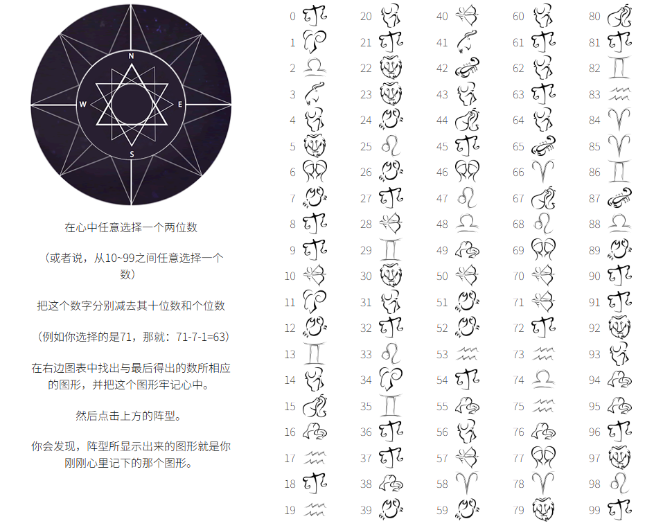

# L13：实现基于原生 JS 的读心术小游戏

---


## 1 需求描述

根据示例页面完成一个趣味读心术小游戏。要求：

1. 点击左上方图片开始游戏，图片开始转动；
2. 转动结束后展示答案；
3. 点击答案图片，询问是否重新开始：
   1. 确认：恢复至初始界面，点击图片继续；
   2. 取消：中止操作。

最终效果：




## 2 要点梳理

1. 练习 `Flexbox` 及 `Grid` 布局设置；

2. 练习 `transition` 样式设置以及 `transitionend` 事件注册；

3. 使用 `HTML5` 语义化标签。

4. 关于过渡动画的启动与重置，视频采用的是让 `el.style` 为空值，并且注销 `transitionend` 事件；而 DIY 方案采用的是设置暂停过渡并反向旋转：

   ```js
   // DIY:
   // 设置：
   function rotate() {
       domImages.style.transition = 'transform 3s ease-in-out';
       domImages.style.transform = `rotate(${ROTATE_ANGLE}turn)`;
   }
   // 还原：
   function resetRotate() {
       domImages.style.transition = 'none';
       domImages.style.transform = `rotate(-${ROTATE_ANGLE}turn)`;
   }
   
   // Video:
   // 设置：
   e.currentTarget.style.transition = 'all 2s'
   e.currentTarget.style.transform = 'rotate(1800deg)';
   // 还原：
   e.currentTarget.setAttribute('style', '');
   ```

   

核心 JS 逻辑：

```js
function renderRandomRefs() {
    // 随机生成一个目标图片的索引，范围在 0-15 之间
    const targetNum = random(0, 15);
    // 生成 100 张随机图片，其中 9 的倍数位置放置目标图片
    const html = Array.from({length: 100}, (_, i) => i)
        .map((num, idx) => {
            const imgIndex = (idx % 9 === 0) ? targetNum : random(0, 15);
            return `
                <figure class="item">
                    <figcaption class="item__num">${num}</figcaption>
                    
                </figure>
            `.replace(/\n\s*/g, '');
        }).join('');
    domRefs.innerHTML = html;
    // 同步更新选中图片
    domChosen.src = `./img/values/${targetNum}.png`;
}

domMask.addEventListener('click', ({target}) => {
    if(needRefresh) {
        if(confirm('是否再玩一次？')) {
            retry();
        }
        return;
    }
    needRefresh = true;
    rotate();
});

domImages.addEventListener('transitionend', ({target}) => {
    resetRotate(target);
    resetImages();
});
```

