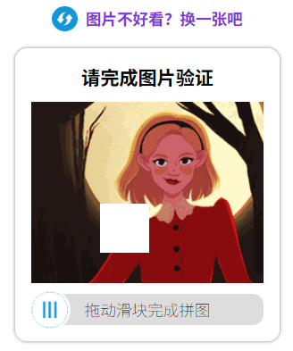

# L14：图片拖动验证

---


## 1 需求描述

利用 `HTML5`、`CSS3`、原生 `JavaScript` 实现一个图片拖动校验模块，要求：

1. 点击顶部提示可换一张新图片；
2. 滑块拖到空缺部分显示验证成功；误差过大则显示验证失败，同时伴随不同的字体颜色；
3. 验证失败后，滑块会自动复位（即过渡特效）；
4. 验证成功后，滑块不可再次拖动，除非点击上方的图片刷新页面；
5. 按住滑块时，补缺图片才显示；且

最终效果：




## 2 要点梳理

1. 本节重点练习元素拖拽逻辑、过渡效果设置；

2. 配合 `Flexbox` 布局可快速完成 CSS 设计；

3. 顶部切换新图片时，文字区域应设置 `user-select: none;`，**避免选中里面的文字**；

4. 页面元素的逐渐消失、逐渐显现是通过 `opacity` 控制的，不能对 `display: none;` 使用过渡特效；但是可以在 `transitionend` 事件中切换 `hidden` 样式类（声明了 `display: none;`）来完全隐藏元素。

5. 验证成功后，应该隐藏两个图片块，呈现完整背景大图（**实操时遗漏了**）；

6. 元素拖拽的原理不同：

   1. DIY：使用鼠标的位移量 `dx` + 按下鼠标时滑块的初始 `left`；

   2. 视频：使用鼠标结束移动时的坐标 `ev.clientX` 减去鼠标自身的偏移量 `ev.offsetX`，以及滑块的原始偏移量 `plug.offsetLeft`。

      ```js
      // DIY:
      const x0 = ev1.clientX;
      const dx = ev2.clientX - x0;
      const left = clamp(left0 + dx, initLeft, maxLeft);
      // 视频：
      var newLeft = ev2.clientX - slider.offsetLeft - ev1.offsetX;
      ```

      显然视频的方案更复杂，不容易记忆。

7. 拖动事件的注册最好使用 `onmousedown` 形式，避免重复注册；

8. 元素背景图的图片链接，可以通过 `dom.style.backgroundImage` 获取；

9. 快速提取图片 URL 中的数字部分：`urlStr.replace(/\D/g, '')`。

核心 JS 逻辑：

```js
function makeDraggable(elem) {
    const maxLeft = domImage.offsetWidth - domBlank.offsetWidth;
    elem.onmousedown = ev1 => {
        domPlug.style.transition = 'none';
        domSquare.style.transition = 'none';
        domTip.style.opacity = 0;
        domSquare.classList.remove('hidden');

        const x0 = ev1.clientX;
        const left0 = ev1.target.offsetLeft;

        const mousemoveHandler = ev2 => {
            if(!ev2.target.classList.contains('plug')) {
                return;
            }
            domMsg.classList.remove('pass', 'fail');
            domMsg.innerText = '拖动图片完成验证';

            const dx = ev2.clientX - x0;
            const left = clamp(left0 + dx, initLeft, maxLeft);
            elem.style.left = `${left}px`;
            domSquare.style.left = `${left}px`;
        };

        const mouseupHandler = () => {
            window.onmousemove = null;
            window.onmouseup = null;

            validatePosition();
        };

        window.onmousemove = mousemoveHandler;
        window.onmouseup = mouseupHandler;
    };
}

function validatePosition() {
    const left0 = domBlank.offsetLeft;
    const left = domSquare.offsetLeft;
    const isValid = Math.abs(left - left0) <= diffMax;
    if(isValid) {
        domSquare.classList.add('hidden');
        domBlank.classList.add('hidden');

        domMsg.classList.add('pass') || domMsg.classList.remove('fail');
        domMsg.innerText = '验证成功';

        domPlug.onmousedown = null;
        domPlug.classList.add('forbidden');
    } else {
        domMsg.classList.add('fail') || domMsg.classList.remove('pass');
        domMsg.innerText = '验证失败';
        
        [domPlug, domSquare].forEach(elem => {
            elem.style.transition = 'left 0.5s ease-in-out';
            elem.style.left = `${initLeft}px`;
        });
    }
}
```


