# 1 布局

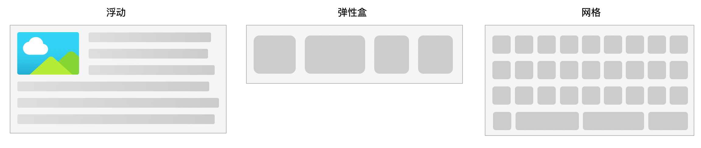

**浮动**：做文字环绕效果

**弹性盒**：单行或单列布局

**网格**：多行多列布局

## 1.1 弹性盒

> [!tip]
>
> 文档详见 [MDN](https://developer.mozilla.org/zh-CN/docs/Web/CSS/CSS_Flexible_Box_Layout)
>
> [弹性盒小游戏](https://flexboxfroggy.com/)

### 1.1.1 生成弹性容器和弹性项目

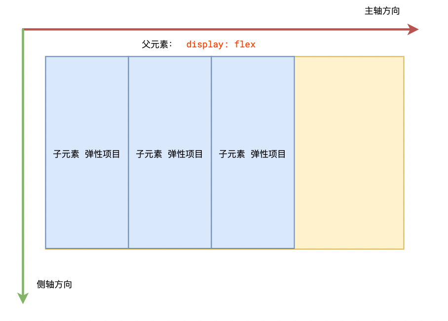

**默认情况下**，弹性项目 [^1] 沿着主轴依次排列，侧轴 [^2] **拉伸** [^3]。

### 1.1.2 更改方向

通过 `flex-direction` 可更改主轴方向：

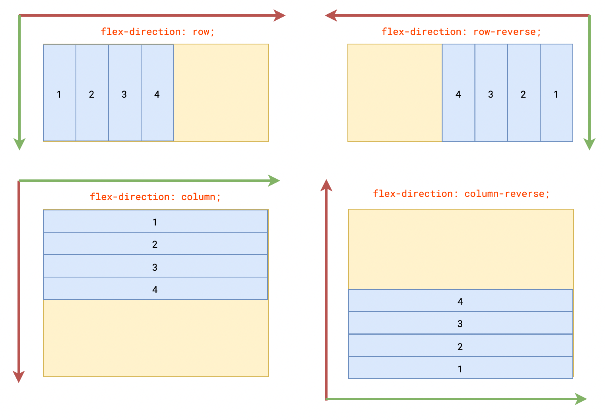

### 1.1.3 主轴排列

通过 `justify-content` 属性，可以影响主轴的排列方式：

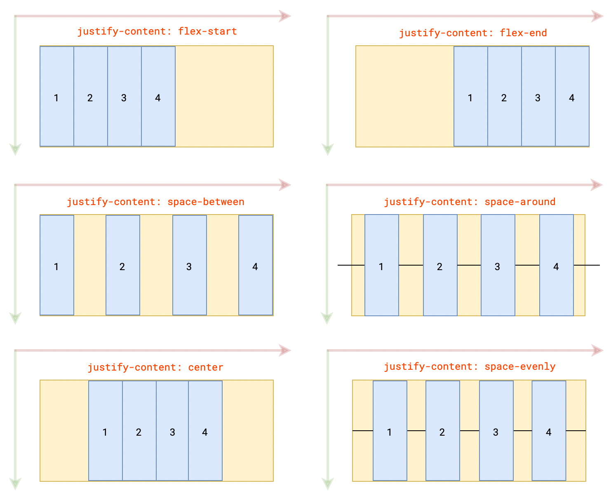

### 1.1.4 侧轴排列

通过 `align-items` 属性，可以影响侧轴的排列方式：

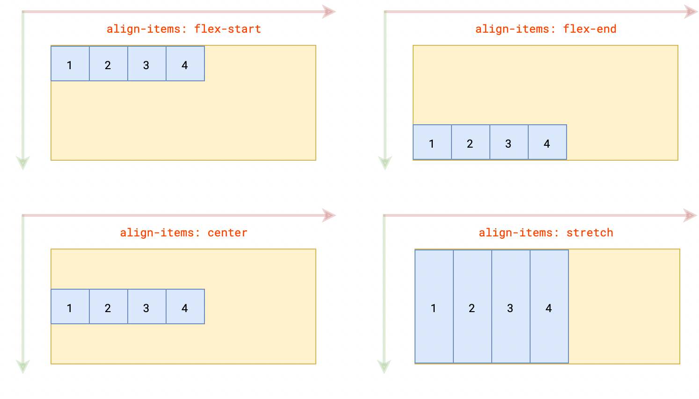

### 1.1.5 弹性项目伸缩

所谓伸缩，是指在 **主轴方向** 上，当 **弹性容器** 有 **额外空间** 时，是否需要拉伸，当 **空间不足** 时，是否需要 **压缩**。

在 **弹性项目** 上使用 `flex` 属性，可设置拉伸和压缩比例：`flex: 拉伸比例 压缩比例 初始尺寸`

拉伸示例：

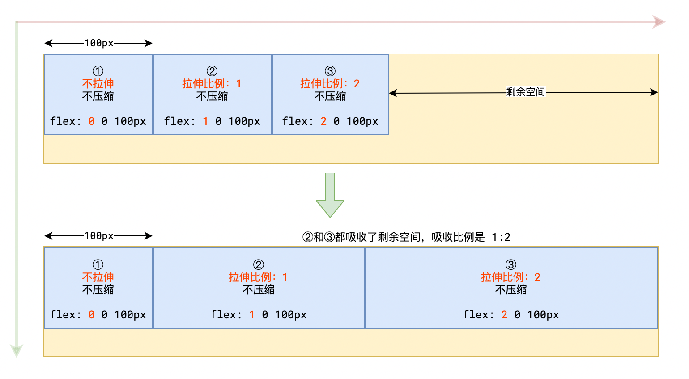

压缩示例：

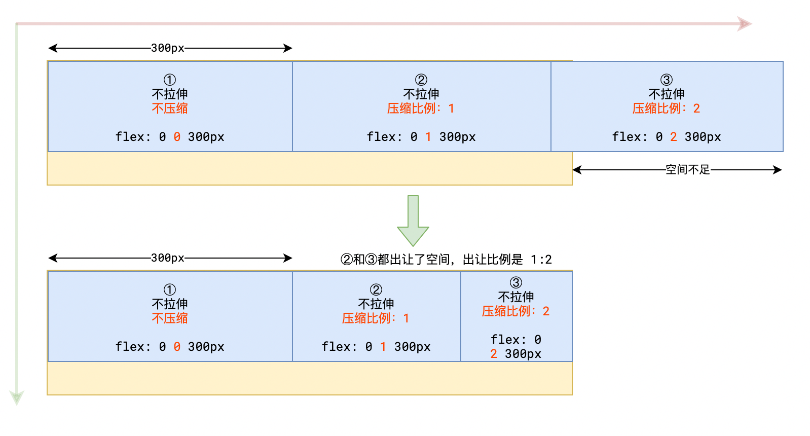

默认情况下，`flex: 0 1 auto`。

### 1.1.6 主轴换行

默认情况，当主轴剩余空间不足时，按照压缩比例进行压缩，但如果设置了主轴换行，则不会压缩，直接换行显示

给 **弹性容器** 设置 `flex-wrap: wrap`，即可主轴换行：

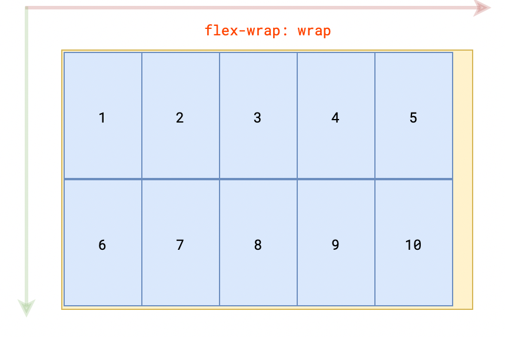

> 尽管如此，多行多列仍然推荐使用 **网格布局**


## 1.2 网格

> [!tip]
>
> [MDN 详细文档](https://developer.mozilla.org/zh-CN/docs/Web/CSS/CSS_Grid_Layout)
>
> [阮一峰网格布局教程](http://www.ruanyifeng.com/blog/2019/03/grid-layout-tutorial.html)
>
> [网格布局小游戏](https://cssgridgarden.com/)

**网格布局是多行多列布局的终极解决方案**

### 1.2.1 生成网格布局

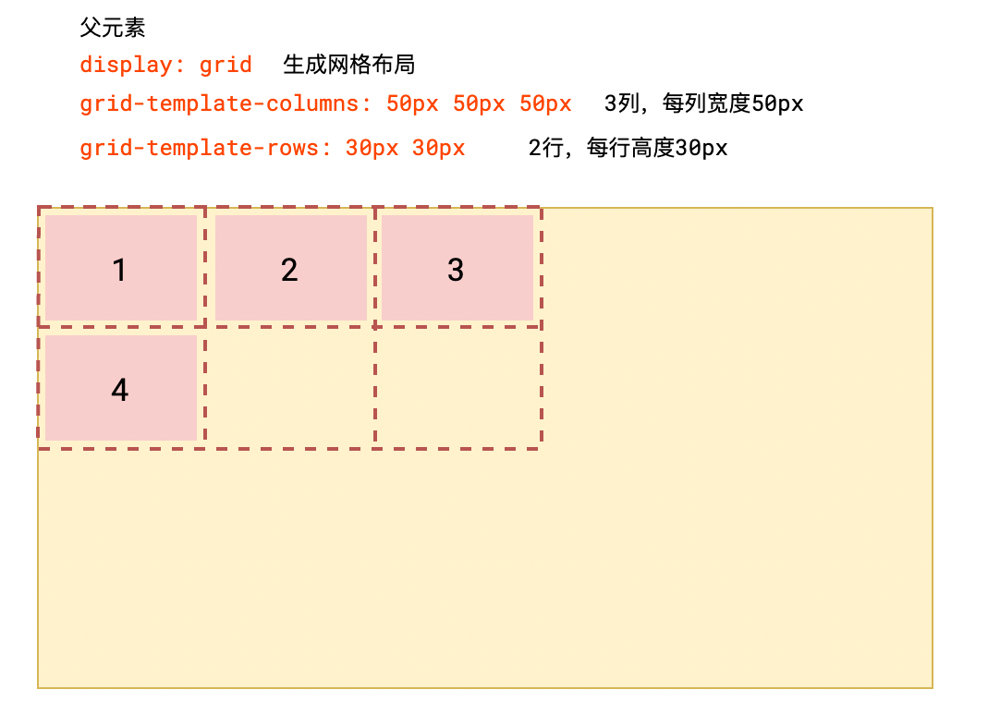

容器生成网格布局后，其所有子元素为 **网格项目** [^4]

### 1.2.2 定义行和列

`grid-template-rows`：定义行

`grid-template-columns`：定义列

**它们的语法是相同的**

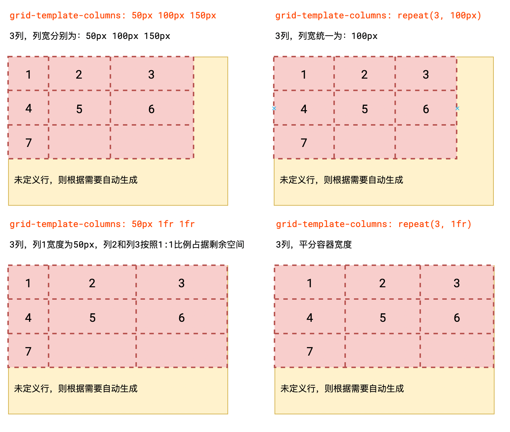

### 1.2.3 改变排列方向

使用属性 `grid-auto-flow: column`，可使子元素按列排放：

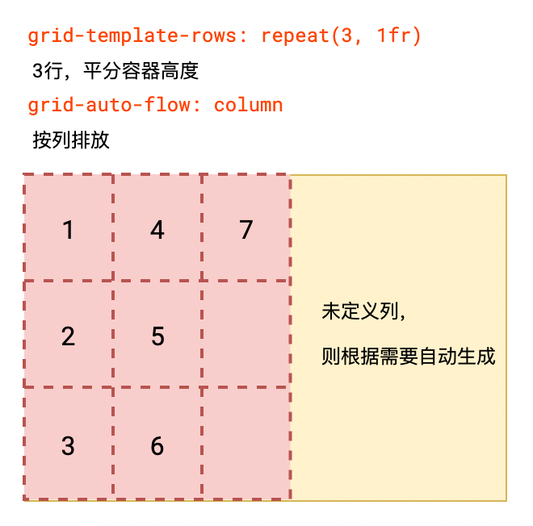

### 1.2.4 单元格之间的间隙

```css
row-gap: 10px; /* 行间隙为 10px */
column-gap: 20px; /* 列间隙为 20px */
gap: 10px 20px; /* 行间隙为 10px，列间隙为 20px */
```

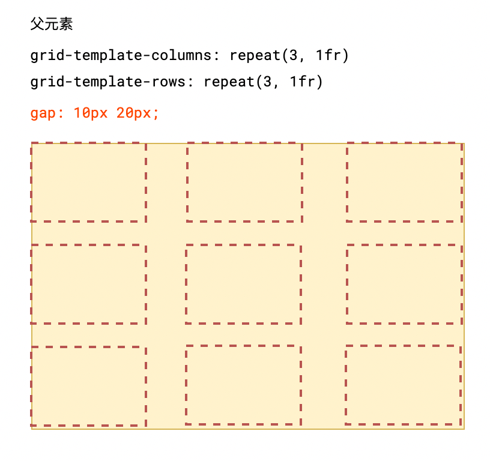

### 1.2.5 单元格内部的对齐

默认情况下，网格项目在单元格内部水平和垂直拉伸，以撑满单元格

可以使用属性 `justify-items` 设置 **水平方向** 的排列方式

可以使用属性 `align-items` 设置 **垂直方向** 的排列方式

它们的可取值是相同的：

```css
justify-items: start 左 | end 右 | center 中 | stretch 拉伸;
align-items: start 上 | end 下 | center 中 | stretch 拉伸;
```

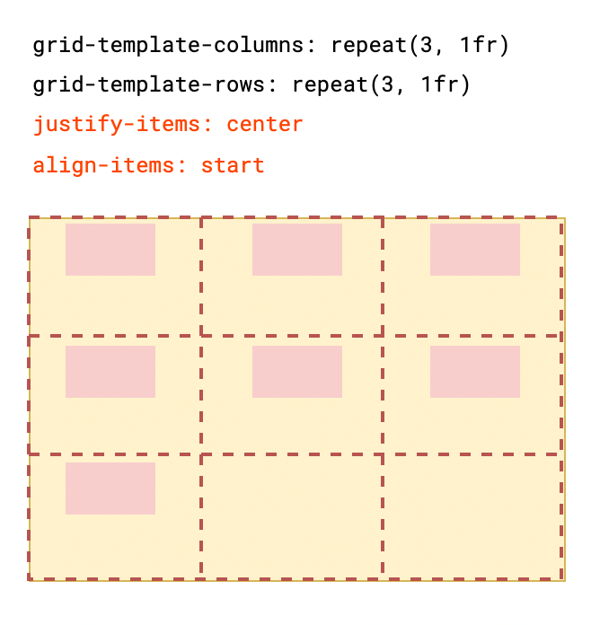

可以使用速写属性 `place-items: 垂直对齐方式 水平对齐方式` 同时设置这两个值

```css
place-items: start center; /* 垂直靠上，水平居中 */
```

### 1.2.6 网格项目定位

默认情况下，网格项目依次排列到单元格中，每个网格占据一个单元格

但可以对网格项目设置 `grid-area` 属性来改变这一行为

使用方式为：

```css
grid-area: 起始行线编号/起始列线编号/结束行线编号/结束列线编号;
```

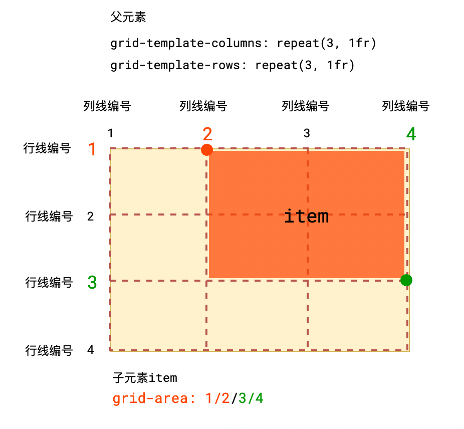

# 2 视觉

> 所谓视觉类样式，是指不影响盒子位置、尺寸的样式，例如文字颜色、背景颜色、背景图片等

## 2.1 阴影

### 2.1.1 盒子阴影

> [!tip]
>
> [MDN 详细文档](https://developer.mozilla.org/zh-CN/docs/Web/CSS/box-shadow)

通过 `box-shadow` 属性可以设置整个盒子的阴影。

下面是一些示例：

<iframe src="http://mdrs.yuanjin.tech/html/css-manual/box-shadow.html?v=2" style="height:900px;">

### 2.1.2 文字阴影

> [!tip]
>
> [MDN 详细文档](https://developer.mozilla.org/zh-CN/docs/Web/CSS/text-shadow)

通过 `text-shadow` 可以设置文字阴影。

下面是一些示例：

<iframe src="http://mdrs.yuanjin.tech/html/css-manual/text-shadow.html?v=3" style="height:500px;">

## 2.2 圆角

> [!tip]
>
> [MDN 详细文档](https://developer.mozilla.org/zh-CN/docs/Web/CSS/border-radius)

通过设置 `border-radius`，可以设置盒子的圆角（即曲率半径）：

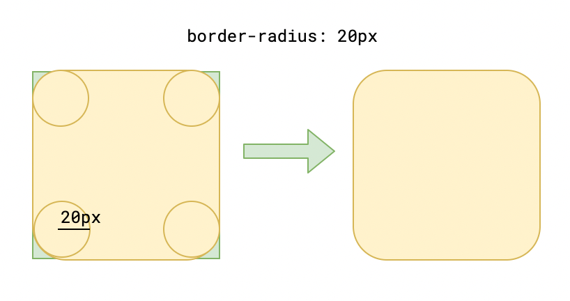

`border-radius` 可以有很多灵活的用法，将下面的代码依次粘贴到页面中测试一下：

```css
border-radius: 10px; /* 同时设置 4 个角的圆角，半径为 10px */
border-radius: 50%; /* 同时设置 4 个角的圆角，圆的横向半径为宽度一半，纵向半径为高度一半 */
border-radius: 10px 20px 30px 40px; /* 分别设置左上、右上、右下、左下的圆角 */
```

<iframe src="http://mdrs.yuanjin.tech/html/css-manual/border-raduis.html?v=5" style="height:550px;">

## 2.3 背景渐变

> [!tip]
>
> [MDN 详细文档](https://developer.mozilla.org/zh-CN/docs/Web/CSS/linear-gradient())

在设置 **背景图片** 时，除了可以使用 `url()` 加载一张背景图，还可以使用 `linear-gradient()` 函数设置背景渐变。

`linear-gradient()` 用于创建一张渐变的图片，语法为：

```css
/* 设置渐变背景，方向：从上到下，颜色：从 #e66465 渐变到 #9198e5 */
background: linear-gradient(to bottom, #e66465, #9198e5);
```

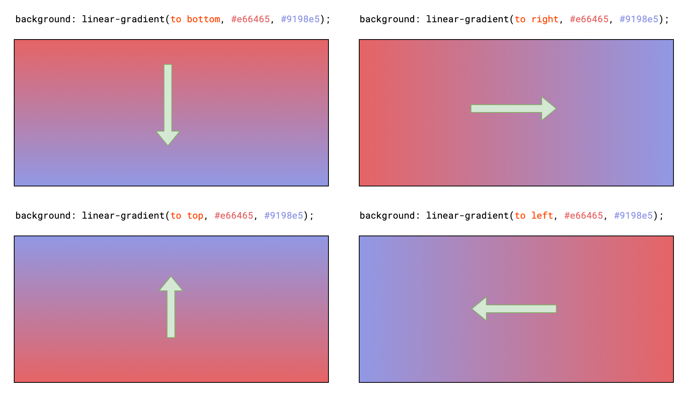

## 2.4 变形

> [!tip]
>
> [MDN 详细文档](https://developer.mozilla.org/zh-CN/docs/Web/CSS/transform)

通过 `transform` 属性，可以使盒子的形态发生变化。

该属性支持多种变形方案，常见的有:

- `translate`，平移
- `scale`，缩放
- `rotate`，旋转
- `skew`，剪切变换（DIY 补充）

**无论是哪一种 transform，都只是视觉效果的变化，不会影响盒子的布局**

**transform 不会导致浏览器 reflow 和 rerender，因此效率极高**

### 2.4.1 translate 平移

使用 `translate` 可以让盒子在原来位置上产生位移，类似于 **相对定位**：

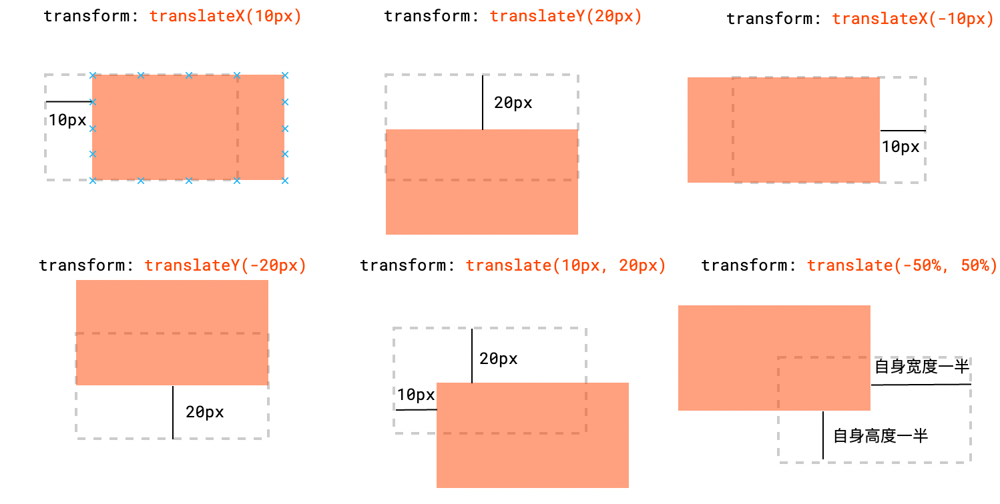

### 2.4.2 scale 缩放

使用 `scale` 可以让盒子基于原来的尺寸发生缩放：

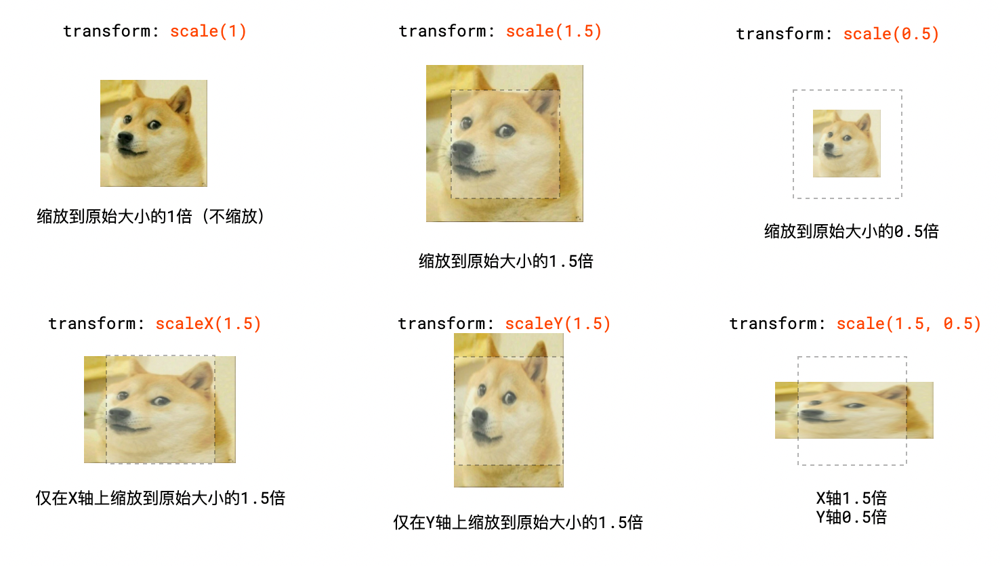

### 2.4.3 rotate 旋转

使用 `rotate` 属性可以在原图基础上进行旋转：

```css
/* 在原图的基础上，顺时针旋转 45 度角 */
transform: rotate(45deg); 
/* 在原图的基础上，顺时针旋转半圈 */
transform: rotate(0.5turn); 
```

可以点击下面的按钮试一下旋转效果

<iframe src="http://mdrs.yuanjin.tech/html/css-manual/rotate.html" style="height:400px;">


### 2.4.4 改变变形原点

> [!tip]
>
> [MDN 详细文档](https://developer.mozilla.org/zh-CN/docs/Web/CSS/transform-origin)

变形原点的位置，会影响到具体的变形行为。

默认情况下，变形的原点在盒子中心，你可以通过 `transform-origin` 来改变它：

```css
transform-origin: center; /* 设置原点在盒子中心 */
transform-origin: left top; /* 设置原点在盒子左上角 */
transform-origin: right bottom; /* 设置原点在盒子右下角 */
transform-origin: 30px 60px; /* 设置原点在盒子坐标 (30, 60) 位置 */
```

试一试，先点击设置原点的按钮来设置原点(已在图片中使用红色小点标记)，然后点击变形按钮进行变形：

<iframe src="http://mdrs.yuanjin.tech/html/css-manual/transform-origin.html?v2" style="height:600px;">

### 2.4.5 多种变形叠加

可以一次性设置多种变形效果：

```css
/* 先旋转 45 度，再平移 (100, 100) */
transform: rotate(45deg) translate(100px, 100px);
/* 先平移 (100, 100)，再旋转 45 度 */
transform: translate(100px, 100px) rotate(45deg);
```

注意：旋转会导致坐标系也跟着旋转，从而可能影响到后续的变形效果。

下面的例子可以很好的说明这一点

<iframe src="http://mdrs.yuanjin.tech/html/css-manual/multi-transform.html" style="height: 650px;"></iframe>

> [!note]
>
> 本来打算把这个效果嵌入到 `Markdown`，但由于嵌入后出现一些未知的 bug，因此只能粘贴效果地址了

# 3 过渡和动画

使用过渡和动画，可以让 CSS 属性变化更加丝滑

**过渡和动画无法对所有的 CSS 属性产生影响，能够产生影响的只有数值类属性**，例如：颜色、宽高、字体大小等等。

## 3.1 过渡

> [!tip]
>
> [MDN 详细文档](https://developer.mozilla.org/zh-CN/docs/Web/CSS/transition)

```css
transition: 过渡属性 持续时间 过渡函数 过渡延迟
```

- **过渡属性**

  针对哪个 CSS 属性应用过渡。例如填写 `transform`，则表示过渡特效仅对 **transform** 属性生效。

  若填写 `all` 或不填写，则表示过渡特效对所有 CSS 属性生效。

- **持续时间**

  CSS 属性变化所持续的时间，需要带上单位。例如 `3s` 表示 3 秒，`0.5s` 或 `500ms` 均表示 500 毫秒。

- **过渡函数**

  本质是 CSS 属性变化的贝塞尔曲线函数，通常直接使用预设值：

  `ease-in-out`：平滑开始，平滑结束

  `linear`：线性变化

  `ease-in`：仅平滑开始

  `ease-out`：仅平滑结束

- **过渡延迟**

  书写规则和持续时间一样，表示过渡效果延迟多久后触发，不填则无延迟

**在JS中，可以监听元素的 `transitionstart` 和 `transitionend` 事件，从而在过渡开始和过渡结束时做一些别的事情。**

## 3.2 动画

> [!tip]
>
> [MDN 详细文档](https://developer.mozilla.org/zh-CN/docs/Web/CSS/CSS_Animations)

**动画的本质是预先定义的一套 CSS 变化规则，然后给该规则取个名字**：

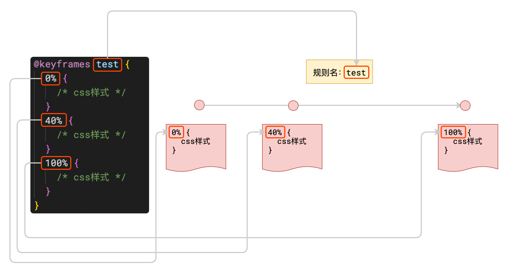

然后，其他元素即可使用这样的规则：

```css
animation: 规则名 持续时间;
```

在应用规则时，还可以指定更多的信息

```css
animation: 规则名 持续时间 重复次数 时间函数 动画方向 延迟时间
```

一些细节：

- 定义规则时，`0%` 可以书写为 `from`
- 定义规则时，`100%` 可以书写为 `to`
- 重复次数为 `infinite` 时，表示无限重复
- 动画方向为 `alternate` 时，表示交替反向，第 1 次正向，第 2 次反向，第 3 次正向，第 4 次反向，以此类推。

**在JS中，可以监听元素的 `animationstart` 和 `animationnend` 事件，从而在动画开始和动画结束时做一些别的事情。**

# 4 其他

## 4.1 box-sizing

一图胜千言

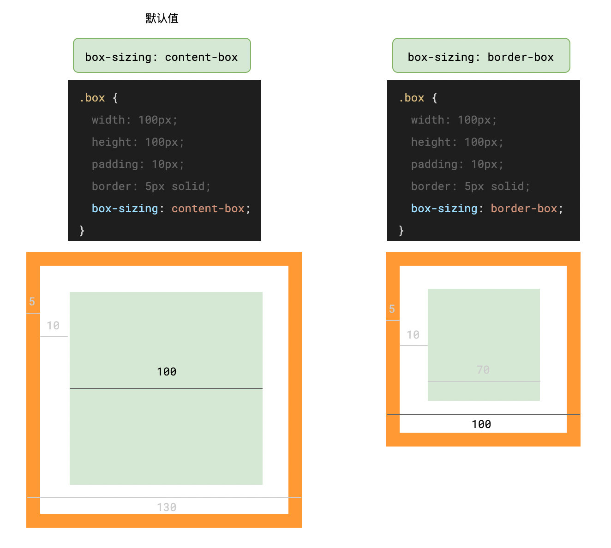

使用 `border-box` 控制尺寸更加直观，因此，很多网站都会加入下面的代码：

```css
* {
  margin: 0;
  padding: 0;
  box-sizing: border-box;
}
```

## 4.2 字体图标

> [!tip]
>
> [MDN font-face 指令](https://developer.mozilla.org/zh-CN/docs/Web/CSS/@font-face)

CSS3 新增了 `font-face` 指令，该指令可以让我们加载网络字体。

其最常见的应用就是 **字体图标**。

**字体图标本质上是文字，可以通过 `color` 设置颜色，通过 `font-size` 设置尺寸。**

国内使用最多的字体图标平台是 [阿里巴巴矢量图标库](https://www.iconfont.cn/)

登录平台后即可免费使用其所有字体图标。

## 4.3 图像内容适应

> [!tip]
>
> [MDN 详细文档](https://developer.mozilla.org/zh-CN/docs/Web/CSS/object-fit)

CSS3 属性 `object-fit` 可以控制 **多媒体内容和与元素** 的适应方式，通常应用在 `img` 或 `video` 元素中。

> [!tip] 
>
> 一图胜千言

下图中的所有 `img` 元素均被固定了宽高，溢出 `img` 的部分实际上均不会显示

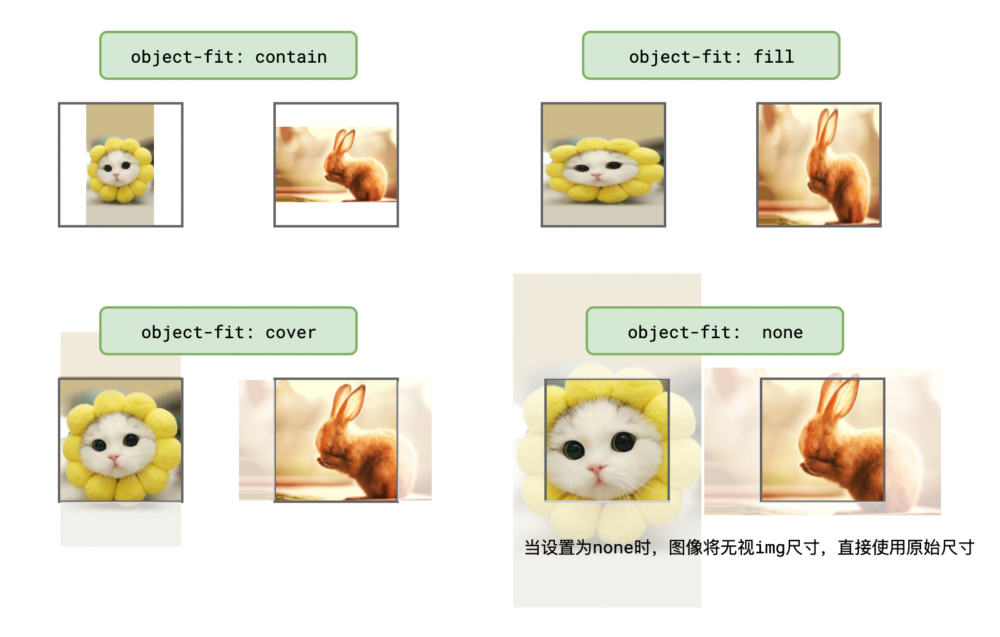

## 4.4 视口单位

CSS3 支持使用 `vw` 和 `vh` 作为单位，分别表示 `视口宽度` 和 `视口高度`

例如 `1vh` 表示视口高度的 `1%`，`100vw` 表示视口宽度的 `100%`

## 4.5 伪元素选择器

通过 `::before` 和 `::after` 选择器，可以通过 CSS 给元素生成两个子元素：

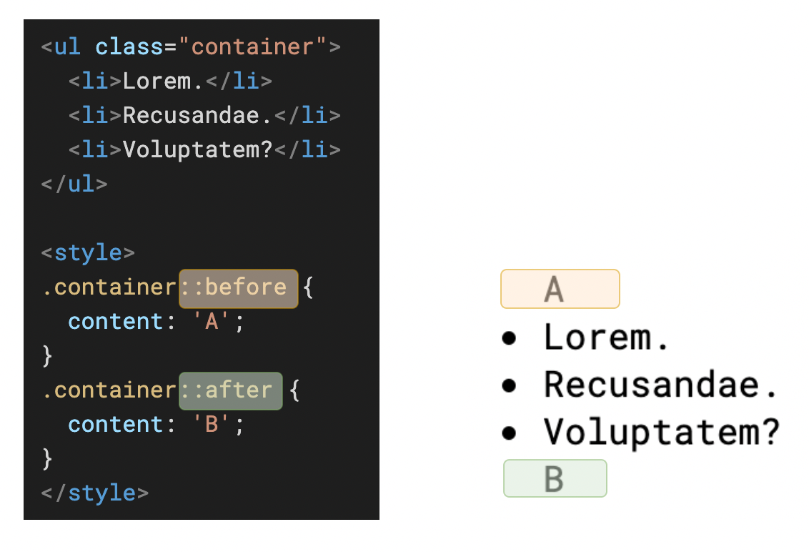

使用伪元素可以 **避免在 HTML 中使用过多的空元素**。

**伪元素必须要有 `content` 属性，否则不能生效；如果不需要有元素内容，设置 `content: '';`**

## 4.6 平滑滚动

> [!tip]
>
> [MDN 详细文档](https://developer.mozilla.org/zh-CN/docs/Web/CSS/scroll-behavior)

使用 `scroll-behavior: smooth`，可以让滚动更加丝滑

参见 MDN 效果即可。


---

[^1]: 英文原文为 `flex item`，个人认为按 **弹性元素** 翻译更贴切。
[^2]: 所谓的侧轴，英文原文为 `cross axis`，个人认为按 **交叉轴** 翻译更准确。
[^3]: 所谓的 **拉伸**，即对于 `align-items` 和 `align-content` 属性的 `stretch` 属性值作为其 `initial` 值。

[^4]: 即 `grid item`，个人认为应译作 **网格元素** 更贴切。


