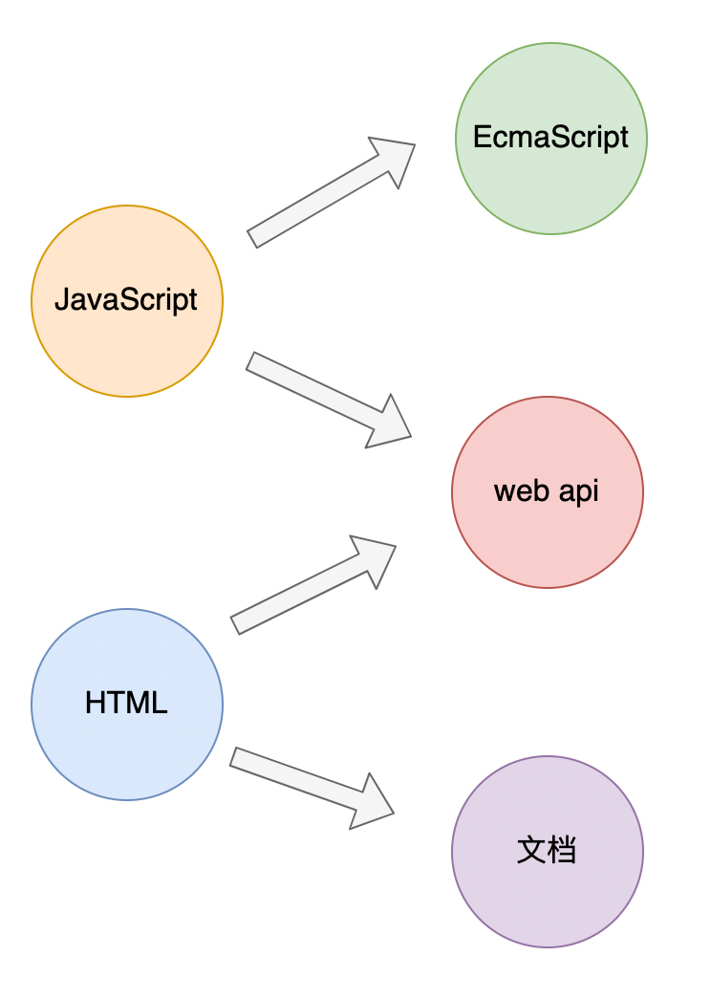
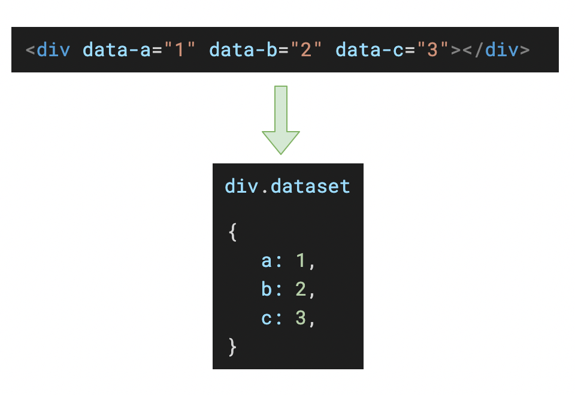

# HTML5 简要文档

---



`HTML5` 包含两个部分的更新，分别是 `文档` 和 `Web API`。

## 1 文档

<iframe src="https://www.xuanfengge.com/funny/html5/element/" style="height: 700px;"></iframe>

[HTML5元素表](https://www.xuanfengge.com/funny/html5/element/)


### 1.1 元素语义化

元素语义化是指 **每个 HTML 元素都代表着某种含义，在开发中应该根据 *元素含义* 选择元素**。

元素语义化的好处：

1. 利于 `SEO`（搜索引擎优化）；
2. 利于无障碍访问；
3. 利于浏览器的插件分析网页；


### 1.2 新增元素

#### 1.2.1 多媒体

可以使用 `audio` 元素表达一个音频。

可以使用 `video` 元素表达一个视频。

它们均具有以下属性：

|   属性名   | 含义             | 类型     |
| :--------: | ---------------- | -------- |
|   `src`    | 多媒体的文件路径 | 普通属性 |
| `controls` | 是否显示播放控件 | 布尔属性 |
| `autoplay` | 是否自动播放     | 布尔属性 |
|   `loop`   | 是否循环播放     | 布尔属性 |
|  `muted`   | 静音播放         | 布尔属性 |

> [!note]
>
> 新版浏览器不允许「**带声音的自动播放**」，可能将来甚至不允许自动播放。
>
> 浏览器希望播放行为 **由用户决定**。


#### 1.2.2 文章结构

为了让搜索引擎和浏览器更好的理解文档内容，`HTML5` 新增了多个元素来表达内容的含义。

下面的示例中，使用了 `HTML5` 的新增元素来表达一篇文章

```html
<!-- article：一篇文章 -->
<article>
  <!-- header：文章头部信息 -->
  <header>
    <h1>文章标题</h1>
    <!-- blockquote：引用信息 -->
    <blockquote>此文章引用的文献：xxxx</blockquote>
  </header>
  <!-- aside: 文章的其他附加信息 -->
  <aside>
    <span>作者：xxxx</span>
    <span>发布日期：xxx</span>
    <span>浏览量：xxx</span>
  </aside>
  <!-- section：章节 -->
  <section>
    <h2>章节1</h2>
    <p>段落1</p>
    <p>段落2</p>
    <p>段落3</p>
    <p>段落4</p>
  </section>
  <!-- section：章节 -->
  <section>
    <h2>章节2</h2>
    <p>段落1</p>
    <p>段落2</p>
    <p>段落3</p>
    <p>段落4</p>
  </section>
  <!-- section：章节 -->
  <section>
    <h2>章节3</h2>
    <p>段落1</p>
    <p>段落2</p>
    <p>段落3</p>
    <p>段落4</p>
  </section>
  <!-- 页脚 -->
  <footer>
    <p>参考资料</p>
    <!-- cite表示外部站点的引用 -->
    <cite>xxxxxxx</cite>
    <cite>xxxxxxx</cite>
    <cite>xxxxxxx</cite>
    <cite>xxxxxxx</cite>
    <cite>xxxxxxx</cite>
    <cite>xxxxxxx</cite>
  </footer>
</article>
```


### 1.3 新增属性

#### 1.3.1 自定义数据属性



#### 1.3.2 input 的新增属性

> [!tip]
>
> [MDN input 详细文档](https://developer.mozilla.org/zh-CN/docs/Web/HTML/Element/input)

进入下面的地址查看各种属性及其效果：

http://mdrs.yuanjin.tech/html/html-manual/input-property.html


## 2 Web API

### 2.1 使用 CSS 选择器选中元素

```js
// 使用css选择器选中匹配的第一个元素
document.querySelector('css选择器');
// 使用css选择器选中匹配的所有元素，返回伪数组
document.querySelectorAll('css选择器');
```


### 2.2 控制类样式

```js
// 添加类样式
dom.classList.add('a');  // <div class="a"></div>
dom.classList.add('b');  // <div class="a b"></div>
dom.classList.add('c');  // <div class="a b c"></div>

// 是否包含某个类样式
dom.classList.contains('a');  // true 

// 移除类样式
dom.classList.remove('a');  // <div class="b c"></div>

// 切换类样式
dom.classList.toggle('a'); // <div class="a b c"></div>
dom.classList.toggle('a'); // <div class="b c"></div>
dom.classList.toggle('a'); // <div class="a b c"></div>
```


### 2.3 本地存储

- `localStorage`，永久保存到本地；
- `sessionStorage`，临时保存到本地，关闭浏览器后消失。

```js
// 保存一个键值对到本地，值必须是字符串
localStorage.setItem('key', 'value');
// 根据键，读取本地保存的值
localStorage.getItem('key');
// 清除所有保存的内容
localStorage.clear();
// 根据键，清除指定的内容
localStorage.removeItem('key');

// 保存一个键值对到本地，值必须是字符串
sessionStorage.setItem('key', 'value');
// 根据键，读取本地保存的值
sessionStorage.getItem('key');
// 清除所有保存的内容
sessionStorage.clear();
// 根据键，清除指定的内容
sessionStorage.removeItem('key');
```

无论是 `localStorage` 还是 `sessionStorage`，它们都只能保存字符串，如果需要保存对象或数组，可以先将对象和数组转换为 `JSON` 字符串再进行保存：

```js
JSON.stringify(obj); // 将对象或数组转换为JSON搁置
JSON.parse(jsonString); // 将JSON格式的字符串转换为对象或数组
```


### 2.4 渲染帧

浏览器会不断的对网页进行渲染，通常情况下的速度为每秒渲染60次，每一次渲染称之为 **一帧（frame）**，因此又可以说：浏览器的 **渲染速率** 是 60 帧。

但这不是一定的，它会受到各种因素的影响，因此，帧率往往会有浮动。

浮动的帧率就导致一个问题，我们在使用 `setInterval` 等计时器实现某些动画效果时，如何才能保证每一帧只执行一次动画效果呢？


为了解决该问题，`HTML5` 新增 API `requestAnimationFrame`，用于在每一帧渲染 **之前** 做某些事：

```js
requestAnimationFrame(function(){
  // 传入一个回调函数，该函数在下一帧渲染之前自动运行
  // 通常，可以利用该回调函数，在下一帧渲染前改动元素的状态
})
```

`raq` 的回调函数 **仅执行一次**。因此，要实现连贯的动画，通常使用下面的代码结构：

```js
// 该函数负责在下一帧渲染前，执行一次元素状态变化
function changeOnce(){
  requestAnimationFrame(function(){
    if(动画是否应该停止){
      return;
    }
    改变元素状态
    changeOnce(); // 改变完成后，继续注册下一帧的变化
  })
}
changeOnce();
```


### 2.5 音视频 API

> [!tip]
>
> [MDN 详细文档](https://developer.mozilla.org/zh-CN/docs/Web/API/HTMLMediaElement)

针对 `video` 和 `audio` 元素，`HTML5` 新增了音视频的 API，让开发者可以使用 `JavaScript` 控制它们。

**音视频属性**

|     属性名     | 含义                                                         |
| :------------: | ------------------------------------------------------------ |
| `currentTime`  | 当前播放时间，单位为秒。为其赋值将会使媒体跳到一个新的时间。 |
|     `loop`     | 对应 `HTML` 标签 `loop` 属性，决定该媒体是否循环播放。       |
|   `controls`   | 对应 `HTML` 标签`controls`属性，控制是否显示用户播放界面的控制 `HTML`。 |
|     `src`      | 对应 `HTML` 标签`src`属性，获取和设置播放地址。              |
|    `volume`    | 表示音频的音量。值从 `0.0`（静音）到 `1.0`（最大音量）。     |
| `playbackRate` | 播放倍速。`1` 为正常。                                       |
|   `duration`   | 总时长，单位为秒。                                           |
|    `paused`    | 当前是否是暂停状态。                                         |
|    `muted`     | 是否静音。                                                   |

**音视频方法**

|  方法名   |   含义   |
| :-------: | :------: |
| `play()`  | 开始播放 |
| `pause()` | 暂停播放 |

**事件**

|    事件名    | 含义                                                         |
| :----------: | ------------------------------------------------------------ |
|   `pause`    | 暂停时触发。                                                 |
|   `ended`    | 结束时触发。                                                 |
|    `play`    | 开始播放时触发。                                             |
| `timeupdate` | 属性 `currentTime` 变化时触发。会随着播放进度的变化不断触发。 |
| `loadeddata` | 事件在第一帧数据加载完成后触发。                             |

