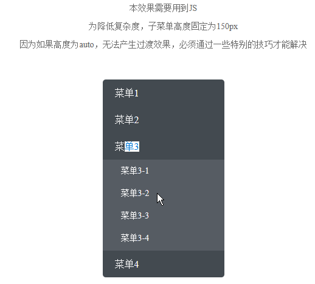
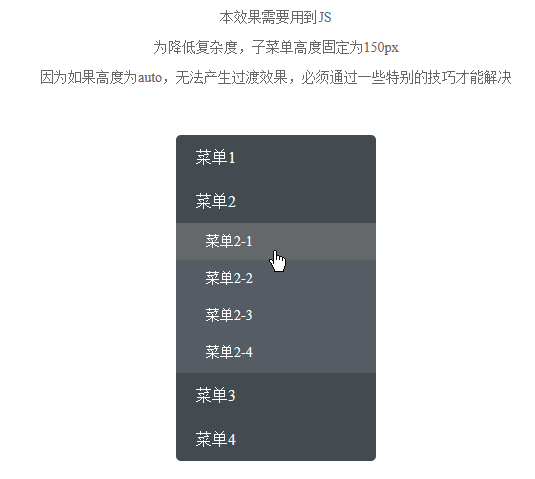

# L02 CSS3 过渡与动画特效

---


## 1 习题复盘

习题四：抓住问题本质，再利用 CSS 样式类的切换，可大幅减少 JS 代码量。

参考效果图：



问题的本质，在于每次点击后，子菜单 `ul` 上最多只能有一组目标样式类（`.extend`）：

```css
.menu-container {
  border-radius: 5px;
}
.sub-menu {
  overflow: hidden;
  height: 0;
  transition: height 0.3s ease-in-out;
}
.open { /* 新增用于切换的样式类 */
  height: 150px;
}
```

JS 前后代码量对比：

```js
// before
var menus = document.getElementsByClassName('menu');
for (var i = 0; i < menus.length; i++) {
  menus[i].getElementsByTagName('h2')[0].onclick = menuClickHandler;
}

function menuClickHandler() {
  var allSubMenus = document.getElementsByClassName('sub-menu');
  var subMenu = this.parentElement.getElementsByClassName('sub-menu')[0];
  if (subMenu.clientHeight) {
    subMenu.style.height = '0';
  } else {
    subMenu.style.height = '150px';
    for (var i = 0; i < allSubMenus.length; i++) {
      if (allSubMenus[i] !== subMenu) {
        allSubMenus[i].style.height = '0';
      }
    }
  }
}

// after
Array.from(document.querySelectorAll('.menu > h2'))
  .forEach((h2, _, arr) => 
    h2.addEventListener('click', ({target}) => {
      arr.filter(_h2 => _h2 !== target)
        .forEach(_h2 => _h2.nextElementSibling.classList.remove('open'));
      target.nextElementSibling.classList.toggle('open');
    }));
```

其他细节完善：

- 禁用鼠标选中文字：`user-select: none;`；
- 子菜单展开后应该对鼠标悬停设置高亮色，同时鼠标变为 `pointer`。

最终样式：

```css
.menu-container {
  border-radius: 5px;
}
.sub-menu {
  overflow: hidden;
  height: 0;
  transition: height 0.3s ease-in-out;
  & > li {
    cursor: pointer;
    &:hover {
      background: #64686b;
    }
  }
}
.open {
  height: 150px;
}
h2 {
  user-select: none;
}
```

最终效果：

