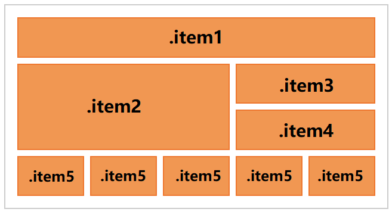

# L03：CSS3 布局—— Flexbox 与 Grid 布局

---


网格练习3：

样式类与对应的网格单元分布情况如下：



上述布局利用网格线定位：

```css
.container {
  display: grid;
  grid-template-columns: repeat(5, 1fr);
  grid-template-rows: repeat(4, 1fr);
  gap: 10px;

  & .item1 { grid-area: 1/1 / 2/6; }
  & .item2 { grid-area: 2/1 / 4/4; }
  & .item3 { grid-area: 2/4 / 3/6; }
  & .item4 { grid-area: 3/4 / 3/6; }
}
```

`L7` 到 `L10` 均通过设置目标网格的 **左上角** 和 **右下角** 的网格线交点坐标（如 `(1,1)` 和 `(2,6)`）实现定位。

除此之外，《CSS in Depth 2》还介绍了其他方式：

- 分别设置 `grid-column` 和 `grid-row`；
- 对上述任一属性使用 `span <number>`；
- 命名网格线：详见 [【CSS in Depth 2 精译_031】5.3 Grid 网格布局的两种替代语法](https://blog.csdn.net/frgod/article/details/142288356)；
- 命名网格区域：详见 [【CSS in Depth 2 精译_031】5.3 Grid 网格布局的两种替代语法](https://blog.csdn.net/frgod/article/details/142288356)；

代码汇总如下：

```css
.container {
  display: grid;
  grid-template-columns: repeat(5, 1fr);
  grid-template-rows: repeat(4, 1fr);
}
/* 1. 左上角坐标 + 右下角坐标 */
.container {
  & .item1 {
    grid-area: 1/1 / 2/6;
  }
}

/* 2. 行轨道的上下网格线、列轨道的左右网格线 */
.container {
  & .item2 { 
    grid-column: 1 / 4;  /* 列轨道的左右网格线 */
    grid-row: 2 / 4;  /* 行轨道的上下网格线 */
  }
}

/* 3. 使用 span 实现跨行或跨列 */
.container {
  & .item2 { 
    grid-column: 1 / 4;
    grid-row: span 2;  /* 跨越两个网格行轨道 */
  }
}

/* 4. 命名网格线 */
.container {
  grid-template-columns: repeat(5, [col] 1fr) [end];
  grid-template-rows: repeat(4, [row] 1fr);
  & .item2 { 
    grid-column: col 1 / end;
    grid-row: row 2 / row 4;
  }
}

/* 5. 命名网格区域 */
.container {
  display: grid;
  grid-template-areas: 
    "header header header header header"
    "main   main   main   aside1 aside1"
    "main   main   main   aside2 aside2"
    "footer footer footer footer footer";
  gap: 10px;
  & .item1 { grid-area: header; }
  & .item2 { grid-area: main; }
  & .item3 { grid-area: aside1; }
  & .item4 { grid-area: aside2; }
}
```


