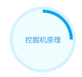

# L05：CSS3 个人简历制作

---


## 1 需求描述

用前面所学的 `HTML5`、`CSS3`、`JavaScript` 的知识，制作一个个人求职简历页面，要求：

- 效果示例：`http://resume.yuanjin.tech/`
- 容器尺寸：`800`
- 文字颜色：`#333`
- 链接颜色：`#0ea5e9`
- 链接颜色浅色1：`#22d3ee`
- 链接颜色浅色2：`#f0fdff`
- 最后将作品发布到公网环境


## 2 要点梳理

1. 页面尽量使用 `HTML5` 语义化标签；

2. 电话可使用 `<a href="tel:13601010101">13601010101</a>`，这样在移动端可以直接拨号；

3. 电子邮箱可使用 `<a href="mailto:abc@hotmail.com">abc@hotmail.com</a>`，这样点击后可以直接发邮件；

4. 最外层容器的蓝色倾斜阴影效果，需在其伪元素上设置 `z-index: -1;` 实现置底效果；

5. `details` 中的 `summary` 具有较多的默认样式与交互效果，纯 `CSS` 设置无法禁用 `click` 和 `toggle` 的默认交互，因此只能通过 `JavaScript` 禁用：

   ```js
   const dtls = document.querySelectorAll('details');
   dtls.forEach(dtl => {
       dtl.querySelector('summary').addEventListener(
           'click', e => e.preventDefault());
       dtl.addEventListener('toggle', ({target}) => {
           if(!target.open) {
               target.open = true;
           }
       });
   });
   ```

6. 二维布局最好用 `Grid` 网格，因为 `Flexbox` 嵌套较深；

7. `oklch()` 颜色函数可读性较差，只能在选定 `rgb()` 颜色值后通过浏览器切换成 `oklch()` 值。

8. 从阿里图标库选定某个图标后，可通过编辑功能调整图标的大小（网站提供了多套定位网格）；下载到本地后，如果是使用样式类引入图标，应该删除其他无关配置文件。

9. 简历中需要强调的文字内容，可通过 `<em>` 元素包裹，然后设置 `margin-inline` 实现与周边文字保持一定间隔距离，无需像视频那样通过换行符添加空白。

最后需要特别强调的，是用伪元素实现不完整边框的效果：


已知：

1. 浅色边框是弹性元素的，深色是其伪元素的；
2. 边框宽度为 `6px`，宽高均为 `130px`；
3. 元素和伪元素均设置了盒模型的度量方式为边框盒：`box-sizing: border-box`；

重要结论：

1. 元素的边框效果是从总宽高开始，向内填充 `6px`，因此内容区的宽高只剩 `118px (= 130px - 6px * 2)`；
2. 伪元素的边框是 **从真元素的内容区** 开始测量的，因此当伪元素宽高设为 `100%`，实际长度只有 `118px`，这样两个边框将无法重合：



3. 为了让边框重合，伪元素宽高只能取绝对尺寸（即宽高各 `130px`），但由于伪元素的定位原点和真实元素不重合，因此伪元素不能再用 `top: 0; left: 0;` 定位，只能主动让出一个边框宽度：

```css
&.skill1::before {
    border-radius: 50%;
    position: absolute;
    width: 130px;
    height: 130px;
    top: -6px;
    left: -6px;
}
```

效果对比如下：


4. 由于真实元素的边框太宽，设置文字行高时也要考虑这部分无效宽度，因此行高也只能设为 `118px`，否则容器中的文字将无法完全居中。

5. 实测时尝试用 `outline` 轮廓线实现该效果，但尝试失败，因为 `outline-color` 无法像 `border-color` 那样，支持分别设置四个方向的轮廓颜色。