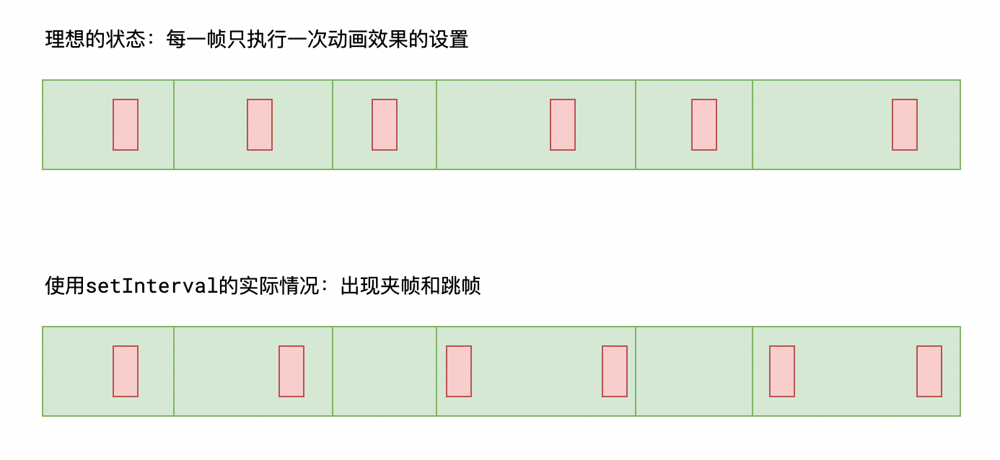

# L07：HTML5 API

---

本节主要结合 `HTML5_manual.md` 中的 **WebAPI** 部分进行学习。

本节不涉及移动端的知识，因此知识点相对较少。


## 1 querySelector 相关


## 2 classList 相关

`dom.classList.add()`、`remove()` 方法可以传多个参数值；

此外还有 `dom.classList.replace(token, newToken)` 直接实现样式类的替换，操作成功返回 `true`，否则返回 `false`。


## 3 本地化存储

- `localStorage`：永久保存到本地；
- `sessionStorage`：临时保存到本地，关闭浏览器后消失。


## 4 渲染帧



为了解决该问题，`HTML5` 新增 API `requestAnimationFrame`，用于在每一帧渲染 **之前** 做某些事：

```js
requestAnimationFrame(function(){
  // 传入一个回调函数，该函数在下一帧渲染之前自动运行
  // 通常，可以利用该回调函数，在下一帧渲染前改动元素的状态
})
```

`requestAnimationFrame` 的回调函数 **仅执行一次**。因此，要实现连贯的动画，通常使用下面的代码结构：

```js
// 该函数负责在下一帧渲染前，执行一次元素状态变化
function changeOnce(){
  requestAnimationFrame(function(){
    if(动画是否应该停止){
      return;
    }
    改变元素状态
    changeOnce(); // 改变完成后，继续注册下一帧的变化
  });
}
changeOnce();
```

