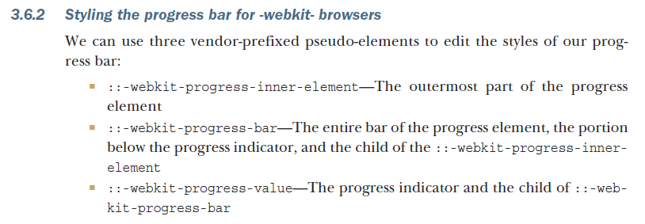

# L08：HTML5 综合练习

---

本节通过定制 `video` 元素的一系列控件，实现了视频的播放/暂停、进度同步、音量条件、播放速率控制等，最后还通过本地化存储实现了播放状态的临时存储与加载。

> [!tip]
>
> 可利用 `dom.classList.toggle('active', condition)` 快速切换某个样式类。

> [!tip]
>
> **DIY 补充**
>
> 根据《**Tiny CSS Projects**》提供的案例，进度条 `progress` 元素的自定义样式比较复杂，需利用 `accent-color` 控制已达进度的颜色，而背景色需要禁用默认样式，再借助 `appearance` 属性对应的厂商前缀：
>
> ```css
> progress {
>     height: 24px;
>     width: 100%;
>     border-radius: 20px;
>     -webkit-appearance: none;
>     -moz-appearance: none;
>     appearance: none;
> }
> ```
>
> 具体样式属性配置，详见该书第三章 `P85` 页内容：
>
> 