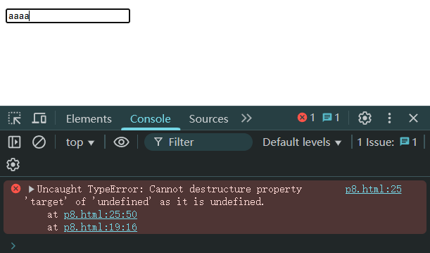

# L04：ES6 函数

---

本节主要围绕 `ES语言提升.md` 第四节展开。


## 1 箭头函数的特点

具有以下特点：

1. 不能使用 `new` 调用

2. 没有原型，即没有 `prototype` 属性

3. 没有 `arugments`

4. 没有 `this`


## 2 防抖函数在事件注册中的应用

习题 8 中，犯了一个很低级的错误：

```js
/* HTML: 
<input type="text" />
<div class="content"></div>
*/
// 监听 文本框 内容的变化，以防抖的方式输出当前文本框的值
const debounce = (fn, delay) => {
  let timer = null;
  return (...args) => {
    if (timer) clearTimeout(timer);
    timer = setTimeout(() => {
      fn.apply(this, ...args);
    }, delay);
  };
};
const content = document.querySelector(".content");
const input = document.querySelector("input[type='text']");
input.addEventListener('input', debounce(({target}) => {
  const value = target.value;
  console.log(value);
  content.innerText = value;
}, 1000));
```

运行情况：



原因：第 11 行 `fn.apply(this, args)` 中多了一个扩展运算符，导致事件对象 `event` 获取失败。更正后恢复正常。

> [!note]
>
> 意外发现使用 `clearInterval(timer)` 也能清除被 `setTimeout` 赋值的计时器（虽然不推荐这样写）。

