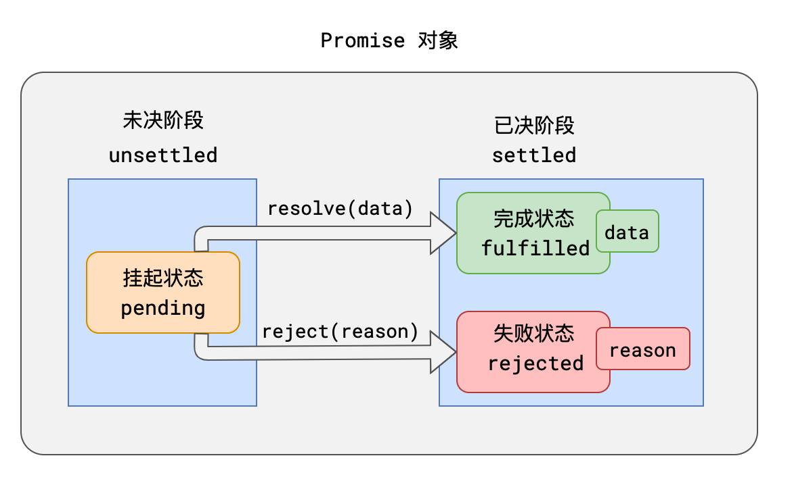

# L06：Promise 基础扫盲

> **本节任务**
>
> 1. 理解 `Promise A+` 规范的基本概念
> 2. 学会创建 `Promise`
> 3. 学会针对 `Promise` 进行后续处理

---

## 1 邓哥的烦恼

邓哥心中有很多女神，他今天下定决心，要向这些女神表白，他认为，只要女神够多，根据概率学原理，总有一个会接收他

稳妥起见，邓哥决定使用 **串行** 的方式进行表白：先给第 1 位女神发送短信，然后等待女神的回应：如果成功了，就结束；如果失败了，则再给第 2 位女神发送短信，依次类推：


邓哥的女神一共有 4 位，名字分别是：李建国、王富贵、周聚财、刘人勇

发短信是一个重复性的劳动，邓哥是个程序员，因此决定用函数封装这个动作：

```js
// 向某位女生发送一则表白短信
// name: 女神的姓名
// onFulffiled: 成功后的回调
// onRejected: 失败后的回调
function sendMessage(name, onFulffiled, onRejected) {
  // 模拟 发送表白短信
  console.log(
    `邓哥 -> ${name}：最近有谣言说我喜欢你，我要澄清一下，那不是谣言😘`
  );
  console.log(`等待${name}回复......`);
  // 模拟 女神回复需要一段时间
  setTimeout(() => {
    // 模拟 有10%的几率成功
    if (Math.random() <= 0.1) {
      // 成功，调用 onFuffiled，并传递女神的回复
      onFulffiled(`${name} -> 邓哥：我是九，你是三，除了你还是你😘`);
    } else {
      // 失败，调用 onRejected，并传递女神的回复
      onRejected(`${name} -> 邓哥：你是个好人😜`);
    }
  }, 1000);
}
```

有了这个函数后，邓哥于是开始编写程序发送短信了：

```js
// 首先向 李建国 发送消息
sendMessage(
  '李建国',
  (reply) => {
    // 如果成功了，输出回复的消息后，结束
    console.log(reply);
  },
  (reply) => {
    // 如果失败了，输出回复的消息后，向 王富贵 发送消息
    console.log(reply);
    sendMessage(
      '王富贵',
      (reply) => {
        // 如果成功了，输出回复的消息后，结束
        console.log(reply);
      },
      (reply) => {
        // 如果失败了，输出回复的消息后，向 周聚财 发送消息
        console.log(reply);
        sendMessage(
          '周聚财',
          (reply) => {
            // 如果成功了，输出回复的消息后，结束
            console.log(reply);
          },
          (reply) => {
            // 如果失败了，输出回复的消息后，向 刘人勇 发送消息
            console.log(reply);
            sendMessage(
              '刘人勇',
              (reply) => {
                // 如果成功了，输出回复的消息后，结束
                console.log(reply);
              },
              (reply) => {
                // 如果失败了，就彻底没戏了
                console.log(reply);
                console.log('邓哥命犯天煞孤星，注定孤独终老！！');
              }
            );
          }
        );
      }
    );
  }
);
```

该程序完成后，邓哥内心是崩溃的

这一层一层的回调嵌套，形成了传说中的「**回调地狱 callback hell**」

邓哥是个完美主义者，怎么能忍受这样的代码呢？

要解决这样的问题，需要 `Promise` 出马。


## 2 Promise 规范

`Promise` 是一套专门处理异步场景的规范，它能有效的避免回调地狱的产生，使异步代码更加清晰、简洁、统一。

这套规范最早诞生于前端社区，规范名称为 [Promise A+](https://promisesaplus.com/)

该规范出现后，立即得到了很多开发者的响应

`Promise A+` 规定：

1. 所有的异步场景，都可以看作是一个 **异步任务**。每个异步任务，在 `JS` 中应该表现为一个 **对象**，该对象称之为 **Promise 对象**，也叫做任务对象：

   

2. 每个任务对象，都应该有两个阶段、三个状态：

   

   根据常理，它们之间存在以下逻辑：

   - 任务总是从未决阶段变到已决阶段，无法逆行；
   - 任务总是从挂起状态变到完成或失败状态，无法逆行；
   - 时间不能倒流，历史不可改写，任务一旦完成或失败，状态就固定下来，永远无法改变。

3. `挂起->完成`，称之为 `resolve`；`挂起->失败` 称之为 `reject`。任务完成时，可能有一个相关数据；任务失败时，可能有一个失败原因。

   

4. 可以针对任务进行后续处理，针对完成状态的后续处理称之为 `onFulfilled`，针对失败的后续处理称之为 `onRejected`：

   

## 3 Promise API

`ES6` 提供了一套 `API`，实现了 `Promise A+` 规范

基本用法如下：

```js
// 创建一个任务对象，该任务立即进入 pending 状态
const pro = new Promise((resolve, reject) => {
  // 任务的具体执行流程，该函数会立即被执行
  // 调用 resolve(data)，可将任务变为 fulfilled 状态， data 为需要传递的相关数据
  // 调用 reject(reason)，可将任务变为 rejected 状态，reason 为需要传递的失败原因
});

pro.then(
  (data) => {
    // onFulfilled 函数，当任务完成后，会自动运行该函数，data为任务完成的相关数据
  },
  (reason) => {
    // onRejected 函数，当任务失败后，会自动运行该函数，reason为任务失败的相关原因
  }
);
```


## 4 邓哥的解决方案

学习了 `ES6` 的 `Promise` 后，邓哥决定对 `sendMessage` 函数进行改造，改造结果如下：

```js
// 向某位女生发送一则表白短信
// name: 女神的姓名
// 该函数返回一个任务对象
function sendMessage(name) {
  return new Promise((resolve, reject) => {
    // 模拟 发送表白短信
    console.log(`邓哥 -> ${name}：最近有谣言说我喜欢你，我要澄清一下，那不是谣言😘`);
    console.log(`等待${name}回复......`);
    // 模拟 女神回复需要一段时间
    setTimeout(() => {
      // 模拟 有10%的几率成功
      if (Math.random() <= 0.1) {
        // 成功，调用 resolve，并传递女神的回复
        resolve(`${name} -> 邓哥：我是九，你是三，除了你还是你😘`);
      } else {
        // 失败，调用 reject，并传递女神的回复
        reject(`${name} -> 邓哥：你是个好人😜`);
      }
    }, 1000);
  });
}
```

之后，就可以使用该函数来发送消息了：

```js
sendMessage('李建国').then(
  (reply) => {
    // 女神答应了，输出女神的回复
    console.log(reply);
  },
  (reason) => {
    // 女神拒绝了，输出女神的回复
    console.log(reason);
  }
);
```

> [!note]
>
> 至此，回调地狱的问题仍然没能解决
>
> 要解决回调地狱，还需要进一步学习 `Promise` 的知识
