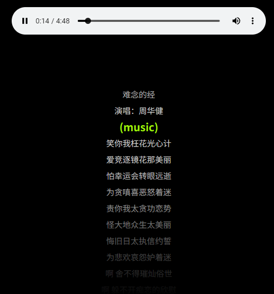

# L01：程序思维训练（一）：歌词滚动

---


## 1 需求描述

根据提供的远程歌词数据和本地音频资源，实现音频与歌词同步播放的简易页面。要求：

1. 页面样式自行设计；
2. 切换到音频不同位置时，下方歌词也要同步；
3. 可模仿酷狗音乐歌词效果进行局部优化；

最终效果：




## 2 要点梳理

1. 页面排版使用 `Flexbox` 布局，未采纳视频中歌词在屏幕正中高亮显示的风格；
2. 通过歌词区域的前后伪元素，实现了两端逐渐隐藏的效果（仿酷狗音乐）；注意调整 `z-index` 的值，让伪元素在歌词列表上方渲染；
3. 获取到歌词后，通过正则表达式快速解析时间戳为累计秒数，以便快速定位到当前歌词的位置；
4. 注册 `audio` 播放器事件逻辑时，使用 `throttle` 节流函数降低 `timeupdate` 事件的触发频率，提高整体性能；
5. 由于歌词是从上到下顺次排列的，因此定位当前歌词可以使用二分查找加快检索速度；
6. 渲染初始页面时，使用 `fragment` 收集各 `li` 元素，而非直接拼接 `innerHTML` 文本，进一步提高渲染效率。


核心 JS 逻辑：

```js
function parseLyrics(data) {
  const regexp = /^\[(\d{2}):(\d{2})\.(\d{2})\](.*)$/;
  const lines = data.split('\n');
  // console.log('lines:', lines);
  return lines
    .filter(line => regexp.test(line))
    .reduce((acc, line) => {
      const [_, m, s, fr, text] = line.match(regexp);
      const time = parseInt(m) * 60 + parseInt(s) + parseInt(fr) / 100;
      acc.push({time, text});
      return acc;
    }, []);
}

function offsetLyrics(index, lrcBox = lrc) {
  const init = initOffset * lrcHeight;
  const offset = init - Math.max(0, index) * lrcHeight;
  lrcBox.style.transform = `translateY(${offset}px)`;
}

function highLightLyric(index, parent = lrc) {
  // $$('li', lrc).forEach((li, i) => 
  //   li.classList.toggle('active', i === index));
  const prev = $('.active', parent);
  prev && prev.classList.remove('active');
  const curr = $(`li:nth-child(${index + 1})`, parent);
  curr && curr.classList.add('active');
}

function findTargetIndex(currentTime, data = lyrics, corr = correction) {
  // use binary search
  let [left, right] = [0, data.length - 1];
  let target = currentTime + corr;
  // let k = 0;
  while (left <= right) {
    const mid = Math.floor((left + right) / 2);
    if (data[mid].time < target) {
      left = mid + 1;
    } else {
      right = mid - 1;
    }
    // k++;
  }
  // console.log('二分查找次数:', k);
  return left;
}

function throttle(fn, delay) {
  let t0 = Date.now() - delay;
  return (...args) => {
    const now = Date.now();
    if(now - t0 >= delay) {
      t0 = now;
      fn.apply(null, args);
    }
  }
}

function bindEvents() {
  player.addEventListener('timeupdate', throttle(({target}) => {
    const index = findTargetIndex(target.currentTime);
    highLightLyric(index - 1);
    offsetLyrics(index);
  }, 500));
}

async function renderPage() {
  // 1. 获取并解析歌词数据
  lyrics = parseLyrics(await getLrc());
  // console.log(lyrics);
  // 2. 渲染歌词
  const fragment = lyrics.reduce((frag, {text}) => {
    const li = document.createElement('li');
    li.innerText = text.trim().length === 0 ? '(music)' : text;
    frag.appendChild(li);
    return frag;
  }, document.createDocumentFragment());
  lrc.innerHTML = '';
  lrc.appendChild(fragment);
  // 3. 设置歌词区高度
  lrc.style.height = `${numLines * lrcHeight}px`;
  // 4. 设置歌词初始位置
  offsetLyrics(0);
}

function init() {
  renderPage()
    .then(bindEvents)
    .catch(err => {
      console.error('页面初始化失败:', err);
    })
}
```

核心 `CSS`：

```css
.container {
    margin-block-start: 2em;
    overflow: hidden;
    position: relative;

    & > .lrc {
        display: flex;
        flex-direction: column;
        transition: transform 0.5s ease-in-out;

        & > li {
            min-height: 32px;
            line-height: 32px;
            font-size: 1rem;
            transition: transform 0.5s ease-in-out;
            user-select: none;
            
            &.active {
                transform: scale(1.3);
                color: rgb(159, 240, 9);
                font-weight: 700;
            }
        }
    }

    &::before, &::after {
        position: absolute;
        content: '';
        display: block;
        width: 100%;
        z-index: 1;
        pointer-events: none;
    }
    &::before {
        top: 0;
        left: 0;
        height: 100px;
        background: linear-gradient(to bottom, black, transparent);
    }
    &::after {
        bottom: 0;
        left: 0;
        height: 270px;
        background: linear-gradient(to top, black, transparent);
    }
}
```

