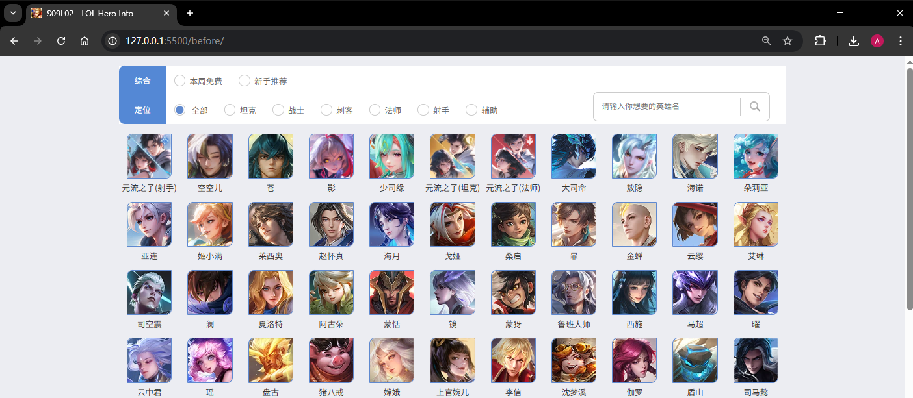

# L02：程序思维训练（二）：王者荣耀官网英雄查询

---

## 1 需求描述

最终效果：




## 2 要点梳理

1. 工具栏使用 `Flexbox` 布局，结果栏使用 `Grid` 布局；
2. 利用 `div` 的伪元素自定义单选按钮效果，同时将正常的 `radio` 单选字段埋进该 `div` 中（以便与后端对接）；
3. 使用 `HTML5` 语义化标签（如 `figure` 等）增强页面可访问性；
4. 快速搜索文本框使用 `form` + `submit` 按钮，实现回车键快速发送关键词；
5. 切换不同筛选条件时，使用 `ev.preventDefault()` 避免点击事件冒泡导致的代码多次重复执行；
6. 通过显式传参减少全局状态的个数；
7. 渲染查询结果时，使用 `fragment` 而非 `innerHTML` 提高渲染性能。

核心 JS 逻辑：

```js
Array.from(doms.options).forEach(opt => 
  opt.addEventListener('click', function(ev) {
    ev.preventDefault();
    toggleActive($('.rdio', this));

    const value = $('input[name=option]', this).value;
    const byHeroType = selectFilter(value);
    const newData = data.filter(byHeroType);
    renderList(newData);
  }));

function toggleActive(currElem) {
    const prev = $('.rdio.active', doms.search);
    prev && prev.classList.remove('active');
    currElem.classList.add('active');
}

function selectFilter(value) {
    const target = parseInt(value, 10);
    if(target === 0) {
      return () => true;
    } else if(target >= 10) {
      return ({pay_type}) => pay_type === target;
    } else {
      return ({hero_type, hero_type2}) => 
        [hero_type, hero_type2].includes(target);
    }
}

function getHandler(data) {
  return function(ev) {
    const value = doms.keyword.value.trim();
    if(!value) return;
    const byName = ({cname}) => cname.includes(value);
    renderList(data.filter(byName));
    toggleActive($('.rdio', doms.all));
  };
}

function renderList(heroes) {
  const fragment = heroes.reduce((frag, d) => {
    const img = document.createElement('img');
    img.classList.add('avatar');
    img.src = `https://game.gtimg.cn/images/yxzj/img201606/heroimg/${d.ename}/${d.ename}.jpg`;
    img.alt = d.cname;
    const p = document.createElement('p');
    p.classList.add('hero-name');
    p.innerText = d.cname;
    const a = document.createElement('a');
    a.href = `https://pvp.qq.com/web201605/herodetail/${d.ename}.shtml`;
    a.title = d.cname;
    a.target = '_blank';
    a.appendChild(img);
    a.appendChild(p);
    const figure = document.createElement('figure');
    figure.classList.add('item');
    figure.appendChild(a);
    frag.appendChild(figure);
    return frag;
  }, document.createDocumentFragment());
  doms.result.innerHTML = '';
  doms.result.appendChild(fragment);
  return heroes;
}
```

