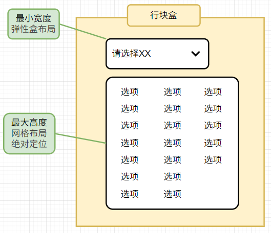
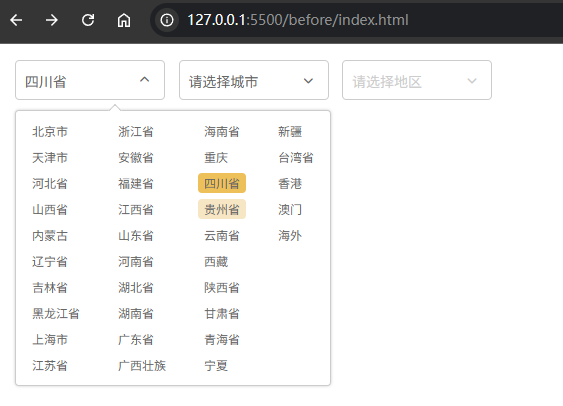

# L03：程序思维训练（三）：美团省市级联

---


## 1 需求描述

从零开始自定义一组包含省、市、区联动的地区下拉菜单组件，要求：

1. 不使用 `select` 和 `option` 元素；
2. 下拉列表选中后有背景标识；
3. 级联效果：初始加载只能选中省份；选定某省份后重置城市栏，同时禁用地区栏；选中某城市后重置地区栏。

布局提示：



最终效果：




## 2 要点梳理

1. 菜单标题使用 `Flexbox` 布局，下拉列表区域使用 `Grid` 布局；

2. 下拉菜单宽度的自动延伸实现：

   1. 指定最小宽度为 `100%`，让下拉区与标题栏等宽；
   2. 外层容器设置 `white-space: nowrap;`，实现宽度不足时自动延展；

3. 设计样式时提前为后续 JS 逻辑做好相应的切换状态效果（展开、选中、图标的反转、过渡等）。

4. DIY：将页面渲染变更为递归调用形式，可以避免对省份下拉菜单单独讨论；

5. DIY：注册事件时，可通过 `CPS` 模式传入一个下级菜单的渲染回调函数，实现代码高度复用（前提：数据源呈嵌套结构）。

6. 充分利用 `dom.classList.toggle(clsName, condition)` 实现状态的切换；

7. 充分利用 `ES6` 中的访问器模式，实现了对象属性值的实时计算（`L5`）：

   ```js
   const doms = {
     selProvince: $('#selProvince'),
     selCity: $('#selCity'),
     selArea: $('#selArea'),
     get sels() { return [this.selProvince, this.selCity, this.selArea] }, 
   };
   ```

8. 和第六章 JS 实战第 4 课中的下拉菜单相比，本次数据源层次更深，且完全脱离 `select-option` 结构，难度更大。DIY 实现功能时的主要区别：

   1. 之前通过递归调用的 `resetCityBar()` 和 `resetSchoolBar()` 重置下级菜单状态；注册 `change` 事件完成下级菜单数据的加载和重新渲染；
   2. 本例通过递归调用的 `fillSelect()` 和 `CPS` 风格的 `regSelEvent()` 函数实现了从渲染到事件注册的一气呵成，结构更加紧凑。唯一不足之处在于 `DOM` 元素本身会缓存大量的业务数据（`dom.data = data`），可能降低页面性能。

核心 JS 逻辑：

```js
const fillSelect = (elem, data) => {
  // load placeholder text
  const selName = elem.dataset.name;
  $('.title > span:first-child', elem).innerText = `请选择${selName}`;

  // load options
  elem.classList.toggle('disabled', data.length === 0);
  $('.options', elem).innerHTML = data.map((item) => 
    `<li data-value="${item.value}">${item.label}</li>`).join('');

  elem.data = data;
  // console.log(data);

  const subElem = elem.nextElementSibling;
  subElem && fillSelect(subElem, []);
};

const fillProvince = data => fillSelect(doms.selProvince, data);
const fillCity = data => fillSelect(doms.selCity, data);
const fillArea = data => fillSelect(doms.selArea, data);

const regSelEvent = (selElem, fillSub) => {
  // 1. 菜单标题点击事件
  const title = $('.title', selElem);
  title.addEventListener('click', (ev) => {
    if(selElem.classList.contains('disabled')) return;
    doms.sels.forEach(sel => sel.classList.toggle('expand', sel === selElem));
  });

  // 2. 菜单选项点击事件
  const ul = $('.options', selElem);
  ul && ul.addEventListener('click', ({target}) => {
    if(target.tagName !== 'LI') return;
    
    const title = $('.title > span:first-child', selElem);
    title.innerText = target.innerText;
    
    const prev = $('.active', ul);
    prev && prev.classList.remove('active');
    target.classList.add('active');
    
    selElem.classList.remove('expand');

    const value = target.dataset.value;
    const subData = selElem.data.find(d => d.value === value).children;
    fillSub && fillSub(subData);
  });
};

const initPage = async () => {
  const datas = await getDatas();
  fillProvince(datas);
};

const bindEvents = () => {
  regSelEvent(doms.selProvince, fillCity);
  regSelEvent(doms.selCity, fillArea);
  regSelEvent(doms.selArea);
};

const init = async () => {
  await initPage();
  bindEvents();
};
```

