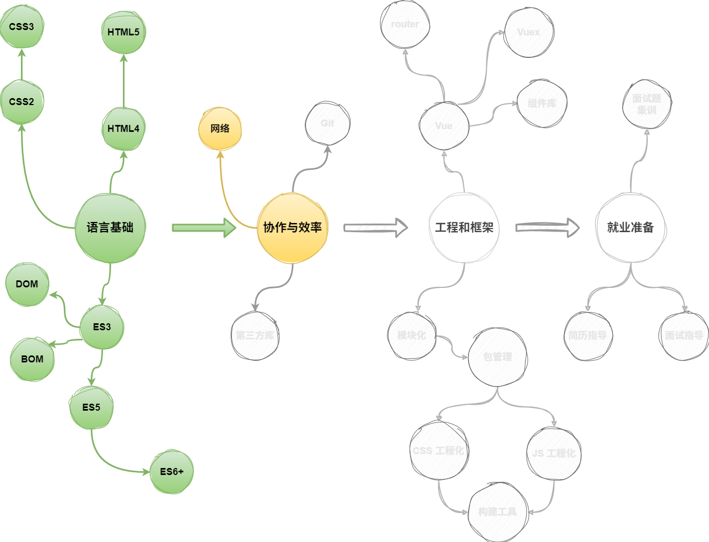

# L01：网络知识概述

---

## 1 概述

本节介绍网络知识在前端中的地位、作用及应用场景：

- 可利用后端数据渲染页面；
- 提交数据到后端处理（登录校验等）；

主要作用：

1. 能干活；
   1. 能看懂接口文档；
   2. 能利用接口文档写出代码；
2. 能就业（高薪面试题）；

## 2 测试接口文档的访问

URL：`mock.duyiedu.com` [^1]

---

[^1]: 已更新为：`https://app.apifox.com/invite?token=9wP_M2QjoHEqhE2NWC9aJ`

