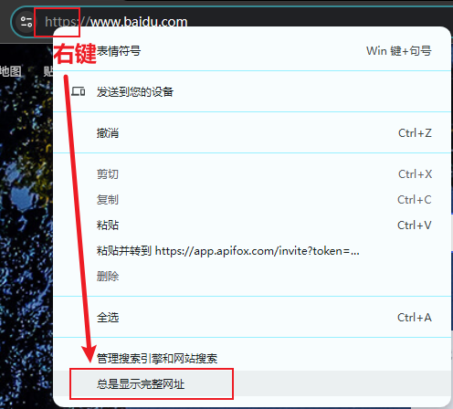

# L03：URL 基本概念

---

参考：`Networks.md` 第 `1.2` 节内容。

## 1 关于强制浏览器显示完整 URL

适用于 `Chrome` 浏览器：

## 2 关于 IP 和域名

切记：不能使用 `https` 协议来访问某个 `IP` 地址，只能用 `http` 协议。

## 3 关于 URL 中的非 ASCII 字符

`URL` 不能出现非 `ASCII` 字符，例如中文。但浏览器可以编码为中文显示。

此外，利用 `JavaScript` 中的 `decodeURIComponent(urlStr)` 函数也可以实现该功能。

