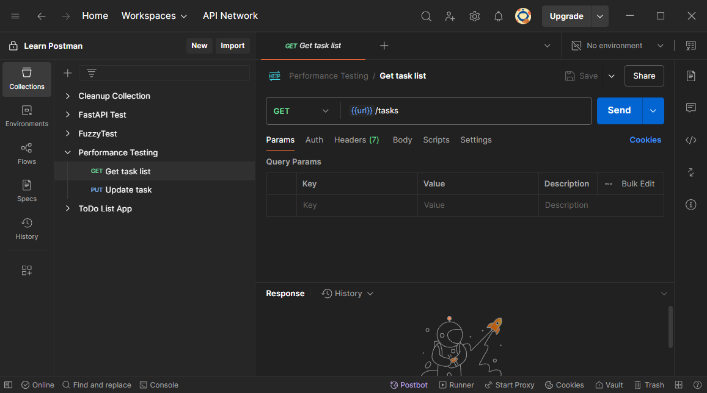

# L04：Postman 的安装

---

参考：`Networks.md` 附录 `4.1` 节。

`Postman` 最新首页截图（`v11.45.1`）：

环境搭建：

1. 注册 `Postman` 官网帐号并下载安装客户端；
2. 发送测试请求；
3. 尝试使用 **查询参数（Query Params）**；
4. 尝试使用 **测试环境（Environments）**；
5. 尝试使用 **环境变量（Variables）**；
6. 尝试保存请求（例如存入某个 **集合（Collection）**的某 **个子文件夹** 中）；

