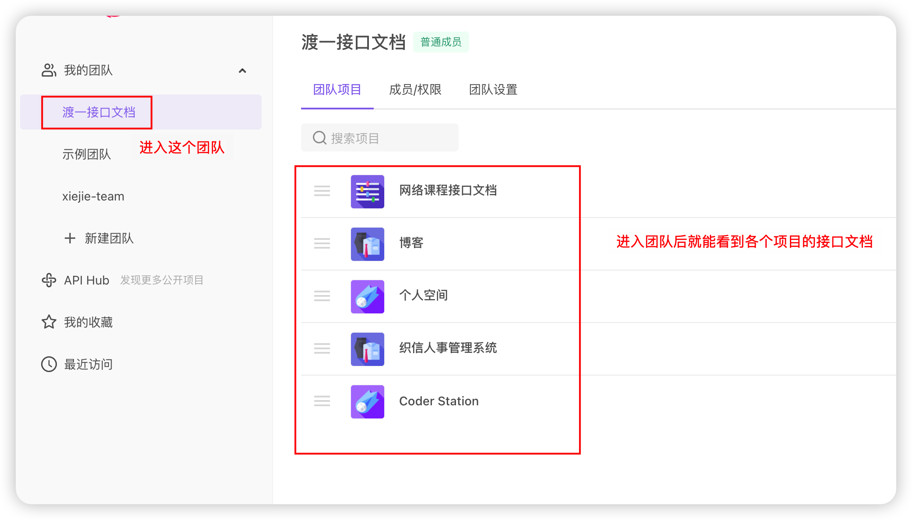
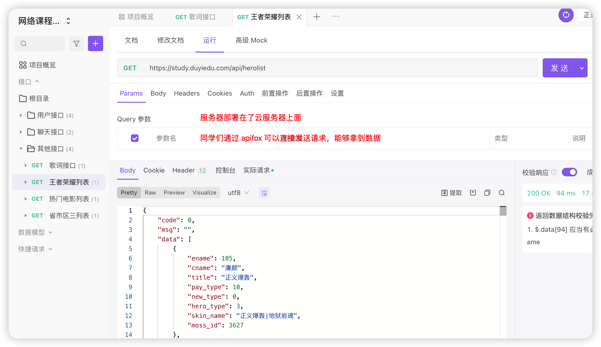
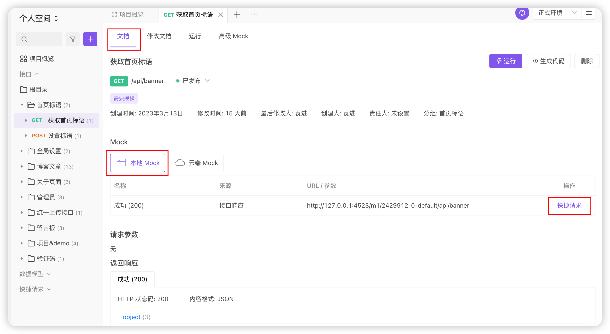
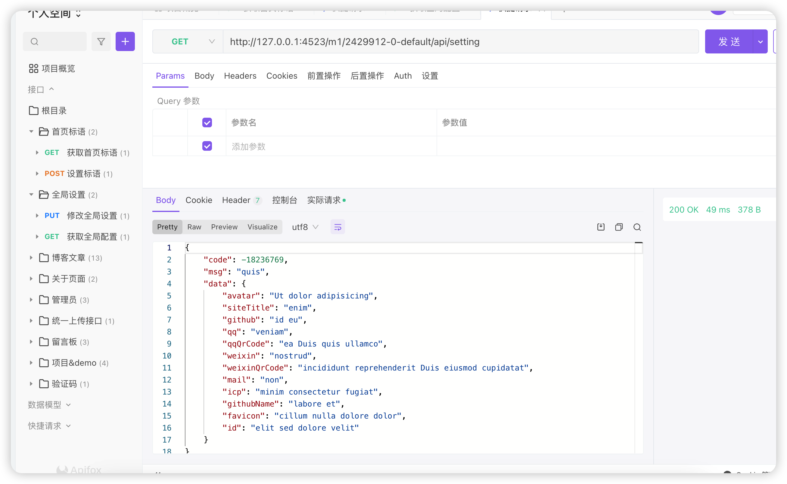

# 关于 Apifox 的使用

`Apifox` 是咱们国内推出的一款类似于 `Postman` 的接口测试工具。

**安装 Apifox**

在官网下载安装包，根据你自己的操作系统选择合适的安装，安装即可：

https://www.apifox.com/

**加入团队**

安装完毕后，自己注册一个账号，然后找班班拉你进入【渡一接口文档】团队，进入团队之后，你就能看到对应的接口文档：

**测试接口**

接口分为两类：

- 服务器是由渡一部署到了云服务器上面，大家直接发送请求就可以拿到数据

  - 比如【网络课程接口文档】，能够直接在 `Apifox` 发送请求拿到数据
  - 回头你在你自己的项目中，发送请求时直接书写该地址即可

  

- 还有一种是没有办法直接通过 `Apifox` 发请求拿到数据的

  - 比如【博客】【个人空间】【织信人事管理系统】【`Coder Station`】
  - 这些项目的服务器在对应的课件中是能够拿到的
  - 回头需要你自己在本地启动对应项目的服务器

  

  -  另外，针对这种类型的接口，如果没有启动本地的服务器，但是我们又想要快速的看一下响应对应有哪些字段，可以通过模拟服务器 `mock` 的形式：

  

  - 当我们点击【快捷请求】后，对应的效果如下：

  

