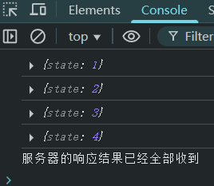

# L09：Ajax 技术

---

> 参考：`Networks.md` 第 3 小节。


## 1 关于 XHR、Fetch 和 Ajax

> [!important]
>
> **无论是 `XHR` 还是 `Fetch`，它们都是实现 Ajax 的技术手段，只是 API 不同。**


## 2 传统 XHR 的写法

```js
var xhr = new XMLHttpRequest(); //创建发送请求的对象
xhr.onreadystatechange = function () {
  //当请求状态发生改变时运行的函数
  // xhr.readyState： 一个数字，用于判断请求到了哪个阶段
  // 0: 刚刚创建好了请求对象，但还未配置请求（未调用 open 方法）
  // 1: open 方法已被调用
  // 2: send 方法已被调用
  // 3: 正在接收服务器的响应消息体
  // 4: 服务器响应的所有内容均已接收完毕
  // xhr.responseText： 获取服务器响应的消息体文本
  // xhr.getResponseHeader("Content-Type") 获取响应头Content-Type
};
xhr.open('请求方法', '`URL`地址'); // 配置请求
xhr.setRequestHeader('Content-Type', 'application/json'); // 设置请求头
xhr.send('请求体内容'); //构建请求体，发送到服务器，如果没有请求体，传递 null
```

在一次完整的网络请求中，`xhr.onreadystatechange` 回调函数总共会执行 **四次**（可分别打印 `xhr.readyState` 进行验证）：

```js
var xhr = new XMLHttpRequest(); //创建发送请求的对象
xhr.onreadystatechange = function () {
  console.log({state: xhr.readyState});
  if (xhr.readyState === 4) {
    console.log('服务器的响应结果已经全部收到');
    }
  }
};
xhr.open('GET', 'http://study.duyiedu.com/api/herolist');
xhr.send(null);
```

实测结果：




## 3 Fetch API 的写法

```js
const resp = await fetch('URL 地址', {
  // 请求配置对象，可省略，省略则所有配置为默认值
  method: '请求方法', // 默认为 GET
  headers: {
    // 请求头配置
    'Content-Type': 'application/json',
    a: 'abc',
  },
  body: '请求体内容', // 请求体
}); // fetch 会返回一个 Promise，该 Promise 会在【接收完响应头后】变为 fulfilled

resp.headers; // 获取响应头对象
resp.status; // 获取响应状态码，例如 200
resp.statusText; // 获取响应状态码文本，例如 OK
resp.json(); // 用 JSON 的格式解析即将到来的响应体，返回 Promise，解析完成后得到一个对象
resp.text(); // 用 纯文本 的格式解析即将到来的响应体，返回 Promise，解析完成后得到一个字符串
```


## 4 特别注意

> [!important]
>
> **无论使用哪一种 API，Ajax 始终都是异步的**