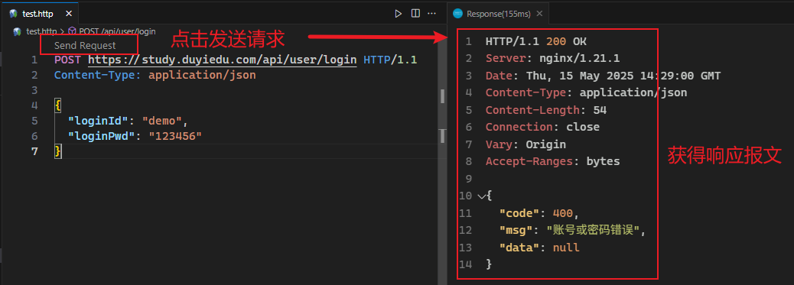

# L10：示例项目：聊天机器人 —— API 接口封装

---


## 1 项目简介

改造本地静态页面，通过调用远程接口实现前端数据接口的开发。主要实现以下接口：

`js/api.js`：

```js
    async function reg(userInfo) {}

    async function login(loginInfo) {}

    async function exists(loginId) {}

    async function profile() {}

    async function sendChat(content) {}

    async function getHistory() {}

    function logout() {}
```

注意：登录成功后，需要将请求头中的登录令牌存入本地 `localStorage`，并且在后续接口中带上该 `token` 完成请求。


## 2 实用调试工具 rest client

安装 `rest client` 插件后，创建文件 `test.http` 可实现接口的快速调用：




# L11：示例项目：聊天机器人 —— 实现登录与注册页

本节在上节课的基础上实现登录和注册页面的各项功能，通过统一的字段校验逻辑，提高核心代码的复用性。

构建字段校验类：

```js
class FieldValidator {
  /**
   * 构造器
   * @param {String} txtId 文本框的Id
   * @param {Function} validatorFunc 验证规则函数，当需要对该文本框进行验证时，会调用该函数，函数的参数为当前文本框的值，函数的返回值为验证的错误消息，若没有返回，则表示无错误
   */
  constructor(txtId, validatorFunc) {
    this.input = $('#' + txtId);
    this.p = this.input.nextElementSibling;
    this.validatorFunc = validatorFunc;
    this.input.onblur = this.validate.bind(this);
  }

  /**
   * 验证，成功返回true，失败返回false
   */
  async validate() {
    const err = await this.validatorFunc(this.input.value);
    if (err) {
      // 有错误
      this.p.innerText = err;
      return false;
    } else {
      this.p.innerText = '';
      return true;
    }
  }

  /**
   * 对传入的所有验证器进行统一的验证，如果所有的验证均通过，则返回true，否则返回false
   * @param {FieldValidator[]} validators
   */
  static async validate(...validators) {
    const proms = validators.map((v) => v.validate());
    const results = await Promise.all(proms);
    return results.every((r) => r);
  }
}
```

> [!note]
>
> **注意**
>
> 第 `L11` 行需要用到 `bind` 绑定实例方法的 `this` 指向，否则事件注册失败。

表单提交逻辑：

```js
const form = $('.user-form');
form.onsubmit = async function (e) {
  e.preventDefault();
  const result = await FieldValidator.validate(
    loginIdValidator,
    loginPwdValidator
  );
  if (!result) {
    return; // 验证未通过
  }
  const formData = new FormData(form); // 传入表单dom，得到一个表单数据对象
  const data = Object.fromEntries(formData.entries());

  const resp = await API.login(data);
  if (resp.code === 0) {
    alert('登录成功，点击确定，跳转到首页');
    location.href = './index.html';
  } else {
    loginIdValidator.p.innerText = '账号或密码错误';
    loginPwdValidator.input.value = '';
  }
};
```

> [!note]
>
> **注意**
>
> 第 `L11-12` 行用 `new FormData(formElem)` 实例化了一个表单数据实例，通过和 `Object.entries()` 结合，可以快速得到表单字段的 `KV` 对象。

注册页面和登录页面的校验逻辑类似，只是多了几个字段，且注册成功后需要跳转到登录页。

