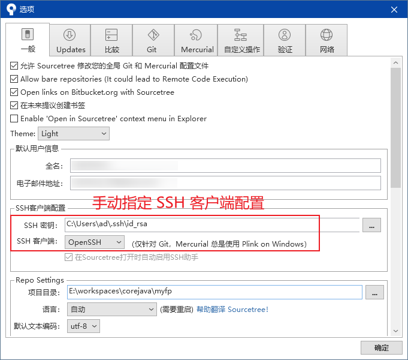

# L04：Sourcetree 用法简介

---

`Sourcetree` 提供了更加便捷的图形化操作界面，可以精确到逐段提交。

# L05：Sourcetree 配置问题

如果导入 `GitHub` 或其他 `Git` 仓库后 `Sourcetree` 不能识别为有效 `Git` 项目，说明 `SSH` 客户端配置用的还是默认配置，需进行手动切换。

方法：`工具 --> 选项 --> 一般 --> SSH 客户端配置`：

> [!note]
>
> **注意**
>
> 该方法仅对单个 `Git` 项目生效。