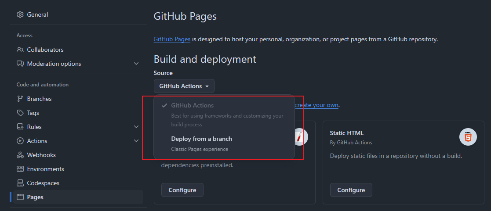
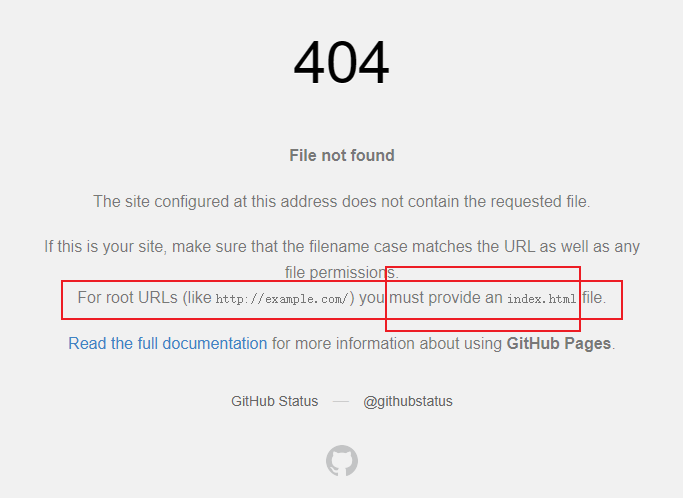
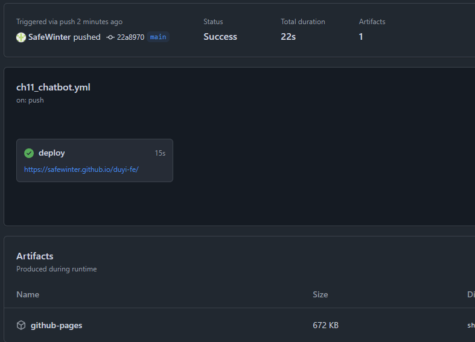
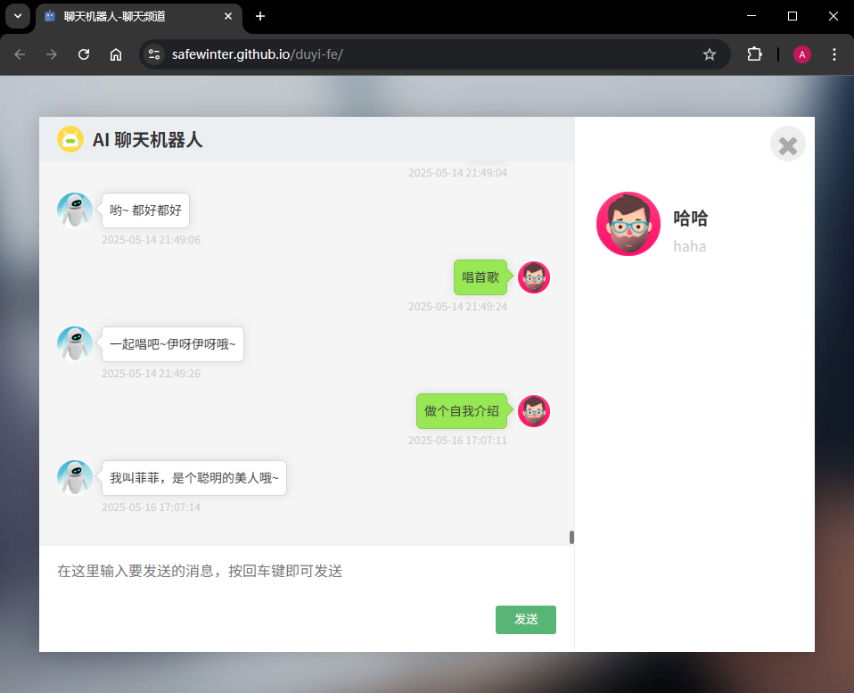

# L06：利用 Git Pages 部署静态页面

---

实测发现，改版后的 `Git Pages` 配置页支持 `GitHub Actions` 和 `指定分支部署`：



其中，通过 `GitHub Actions` 部署需要为当前项目创建一个 `YML` 格式的执行脚本配置文件：

```yaml
# Simple workflow for deploying static content to GitHub Pages
name: Deploy static content to Pages

on:
  # Runs on pushes targeting the default branch
  push:
    branches: ["main"]

  # Allows you to run this workflow manually from the Actions tab
  workflow_dispatch:

# Sets permissions of the GITHUB_TOKEN to allow deployment to GitHub Pages
permissions:
  contents: read
  pages: write
  id-token: write

# Allow only one concurrent deployment, skipping runs queued between the run in-progress and latest queued.
# However, do NOT cancel in-progress runs as we want to allow these production deployments to complete.
concurrency:
  group: "pages"
  cancel-in-progress: false

jobs:
  # Single deploy job since we're just deploying
  deploy:
    environment:
      name: github-pages
      url: ${{ steps.deployment.outputs.page_url }}
    runs-on: ubuntu-latest
    steps:
      - name: Checkout
        uses: actions/checkout@v4
      - name: Setup Pages
        uses: actions/configure-pages@v5
      - name: Upload artifact
        uses: actions/upload-pages-artifact@v3
        with:
          # Upload entire repository
          path: '.'
      - name: Deploy to GitHub Pages
        id: deployment
        uses: actions/deploy-pages@v4

```

如果项目没有在当前仓库的根目录，则还需要变更第 `L40` 行的根路径位置（注意：写到首页所在的文件夹即可，且不要以 `/` 符结尾）。例如，部署之前 JS 实战中的五子棋项目，应改为：

```yaml
        with:
          # Upload entire repository
          path: './06_JavaScript_proj/L12_gomoku_game/demo'
```

另外，部署后的静态页必须要有 `index.html` 文件，否则无法打开页面：




## 关于聊天机器人的静态页部署

需要手动修改项目中使用类似 `/login.html` 的路径，统一改为使用相对路径 `./login.html`。

`location.href = '/index.html'` 改为 `location.href = './index.html'`。

在最近的项目代码中，上述路径问题已更正。最终部署后的实测情况如下：



登录后的聊天页面：

