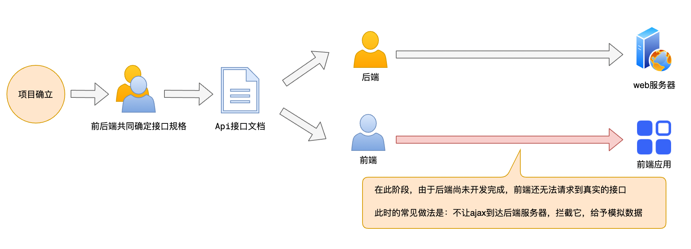

# L05：JS 第三方库之 Mock.js

---

> 课程内容详见 `Third_libraries_manual.md` 的 `MockJS` 小节。

> 官网：http://mockjs.com/
>
> `CDN`：https://cdn.bootcdn.net/ajax/libs/Mock.js/1.0.0/mock-min.js

典型用法：

```html
<script src="https://cdn.bootcdn.net/ajax/libs/axios/0.21.1/axios.min.js"></script>
<script src="https://cdn.bootcdn.net/ajax/libs/Mock.js/1.0.0/mock-min.js"></script>
<script>
  Mock.mock('/hello', 'get', {
    'name|1-5': 'abc',
    'age|10-50': 0,
    'arr|5-10': [
      {
        'id|+1': 1,
        name: '@cname',
        tel: /1\d{10}/,
        addr: '@city(true)',
        avatar: '@image(180x150, #008c8c, #fff, text image)',
      },
    ],
  });

  axios.get('/hello').then((resp) => {
    console.log(resp.data);
  });
</script>
```

`MockJS` 有两个作用：

1. 产生模拟数据；
2. 拦截 `Ajax`。

下面两张图说明 `MockJS` 的作用：




## 仅模拟数据

```js
Mock.mock(数据模板)
```

数据模板有其特有的书写规范，具体写法见官网。

## 拦截 + 模拟数据

```js
Mock.mock(要拦截的url, 要拦截的请求方法, 数据模板)
```

更多用法见官网。

> [!note]
>
> **注意：MockJS 拦截数据的原理是重写了 XHR，因此它仅能拦截 XHR 的数据请求，而无法拦截使用 `fetch ` 发出的请求**。

具体地，`MockJS` 可以拦截：

- 原生 `XmlHttpRequest`
- `jQuery` 中的 `$.ajax`
- `axios`

`MockJS` 可以模拟网络延时，用法为：

```js
Mock.setup({
  timeout: 400 // 网络延时400毫秒
})

Mock.setup({
  timeout: '200-600' // 网络延时200-600毫秒
})
```

> [!tip]
>
> 关于 `Mock.js` 的具体写法，详见 [官网示例页](http://mockjs.com/examples.html)。