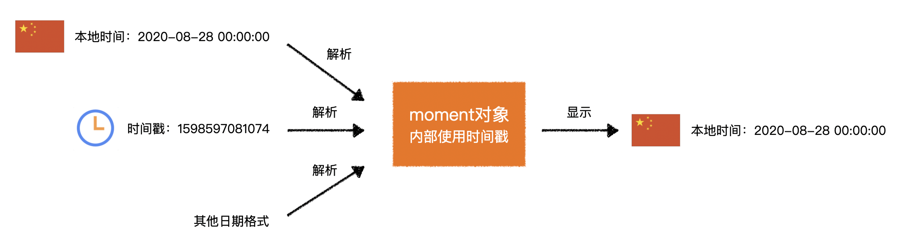

# L06：JS 第三方库之 Moment.js

---

> 课程内容详见 `Third_libraries_manual.md` 的 `Moment.js` 小节。
>
> 另外，`Moment.js` 已逐渐被 `Day.js` 平替（详见：https://day.js.org/），但基本语法与操作习惯和 `Moment.js` 几乎一致，因此学习 `Moment` 并未过时。

> 官网：https://momentjs.com/
>
> 中文网：http://momentjs.cn/
>
> `CDN`：https://cdn.bootcdn.net/ajax/libs/moment.js/2.29.1/moment.min.js
>
> 各种语言包：https://www.bootcdn.cn/moment.js/

---


## 1 Moment 的引入

需要同时引入 `Moment.js` 以及对应地区的本地化 `JS` 包：

```html
<script src="https://cdn.bootcdn.net/ajax/libs/moment.js/2.29.1/moment.min.js"></script>
<script src="https://cdn.bootcdn.net/ajax/libs/moment.js/2.29.1/locale/zh-cn.js"></script>
```


## 2 Moment 核心用法



`Moment` 的使用分为两个部分：

1. 获得 `Moment` 对象；
2. 针对 `Moment` 对象做各种操作；

> [!note]
>
> **【注意】**
>
> 视频中暴露了 `Moment` 一个问题：调整年份后原 `Moment` 实例被默认修改（非纯函数），导致后续求值出错：
>
> ```js
> const now = moment();
> const tomorrow = moment(now).add(1, 'days');
> console.log(now.format(), tomorrow.format());
> // 2025-05-19T13:05:57+08:00 2025-05-20T13:05:57+08:00
> const tomorrowImpure = now.add(1, 'days');
> console.log(now.format(), tomorrowImpure.format());
> // 2025-05-20T13:08:43+08:00 2025-05-20T13:08:43+08:00
> ```
>
> `Day.js` 则很好地规避了这一问题，类似操作都是纯函数操作，不会修改原对象的状态：
>
> ```js
> const now = dayjs();
> const tomorrow = now.add(1, 'day');
> console.log(now.format(), tomorrow.format());
> // 2025-05-19T13:11:41+08:00 2025-05-20T13:11:41+08:00
> ```


## 3 关于时间戳的生成

普通方式：`new Date().getTime()`；

自带格式化：`new Date().toISOString()`，将得到经本地格式化处理后的时间戳文本：`'2025-05-19T04:54:07.168Z'`。
